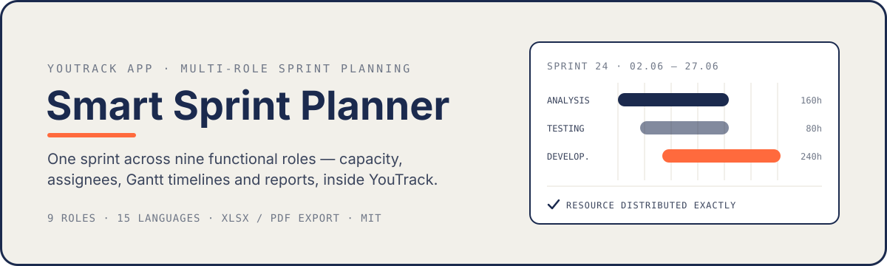
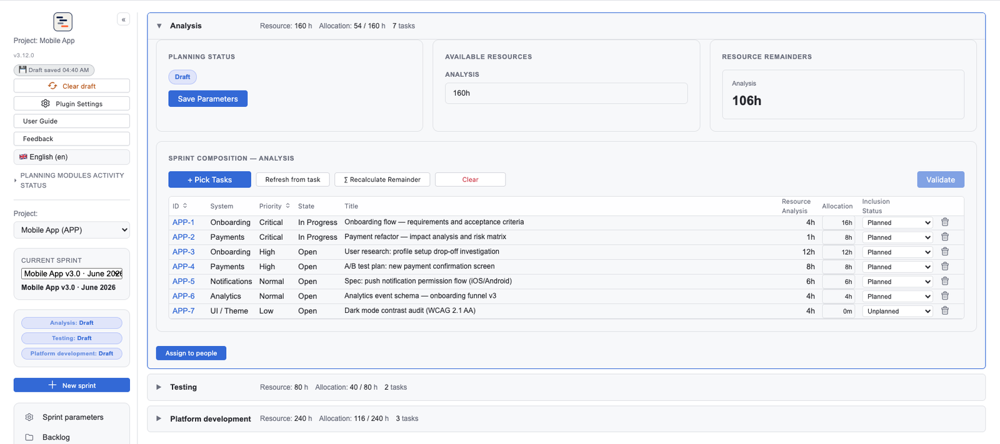
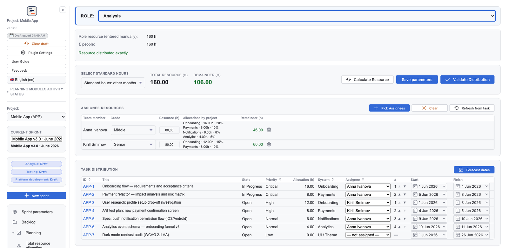
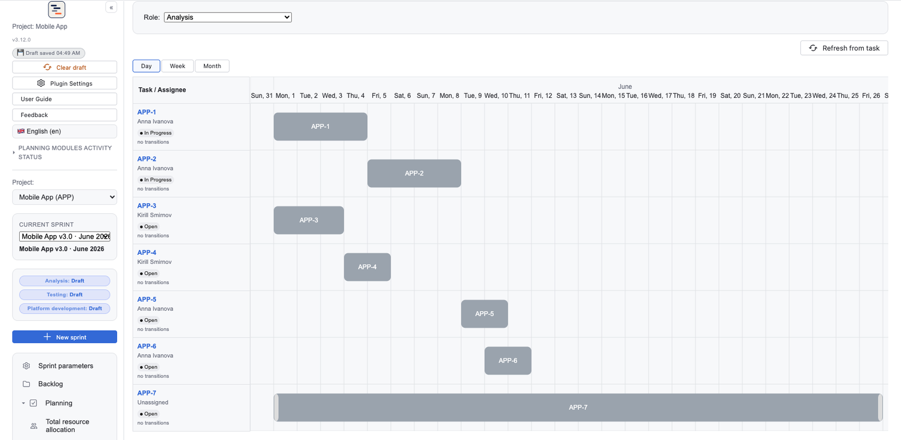
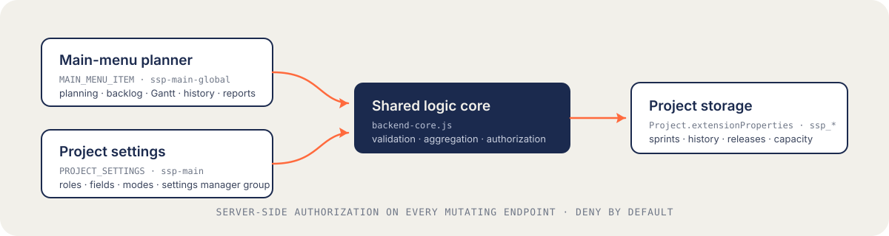

<p align="center">
  
</p>

<p align="right">🇬🇧 English · 🇷🇺 <a href="Documentation/README.ru.md">Читать по-русски</a></p>

<p align="center">
  <a href="https://plugins.jetbrains.com/plugin/31727-smart-sprint-planner"></a>
  <a href="https://github.com/Letsrollamigo/smart-sprint-planner/releases/latest"></a>
  <a href="https://plugins.jetbrains.com/plugin/31727-smart-sprint-planner"></a>
  <a href="https://www.jetbrains.com/youtrack/"></a>
  <a href="https://github.com/Letsrollamigo/smart-sprint-planner/actions/workflows/build.yml"></a>
  <a href="LICENSE"></a>
</p>

**Smart Sprint Planner** is a sprint-planning app for [YouTrack](https://www.jetbrains.com/youtrack/) 2024.3+, built for teams where one sprint spans several functional roles — analysis, testing, and seven engineering specializations. Plan each role's composition, track capacity against load, distribute tasks per assignee, and walk the sprint from working draft to confirmed history — all from the YouTrack main menu.

## What it looks like

Role composition — capacity vs. load per role, planned/unplanned inclusion, direct editing of YouTrack fields from the sprint table:

<p align="center">
  
</p>

Per-assignee capacity — personal resources with grades, cross-project allocations, and remainders:

<p align="center">
  
</p>

Gantt timeline per role, sprint-aware, with per-task assignees:

<p align="center">
  
</p>

## What you get

**Plan**

- **9 functional roles** — analysis, testing, platform development, backend, frontend, iOS, Android, fullstack, database. Roles are enabled selectively per project; the generic `devPlatform` role maps any platform stack (1C, SAP, Salesforce, low-code, etc.) to a custom field.
- **Per-sprint participating roles** — creating a sprint opens a dialog to choose which of the project's active roles take part; the set is fixed at creation. Changing project roles later never rewrites existing sprints: no phantom roles appear retroactively, and roles holding data stay visible.
- **Per-role composition tables** — assignees with capacity vs. load tracking, overlimit guards, and direct editing of YouTrack fields from the sprint table.
- **Backlog workspace** — a pre-planning pool of customer tasks shown **By zones** (state → role) or as an **Epic ▸ Story ▸ Task** tree, with query-assist filtering, Carryover / Continuation / Needs-estimate / Paused labels, and one-click **«lay into sprint»** that distributes a task into role compositions. Tasks in unmapped states land in an «Other» bucket with a fail-loud warning.
- **Three planning models** — **Simple** (manual role capacity, assignees set on the Gantt), **Light** (per-assignee capacity, auto-by-formula or manual), **Full** (adds a «Capacity» tab and consumes approved per-sprint business capacity per role and assignee). Calculation norms — hour quotas, rate, participation, grade coefficients — live in an admin-tier section editable only by the settings manager.
- **Manual per-assignee resource** — opt-in mode for teams whose capacity is set top-down by the team lead as fixed weekly hours per person.
- **Auto-forecast of task dates** — computes planned start/end dates for every assigned task from the assignee's capacity, the production calendar and absences (incl. partial days), with a useful-hours-per-day cap. Personal task queues with instant repacking on reorder; manual date corrections survive until an explicit re-run; over-capacity tasks get an honest «over capacity» badge instead of fake dates.

**Track**

- **Gantt timeline per role** with sprint-aware filtering.
- **Sprint history** — confirmed snapshots, shared working drafts, per-user personal drafts, and one-click restore.
- **Sprint Goals** — structured goals (title, success metric, owner) attached to each sprint and kept visible on the stand-up overlay.
- **Stand-up assistant** — full-screen daily overlay with per-role task lists (Done Yesterday / Doing Today / Blocked), live timer, and blocker-highlight mode; runs on the current sprint's data.
- **Differentiated Time Accounting (DTA)** — work-item type → role mapping, per-role fact aggregation back into custom fields, mandatory work-type validation, optional plan/fact ratio warnings.
- **Cascade aggregation parent ← child** — plan and fact fields on a container issue are the sum of its direct children; container issues can be locked from receiving direct work-item logs.
- **State rollup parent ← min(children)** — container State follows the least-progressed child, with configurable state order, a resolved-states guard, and an optional floor state. Reuses the cascade hierarchy config; off by default.

**Report**

- **Operational reporting** — two contours gated by access groups. **Operational (A):** aging with thresholds, progress to target states, WIP/Done slice, time-to-market medians with norms and pause deduction, flow bottleneck & rework, workload by roles, plan vs. fact with as-of estimates, backlog capacity, sprint spillover, team velocity. **Management (B):** a monthly roll-up of five metrics per system with multi-line charts, tech debt, bug tax, «1000 small things». Any report exports to **XLSX or PDF**; long runs are protected by a configurable timeout with Cancel & rollback. Off by default.
- **Excel export** for both planning and history tabs.

**Govern**

- **Release management** — group tasks into releases (kind Release / Hotfix × source Internal / Vendor) and walk them through six statuses with a previewed, mapping-driven sync of native task States. Readiness traffic-light, an Epic ▸ Story ▸ Task composition tree, composition freeze, patch notes, .txt export, an irreversible snapshot on close, and auto-archiving of the oldest closed releases. Release-manager / release-engineer permissions are enforced server-side. Off by default.
- **Server-side authorization** on every mutating endpoint via project-scoped `ssp_settings`; deny-by-default until the settings manager group is configured.
- **15-language UI** — Czech, German, English, Spanish, French, Hungarian, Italian, Japanese, Korean, Dutch, Polish, Portuguese, Russian, Turkish, Chinese (Simplified). Auto-detected from the browser, manually switchable, with English fallback.

## Installation

The plugin ships through two parallel channels — the version badges above always show the current state of each:

| Channel | Cadence | Who it's for |
|---|---|---|
| **[JetBrains Marketplace](https://plugins.jetbrains.com/plugin/31727-smart-sprint-planner)** | Stable, JB-reviewed | Teams who want vetted releases and YouTrack's built-in auto-update. Uploads pass JetBrains review (1–3 working days) before going live. |
| **[GitHub Releases](https://github.com/Letsrollamigo/smart-sprint-planner/releases)** | Bleeding-edge | Teams who want the latest features immediately and don't mind installing a `.zip` manually. Every release is fully tested in CI (`node --test`: unit + golden) but ships ahead of marketplace review. |

GitHub Releases is the authoritative source — every marketplace upload is built from a tagged GitHub release.

### Option A — JetBrains Marketplace (recommended)

1. In YouTrack: **Administration → Apps → Marketplace** → search for **«Smart Sprint Planner»** → **Install**.
2. Open the project you want to plan and add the **Smart Sprint Planner** widget to its settings page. In **Access and roles**, set the **settings manager group** — this connects the project to the planner and makes it visible in the main menu.
3. Open **Smart Sprint Planner** from the YouTrack main menu, pick the project in the header, and start planning. Until the settings manager group is configured, all mutations are denied.

YouTrack auto-updates the plugin as new marketplace versions are approved.

### Option B — GitHub Release

1. Download the latest `Smart-Sprint-Planner-vX.Y.Z.zip` from the [Releases](https://github.com/Letsrollamigo/smart-sprint-planner/releases) page.
2. In YouTrack: **Project Settings → Apps → Install from file** → upload the zip.
3. Same widget + settings steps as above.

For detailed configuration, see [USER-GUIDE.md](Documentation/USER-GUIDE.md). For the team-lead / Scrum-master perspective — how the plugin maps onto Scrum ceremonies and capacity planning — see [METHODOLOGY-GUIDE.md](Documentation/METHODOLOGY-GUIDE.md).

## How it's built

<p align="center">
  
</p>

- **`ssp-main-global` (MAIN_MENU_ITEM)** — the full planner in the YouTrack main menu: a «rail + pane» dashboard with a project picker and a navigation tree (Sprint parameters / Planning / Backlog / Gantt / History). Planning has two levels — **shared resource allocation** (accordion role cards) and **per-assignee distribution** (shown under the «Light» planning model; under «Simple», assignees are set on the Gantt chart).
- **`ssp-main` (PROJECT_SETTINGS)** — the project settings page: roles, fields, modes, and the **settings manager group**. Setting the group «connects» the project: it appears in the main-menu planner for everyone with access to the project in YouTrack. Until then, the project stays out of the menu and its settings are read-only.

## Building from source

```bash
git clone https://github.com/Letsrollamigo/smart-sprint-planner.git
cd smart-sprint-planner
npm ci
npm run build:check    # syntax-validates bundle + workflow files
npm test               # unit + golden (Node test runner, jsdom — no browser, no YouTrack)
```

Requirements: Node.js 20+. A YouTrack 2024.3+ instance is needed only for **manual** end-to-end verification — see [docs/LOCAL_YT.md](docs/LOCAL_YT.md); the automated suite needs no YouTrack. Contributor guide: [CONTRIBUTING.md](Documentation/CONTRIBUTING.md).

## Documentation

- **[docs/](docs/) — the illustrated manual, in English and Russian.** Three documents, 88 chapters, 80 screenshots: [an overview of every screen](docs/en/01-overview/), [a step-by-step rollout guide](docs/en/02-setup/), and [the fourteen reports](docs/en/03-reporting/).
- [USER-GUIDE.md](Documentation/USER-GUIDE.md) — full usage guide with configuration examples.
- [METHODOLOGY-GUIDE.md](Documentation/METHODOLOGY-GUIDE.md) — team-lead / Scrum-master / PM perspective: ceremony mapping, capacity planning, time-tracking discipline, anti-patterns.
- [SECURITY.md](.github/SECURITY.md) — security model, threat surface, and disclosure process.
- [CHANGELOG.md](Documentation/CHANGELOG.md) — release history.
- [CONTRIBUTING.md](Documentation/CONTRIBUTING.md) — how to contribute (DCO sign-off required).
- [CODE_OF_CONDUCT.md](Documentation/CODE_OF_CONDUCT.md) — community guidelines.

## Compatibility

- **YouTrack**: 2024.3 and later (uses the modern app-widget API and `extensionPoint: PROJECT_SETTINGS`).
- **Browsers**: any evergreen browser supported by YouTrack itself.
- **Storage**: extension properties under the `ssp_*` namespace; cross-tab synchronization via the `localStorage` signal `ssp:wc-touched:*`.

## Support the project

If Smart Sprint Planner helped your team and you'd like to support its development, donations in any amount are welcome on TON:

[](ton://transfer/UQAeXVOoOQXx0BR9iFOtS0aCux5hLhfZ664e3FNjW3vgJtij)

`UQAeXVOoOQXx0BR9iFOtS0aCux5hLhfZ664e3FNjW3vgJtij`

## License

[MIT License](LICENSE) — Copyright © 2026 Letsrollamigo.

Contributions are welcome under the same license. By submitting code you agree to the [Developer Certificate of Origin](https://developercertificate.org/) — see [CONTRIBUTING.md](Documentation/CONTRIBUTING.md) for details.
