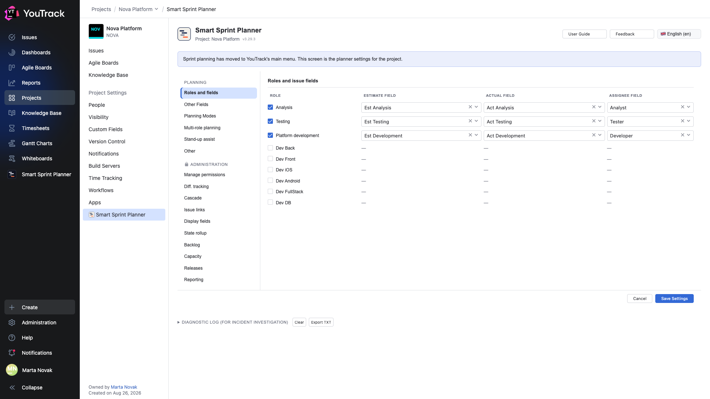

# 01. Where the planner lives and how to open it

The planner has two entry points, and they do different things.

## Entry one: YouTrack's main menu

**Smart Sprint Planner** in YouTrack's left menu is the planning itself. Here you pick a project, pick a sprint and work: build the composition, spread the hours, look at the Gantt chart and the history.

On the left is the **rail** — the tree of the planner's sections. It is the same on every screen and does not change as you move between them. The `«` button above it collapses the rail when a table needs more room.

## Entry two: project settings

**Project Settings → Apps → Smart Sprint Planner** is not planning but *configuration* of the planner for one project: which roles take part, which issue fields hold the estimate and the actual, who is allowed to do what.

The blue bar at the top says exactly that: sprint planning has moved to the main menu, and this screen is the settings. What to do here is covered in [Setup and rollout](../02-setup/).

## Picking a project

The **Project** picker in the rail lists only the projects where the planner is attached and configured and where you have access to it. If a project is missing, either the app is not attached to it or the settings-manager group has not been set — chapter 04 of the setup document.

Switching the project switches the whole screen: sprints, composition, history — each project has its own. The planner never mixes data from different projects.

## The header above the rail

| Item | What it is for |
|---|---|
| **Plugin Settings** | a shortcut to this project's settings; shown only to members of the settings-manager group |
| **User Guide** | a link to this documentation |
| **Feedback** | a link to the product's issue tracker |
| **Language** | the language of the planner's own interface |
| **Planning modules activity status** | an expandable list: which modules are enabled in this project |

## Two languages, two switches

This one is easy to miss and worth remembering: **the planner's language and YouTrack's language are switched separately.**

- **The planner's language** — the picker in the rail header. It affects the planner's own text only and is remembered for you personally.
- **YouTrack's language** — in your YouTrack profile. It drives the sidebar, the breadcrumbs and the names of the project settings sections.

Switch only one and the interface comes out mixed. In this documentation both are switched.

⚠️ After the planner's language changes, the project settings screen does not redraw completely — the section navigation stays in the previous language until the page is reloaded. This is a known defect; reloading the page fixes it.

## Picking a sprint

Below the project picker are the **Current sprint** selector and the **+ New sprint** button. The selector holds live sprints only: closed ones move into the [history](10-history.md) and come back from there when they need editing.

The create button can be unavailable — a project can switch on a ban on creating sprints so that the team does not start a new one before closing the previous. The **Sprint creation lock** toggle is right there.

## Role status chips

Below the sprint selector there is one chip per role: **Draft**, **Composition agreed**, **Distributed**, **Closed**. Roles climb that ladder independently of one another. Details are in chapter [12](12-stages-rights.md).
