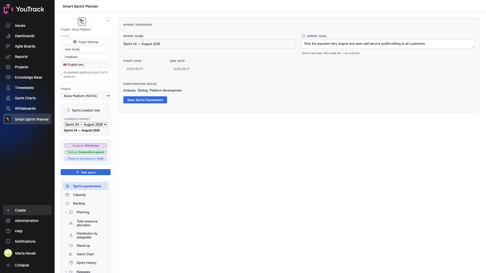

# 02. Sprint parameters

The screen a sprint starts from: its name, its goal, its period and the roles taking part.

## Where

Rail → **Sprint parameters**.

## Fields

| Field | What goes in |
|---|---|
| **Sprint name** | whatever the team calls the sprint: «Sprint 24 — August 2026» |
| **Sprint goal** | one or two lines about the outcome. Not a task list — the reason the sprint exists |
| **Start date** / **End date** | the sprint's period |
| **Participating roles** | which roles take part; taken from the project settings |

There is a single **Save Sprint Parameters** button on the screen — every field is saved at once.

## How dates are set

Click a date field and a calendar opens. The `‹ ›` arrows move between months, **Today** sets the current date, **Clear** wipes the choice.

**Dates cannot be typed in** — only picked from the calendar. That is deliberate: the planner stores dates as calendar days without a time, and parsing free-form input would cause more mistakes than it saves.

## What the goal is for

The sprint goal is shown on the [stand-up](08-standup.md) screen, right above the state sections. The point is that during the daily five minutes everyone can see what all this work is for. The field is optional, but teams that fill it in argue about priorities mid-sprint less often.

The hint under the field says the same thing more briefly: one or two lines, an outcome rather than a task list.

## Creating a new sprint

The **+ New sprint** button in the rail. The dialog asks for a name and a period, after which the sprint appears in the selector as the current one.

The button can be unavailable: the **Sprint creation lock** toggle forbids starting a new sprint before the previous one is closed. The toggle sits right there in the rail, and it can be switched by anyone in the settings-manager group.

## Participating roles

The **Participating roles** line lists this sprint's roles. It is not the project's full role list but exactly those taking part here: a sprint can run without testing if there is nothing in it to test.

The sprint's set of roles is fixed when it is created and stored with the sprint. So if another role is switched on in the project settings later, older sprints will not notice — and the history stays as it was.

## Status chips

Below the sprint selector there is one chip per role:

- **Draft** — the composition is being built;
- **Composition agreed** — the role has confirmed its composition;
- **Distributed** — the issues have been spread across people;
- **Closed** — the role's sprint is over and has moved into the history.

Roles climb that ladder independently: analysis can already be agreed while testing is still a draft. Details are in chapter [12](12-stages-rights.md).
