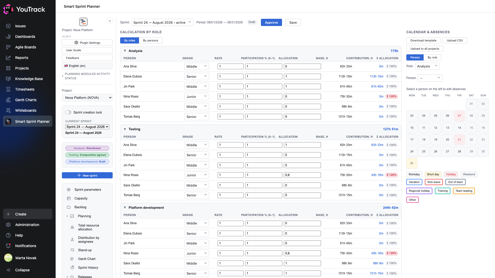

# 03. Capacity

The screen that answers «how many hours does the team actually have». Every other part of planning leans on its numbers.

## Where

Rail → **Capacity**. The section only appears if the project uses a planning model that works the resource out per person (chapter 10 of the setup document).

## Reading the table

The table is grouped by role, and inside a role there is one row per person.

| Column | What it means |
|---|---|
| **Team member** | someone from the project's team |
| **Grade** | Junior / Middle / Senior — feeds the productivity coefficient |
| **Rate** | the share of a full position: `1` is full-time, `0.5` is half |
| **Participation (0–1)** | how much of the person's working time goes to this project |
| **Allocation** | the person's share of time on **this role**: `1` is all of it, `0.6` is sixty per cent |
| **Base, h** | working hours in the sprint's period for this person by the calendar, minus absences |
| **Contribution, h** | the result: base × rate × participation × allocation × grade coefficient |
| **Σ allocation** | the sum of that person's allocations across every role |

The number to the right of the role's name is the **sum of contributions** for that role. That is exactly what becomes the role's resource on the [Total resource allocation](05-allocation.md) screen.

## The red Σ 120 %

When a person's allocations across all roles add up to more than one, the planner marks it red: **Σ 120 %**. It is not a prohibition — there are sprints where someone officially works more than usual — but it is a signal that the resource figure is inflated and cannot be treated as reality.

The same person can take part in several roles: an analyst who tests for part of the sprint contributes to both analysis and testing. The planner supports that; what matters is that the shares add up to something sensible.

## Two views of the table

The **By role / By person** switch changes the grouping only. «By role» answers «how many hours does the role have», «by person» answers «where does this person's time go». The numbers are the same.

## Calendar and absences

The right-hand panel holds the working calendar for the period and people's absences.

- Calendar days are colour-coded: **working day**, **short day**, **public holiday**, **day off**.
- Absences are set per person: **vacation**, **sick leave**, **out of team**, **regional holiday**, **training**, **team lead duty**, **other**.
- To mark an absence, first pick the person in the selector on the left, then click the days.

Every non-working day of a person reduces their **base**, and so their contribution, and so the role's resource. That is the whole point of this screen: the planner does not count «eight people times one hundred and sixty hours», it counts by the calendar.

**Download template** and **Upload CSV** are bulk entry of the calendar and absences from a file. **Load into all projects** copies the calendar into the other projects where the planner is set up — a company usually has one working calendar.

## Draft, Approve, Save

The three buttons at the top mean different things:

- **Save** — write the current numbers down as a draft, without declaring them final.
- **Approve** — fix the sprint's capacity: from that moment the calculation counts as agreed.
- The **Draft** chip on the left shows the current state.

While capacity is a draft you can still plan against it — everyone simply knows the numbers may still move.

## Where the grade coefficient comes from

The Junior / Middle / Senior coefficients are set in the project settings, in the Capacity section. The planner does not invent them and does not substitute industry values: if a project decides that a junior and a senior count the same, that is what happens.
