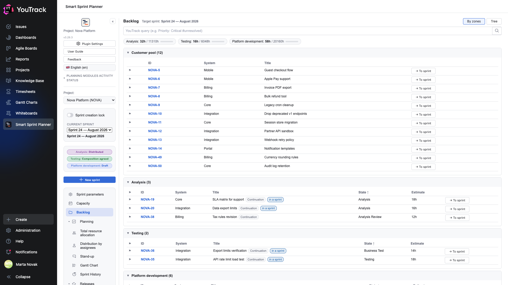
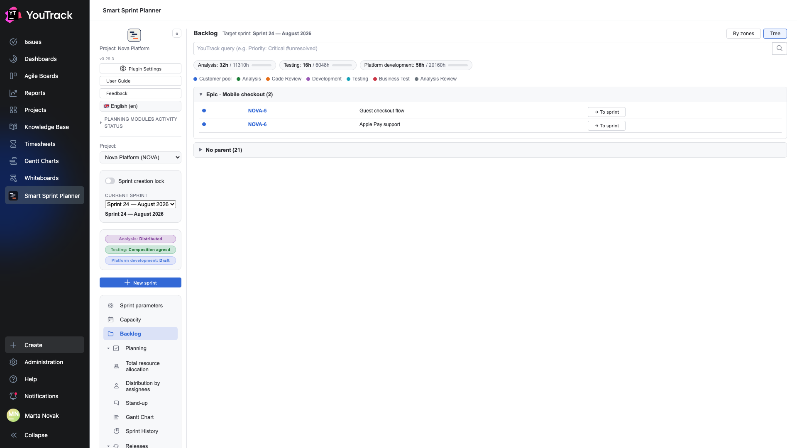

# 04. Backlog

The screen issues arrive into the sprint from. Before it, the sprint is empty.

## Where

Rail → **Backlog**. The section appears if the backlog module is switched on in the project settings.

## Pool and zones

The planner asks YouTrack for the project's issues and lays them out into two kinds of section.

- **Customer pool** — issues in the starting states: work has not begun. This is the incoming queue.
- **Zones** — sections by pipeline state: Analysis, Analysis Review, Development, Code Review, Testing, Business Test. Each zone is bound to a role, and that binding comes from the project settings, not from the state's name.

This split answers «what is in flight and with whom» rather than merely «which issues exist».

## The bars at the top

Under the query line there is one bar per role: **how many hours are already in the sprint** and **how many hours that role has in the backlog in total**. The bar shows how much of the queue the sprint has eaten.

## The YouTrack query line

The **YouTrack query** field takes the tracker's ordinary search syntax: `Priority: Critical #unresolved`. The query is added to the project's scope rather than replacing it — it cannot pull issues from elsewhere.

It is the fastest way to filter a long pool: by system, by priority, by tag.

## The «→ To sprint» button

The button at the end of a row sends the issue into the sprint composition of the role its zone belongs to. An issue from the customer pool lands in the role matching its state.

After that the issue appears in the [role's composition](06-role-card.md), and hours are set for it there.

## Labels on issues

| Label | What it means |
|---|---|
| **Continuation** | the issue was already in the previous sprint and carries on |
| **in a sprint** | the issue is already in the current sprint |
| the flag on the left | the issue's priority, in YouTrack's colour |

## The Tree view

The **By zones / Tree** switch in the top right changes how issues are laid out.

**Tree** groups issues by the hierarchy of links: an epic's children sit under it, everything else goes into «No parent». Useful when the backlog is built from large pieces of work and you need to see what they consist of.

The dot legend above the tree tells you which zone each issue is in: the colour of the dot to the left of an issue matches its zone.

⚠️ The tree shows the **pool**, not the whole project. If an epic's child has a type outside the pool's type filter, it will not appear in the tree and the epic will look empty. The type filter is set in the backlog settings.

## The orange «Unmapped states» bar

The planner compares the project's list of states with its own layout and says plainly when a state has been left out: not a zone, not a starting state, not a pause and not a resolved state of YouTrack.

This is not an error but a reminder to finish the setup: issues in such a state land in no section at all and simply disappear from the screen.

## Pauses

States and tags marked as «pause» in the settings are singled out: the issue is formally in progress but the team is not moving it — waiting for a vendor, an answer, someone else's release. In reporting these intervals are subtracted from cycle time.
