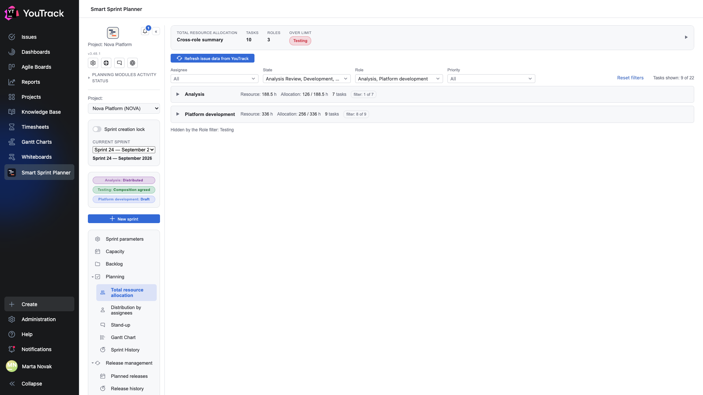

# 05. Total resource allocation

The main planning screen. This is where you see whether the work fits into the sprint.

## Where

Rail → **Planning → Total resource allocation**.

## The header

The top panel summarises the whole sprint: how many **tasks**, how many **roles**, and which roles are **over limit**. The triangle on the right expands the cross-role summary table.

## A role's row

Each role is one collapsed row:

| Item | What it means |
|---|---|
| **Resource: 336 h** | how many hours the role has — taken from the [Capacity](03-capacity.md) screen |
| **Allocation: 256 / 336 h** | how much of that resource the role has already planned |
| **9 tasks** | how many issues are in the role's composition |
| **Over limit** | a red marker: allocation has passed the resource |

**Over limit is not a block.** The planner does not stop a team from over-promising; it stops them from over-promising *unnoticed*. The decision is the team's: drop an issue, cut an estimate, or knowingly go negative.

## The «Refresh from task» button

The button above the role list re-reads the issues in YouTrack and updates what the planner stores about them: state, priority, estimate, assignee, state colour.

Press it when the team has been working in the tracker rather than in the planner: states have moved, estimates have changed, and the sprint composition does not know about it yet.

⚠️ The button refreshes the **current role**. With three roles, refreshing all of them means pressing it in each.

## Filters

Below the button sits a filter row: **Assignee**, **State**, **Role**, **Priority**. Each takes several values: within a field it is «any of the ticked», between fields it is «and». The filter applies to the summary table and to every role's composition at once.

| Item | What it means |
|---|---|
| **Tasks shown: N of M** | how many of the sprint's issues pass the filter |
| **filter: N of M** on a role's row | the role table shows only part of the composition; resource, allocation, issue count and «Over limit» are still counted over the whole composition |
| **Hidden by the Role filter: …** | roles left out by the Role filter are hidden entirely |
| **No tasks match the selected filters** | the table is empty because of the filter, not because the composition is |
| **Reset filters** | bring everything back |

The lists offer only values present in the sprint's issues; states and priorities follow YouTrack's order. Assignee appears only when the planning model has assignees; «Unassigned» picks issues with no assignee.

The filter changes no data and is stored nowhere: the selection lives until the page is reloaded, is shared with the [Assignee distribution](07-assignees.md) screen, and resets when you switch projects.

## An expanded role card

Clicking a role's row expands it fully: planning status, resource, remainder and the issue table. Details are in chapter [06](06-role-card.md).

## Where the hours come from

The planner does not invent hours. Every role has an **estimate field** named in the project settings — `Est Development`, for instance. The role's allocation for an issue is read from that field on the YouTrack issue.

Hence the main rule: **if the estimate is not filled in on the issue, it will not be in the planner either.** An empty allocation on screen is almost always an empty field in the tracker, not a planner failure.

## What counts as the remainder

**Remainder = role resource − sum of allocations.** A negative remainder is highlighted red and produces the «Over limit» marker.

The remainder is recomputed by the **Σ Recalculate remainder** button inside a role card — useful when hours have been edited by hand and you want the balance settled without saving.
