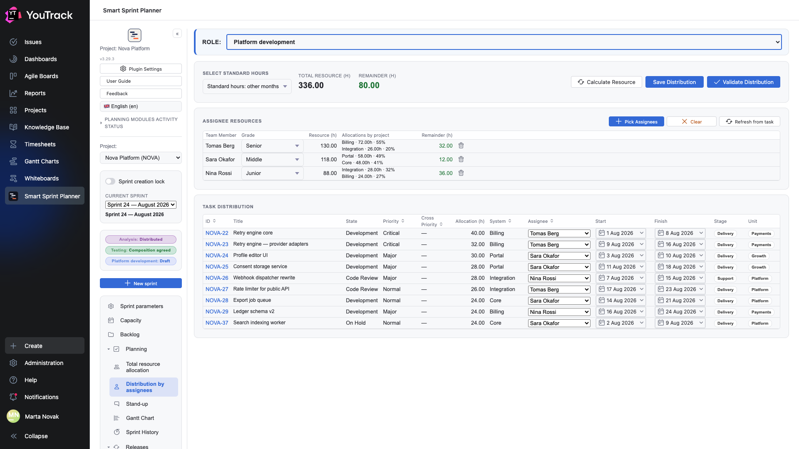

# 07. Distribution by assignees

The second step: the role's hours are already gathered, now they have to be spread across people and days.

## Where

Rail → **Planning → Distribution by assignees**. The role is chosen with the **Role** picker at the top.

## The calculation header

| Field | What it means |
|---|---|
| **Select standard hours** | which month's norm to count by: January, May or other months |
| **Total resource (h)** | the role's resource in full |
| **Remainder (h)** | how much is still unassigned |
| **Calculate Resource** | recompute people's resources against the norm and the calendar |
| **Save Distribution** | write the layout down |
| **Validate Distribution** | check it and move the role to the «distributed» rung |

## Assignee resources

The upper table holds the people picked for this role.

| Column | What it means |
|---|---|
| **Team member** | the person |
| **Grade** | Junior / Middle / Senior |
| **Resource (h)** | how many hours this person has for this role |
| **Allocations by project** | where their time goes, with shares: `Billing · 72.00h · 55%` |
| **Remainder (h)** | how much of them is still free |

**+ Pick Assignees** opens the people picker, **Clear** removes everyone, **Refresh from task** re-reads the issue data.

The «Allocations by project» column is the most useful one in a planning meeting: it shows at once that a person is not «half free» but torn between three systems.

## The task distribution table

The lower table holds the role's issues, one row each.

| Column | What it means |
|---|---|
| **ID**, **Title** | the issue |
| **State**, **Priority**, **Cross priority** | from the tracker |
| **Allocation (h)** | the role's hours for this issue |
| **System** | which system it belongs to |
| **Assignee** | a dropdown: who does it |
| **Start**, **Finish** | the dates the work runs between |
| **Spent time** | how much has been logged in YouTrack |

Dates are picked from a calendar — the same dates the [Gantt chart](09-gantt.md) draws later.

## How a person's remainder is worked out

**A person's remainder = their resource − the sum of allocations of issues where they are the assignee.** So assigning an issue changes two numbers at once: the person's remainder and the role's overall remainder.

## The hours norm

The **Select standard hours** picker exists because months are unequal: January and May are shorter than usual in the working calendar. The choice feeds the recalculation behind the «Calculate Resource» button.

## Validating the distribution

**Validate Distribution** moves the role to the **Distributed** rung. From that point every issue of the role is considered to have an owner and dates.

The right to validate belongs to a group named in the project settings. «Save Distribution» is available more widely: an editor can save a draft.
