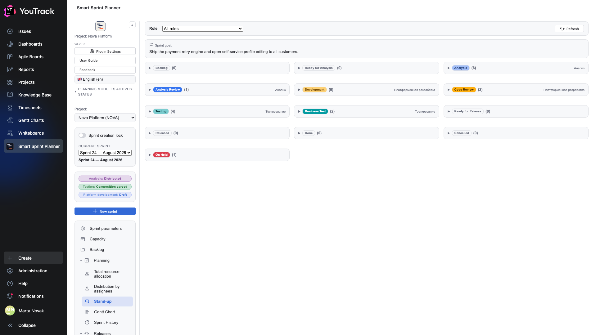

# 08. Stand-up

A screen for the daily five minutes: one page showing where all the sprint's work stands.

## Where

Rail → **Planning → Stand-up**. The section appears if the stand-up assist module is switched on in the project settings.

## How the screen is built

At the top is the **sprint goal**, the one set in the [parameters](02-sprint-params.md). It is not decoration: a stand-up keeps to the point more easily when the reason for the sprint is written above it.

Below are **sections by state**. One section per state of the project's flow, in the flow's order: Backlog → Ready for Analysis → Analysis → Analysis Review → Development → Code Review → Testing → Business Test → Ready for Release → Released → Done → Cancelled → On Hold.

Each section shows:

- the **state chip** — in the state's own colour from YouTrack;
- the **issue count** in brackets;
- the **owning role** on the right — whose zone this is by the settings.

The triangle on the left expands a section and shows the issues themselves.

## The role picker

**Role** at the top narrows the screen to a single role. «All roles» is the view for a whole-team stand-up; a specific role is for a stand-up inside one discipline.

## The Refresh button

Re-reads the issues' states from YouTrack. A stand-up happens in the morning, when things may have moved overnight — the button is needed nearly every time.

## Empty sections

Sections with zero issues are not hidden. That is deliberate: an empty «Code Review (0)» is information too — it says nothing is waiting for review. Individual states can be hidden through the settings (chapter 12 of the setup document).

## How this differs from an Agile board

A YouTrack board shows **issues** and lets you drag them. The planner's stand-up shows **the spread across states in terms of the sprint's roles** and moves nothing: it is a screen for a conversation, not for work.

The second difference matters more: the stand-up knows the planner's sprint composition. An issue that is not in the composition will not appear here, even if it exists in the project and sits in that state.
