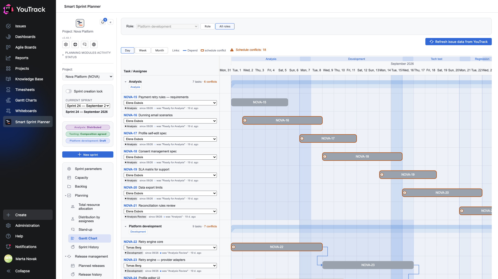
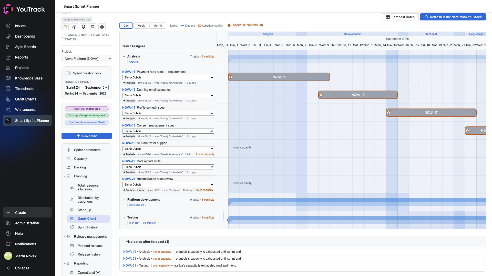

# 09. Gantt chart

The sprint laid out in time: who does what, when, and what depends on what.

## Where

Rail → **Planning → Gantt chart**. The role is chosen with the **Role** picker at the top; the **Role | All roles** buttons next to it switch the chart from one role to the whole sprint (see [All roles](#all-roles)).

## Where the bars come from

A bar is drawn from the **start** and **finish** dates set on the [Distribution by assignees](07-assignees.md) screen. An issue without dates stretches across the whole sprint.

A bar's colour is the issue's state colour from YouTrack. That makes the chart readable as a snapshot: yellow bars are development, orange is review, red is an issue on hold.

## The row on the left

Under the issue number sit the assignee and the **state badge**: a chip with the current state, the date it entered that state, and the previous one. That answers «how long has it been sitting like this» without opening the tracker.

## Zoom levels

The **Day / Week / Month** buttons change the axis step. Day is for a sprint; month is for seeing the whole picture when issues stretch out.

## Dependency arrows

When issues have dependency links configured, the planner draws an arrow between the bars: from the predecessor to the successor. A **legend** appears above the chart showing which colour belongs to which link type.

Link-type roles are set in the project settings (chapter 16 of the setup document): the planner does not guess from a type's name but reads the «type × role» table. So the chart shows exactly the links the team considers dependencies, not everything at once.

**A predecessor outside the sprint** gets no arrow — there is nothing to draw from. Instead a marker appears on the issue's row with its number and state: the work depends on something that is not in this sprint.

## Dragging dates

A bar can be dragged with the mouse and the issue's dates change. Rights are checked at the moment you let go: anyone without edit rights sees the bar snap back.

It is the same write channel as the calendar on the distribution screen — the data is one and the same.

## The «Refresh issue data from YouTrack» button

Re-reads states, colours and links. Needed after something changes in the tracker: the chart does not poll YouTrack on a timer.

## All roles

**All roles** shows the sprint as one picture: a track per role, the role’s issues inside it. The mode and the zoom are remembered; a Share link to this node opens the same mode for the recipient (YouTrack 2026.1 and later).

**A track** has a header with a caret, task and conflict counts and the role’s phase chips; its summary bar spans the track’s issues. The caret collapses the track until reload, and its arrows move to the summary bar. **A task row** carries the key and title, the assignee as a list of the role’s people, and the state with the transition history.

**Task chain.** When one issue is in several roles, its bars are joined by a grey dashed arrow. The role order follows the work phases when phases are on and roles are bound to them (roles without a phase take the built-in order relative to the bound ones); otherwise it is analysis → development → testing.

**Schedule conflicts** are a hint, not a block. “Starts before predecessor ends” — the issue starts no later than the day its predecessor ends, by a dependency link (a predecessor in any role) or along the chain. “Outside the role’s phase” — the bar goes beyond the dates of its role’s phases (only with phases on). A conflicting bar is outlined and marked “!”, with the reasons in its tooltip; a “Schedule conflicts: N” counter sits above the chart. Only issues with their own dates are checked.

**Phase bands** are work phase segments on the timeline, accented in the tracks of their roles; the phase names sit in the header.

**Editing.** A bar of any track can be dragged and the assignee picked in its row: the change is written to that track’s role. The rights are the same as in the Role mode; if the server refuses, the screen returns to the saved state.

**A past sprint** opens read-only with a “History · … · read-only” chip; a role without a snapshot shows a “no snapshot” track.

## Forecast across all roles

The **“Forecast dates”** button in “All roles” mode (shown with “Auto-forecast dates” on; editor rights required) schedules every sprint role at once: an issue waits for its predecessors — by a dependency link and along the chain (the same issue in the previous role), each person has a queue in each role, and capacity, the calendar and absences work as in the role forecast. When assigned issues already have dates, the planner asks for confirmation — the dates will be overwritten for all sprint roles. Only dates are written.

- **waiting for {issue} · {role}** — the predecessor has no dates, for example the analysis of the same issue is not assigned to anyone;
- **over capacity** — the person’s capacity is exhausted until sprint end;
- **No dates after forecast (N)** — a block under the timeline: issue, role, reason; open right after the forecast;
- **Link cycle: …** — the issues depend on each other; their dates are set as for independent issues.

The marks and the block last until reload. An issue without an assignee gets no dates and holds the issues depending on it.

## Epic groups

When issues in a track share a parent (the “Hierarchy” role of the links screen) and the parent is in the sprint in at least one role, the subtasks are grouped under it: the parent row with a caret and an **“epic · N subtasks”** chip, indented subtasks, the parent bar spanning the subtasks’ dates. In its own role the parent stays a full row — the assignee and state are edited like for any issue; in another track it carries a **“parent in role “X””** mark instead. The caret collapses the group and its arrows move to the parent bar. A parent outside the sprint leaves the subtasks flat.
