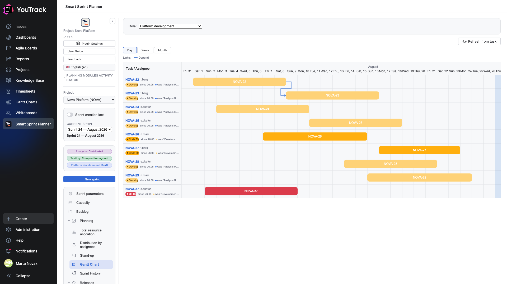

# 09. Gantt chart

The sprint laid out in time: who does what, when, and what depends on what.

## Where

Rail → **Planning → Gantt chart**. The role is chosen with the **Role** picker at the top — the chart always shows one role.

## Where the bars come from

A bar is drawn from the **start** and **finish** dates set on the [Distribution by assignees](07-assignees.md) screen. An issue without dates does not appear on the chart — there is nowhere to draw it.

A bar's colour is the issue's state colour from YouTrack. That makes the chart readable as a snapshot: yellow bars are development, orange is review, red is an issue on hold.

## The row on the left

Under the issue number sit the assignee and the **state badge**: a chip with the current state, the date it entered that state, and the previous one. That answers «how long has it been sitting like this» without opening the tracker.

## Zoom levels

The **Day / Week / Month** buttons change the axis step. Day is for a sprint; month is for seeing the whole picture when issues stretch out.

## Dependency arrows

When issues have dependency links configured, the planner draws an arrow between the bars: from the predecessor to the successor. A **legend** appears above the chart showing which colour belongs to which link type.

Link-type roles are set in the project settings (chapter 16 of the setup document): the planner does not guess from a type's name but reads the «type × role» table. So the chart shows exactly the links the team considers dependencies, not everything at once.

**A predecessor outside the sprint** gets no arrow — there is nothing to draw from. Instead a marker appears on the issue's row with its number and state: the work depends on something that is not in this sprint.

## Dragging dates

A bar can be dragged with the mouse and the issue's dates change. Rights are checked at the moment you let go: anyone without edit rights sees the bar snap back.

It is the same write channel as the calendar on the distribution screen — the data is one and the same.

## The «Refresh from task» button

Re-reads states, colours and links. Needed after something changes in the tracker: the chart does not poll YouTrack on a timer.
