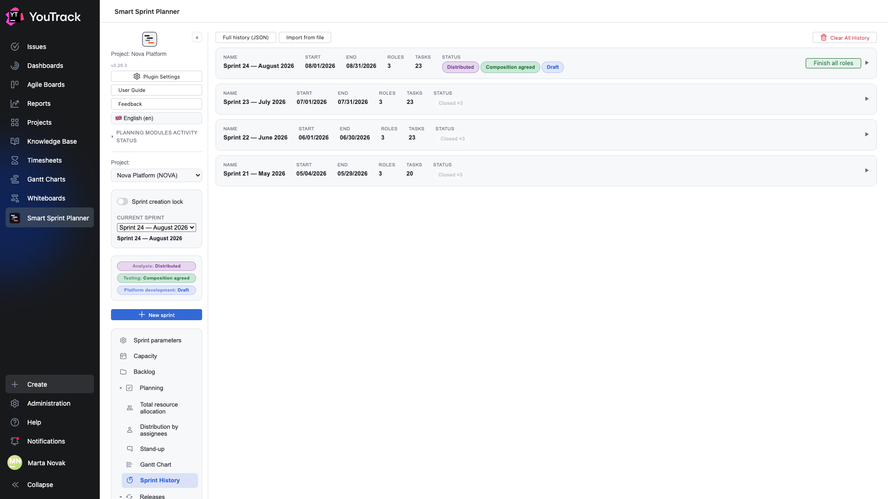

# 10. Sprint history

The project's list of sprints: the active one on top, closed ones below. This is where sprints are closed, exported and, when needed, brought back for editing.

## Where

Rail → **Sprint history**.

## A sprint's row

| Column | What it shows |
|---|---|
| **Name** | what the sprint was called |
| **Start**, **Finish** | the period |
| **Roles** | how many roles took part |
| **Tasks** | how many issues were in the composition |
| **Status** | chips per role: one each for an active sprint, «Closed ×3» for a closed one |

The triangle on the right expands the record: composition by role, hours, who changed it and when.

## The «Finish all roles» button

On the right of the active sprint. It moves every role into **Closed**: the sprint goes into the history and its composition is frozen as a snapshot.

A snapshot is not a link to the issues but a copy of their state at the moment of closing. So when the issues later move on in the tracker, the sprint's history stays as it was at closing time. All of [reporting](../03-reporting/) rests on that property: Velocity and Spillover count from snapshots, not from the current state.

## Export

- **All history (JSON)** — export the project's whole history as one file.
- Inside an expanded record there is an export of that single sprint to Excel and JSON.
- **Import from file** — load history back: moving between instances, restoring.

## Bringing a sprint back for editing

A closed sprint can be returned to work from its expanded record. That is needed when a role was closed too early or a mistake is found in the composition.

Returning is a visible operation: it changes data that reports may already have been built from. The right to do it is granted separately.

## «Clear all history»

The red button in the top right. It wipes the project's sprint history completely and irreversibly.

The right to it is granted to a separate group in the project settings — deliberately, so that the button is not within reach of everyone who can open the planner.

## What goes into a snapshot

- the issue composition by role with estimates, actuals and allocations;
- role resources and remainders;
- the distribution across assignees and the dates;
- the issues' states at the moment of closing.

That is the minimum needed to answer «what did we promise and what did we deliver» later, without relying on the issues in the tracker having been left untouched.
