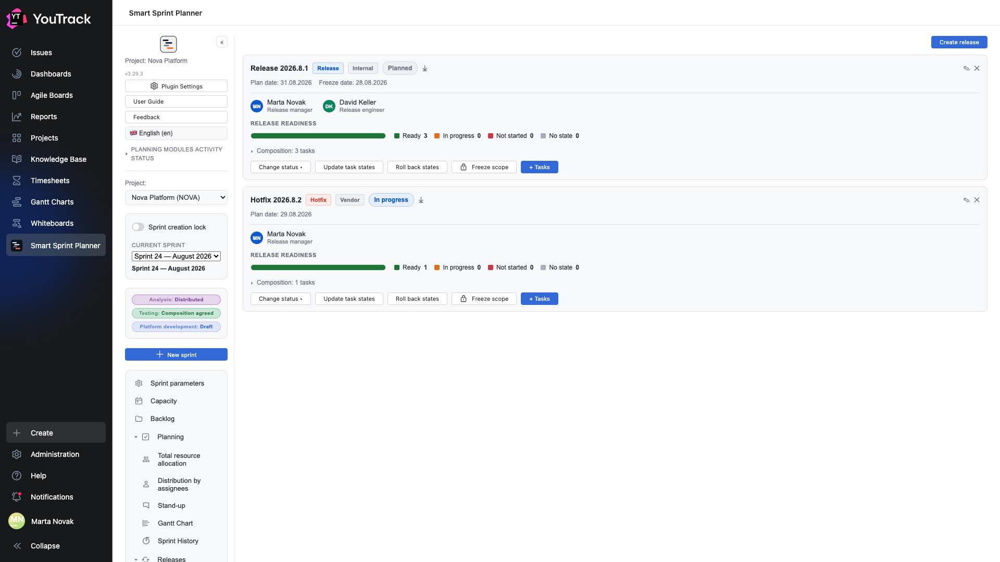
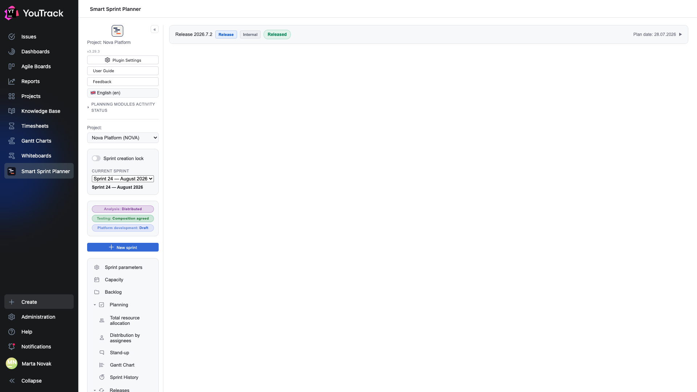

# 11. Releases

This module answers «what are we shipping and is it ready». A sprint and a release are different things: a sprint is about the team's time, a release is about delivery.

## Where

Rail → **Releases** → **Planned releases** and **Release history**. The section appears if release management is switched on in the project settings.

## Planned releases

Each release is a card.

**The card's header:** name, **kind** (release / hotfix), **source** (internal / vendor), **status** (planned / in progress / released) and an **Overdue** marker if the planned date has passed.

**Dates:** the planned ship date and the **freeze date** — from which the release's composition is not changed.

**Owners:** the release's roles — release manager, release engineer. Taken from the project's team.

### The readiness bar

**Release readiness** is a traffic light across the composition's issues:

| Zone | What it means |
|---|---|
| **Ready** | the issue is in a state marked as shipped or resolved |
| **In progress** | the issue is in an intermediate state |
| **Not started** | the issue is in a starting state |
| **No state** | the issue's state is not mapped to any zone |

Readiness is worked out automatically from issue states and the mapping in the settings. A release has no separate «readiness» field — such a field would always lie.

### The card's buttons

- **Change status** — move the release along planned → in progress → released.
- **Update task states** — re-read the composition's states from YouTrack.
- **Roll back states** — return the issues to the states they had before a bulk transition. Needed when a release falls through.
- **Freeze scope** — forbid changes to the composition.
- **+ Tasks** — add issues to the release.

### Composition

The **Composition: 3 tasks** line expands into a list. An issue can be in a sprint and in a release at the same time — they are different views of the same work.

## Release history

Shipped releases move here. A record expands and shows the composition as it was at ship time — the same way sprint history keeps a snapshot.

## Automatic tags

If release tags are switched on in the settings, the planner puts a tag on the composition's issues when the release's status changes. That leaves a trace in YouTrack: the tag shows which release an issue went out with, even outside the planner.
