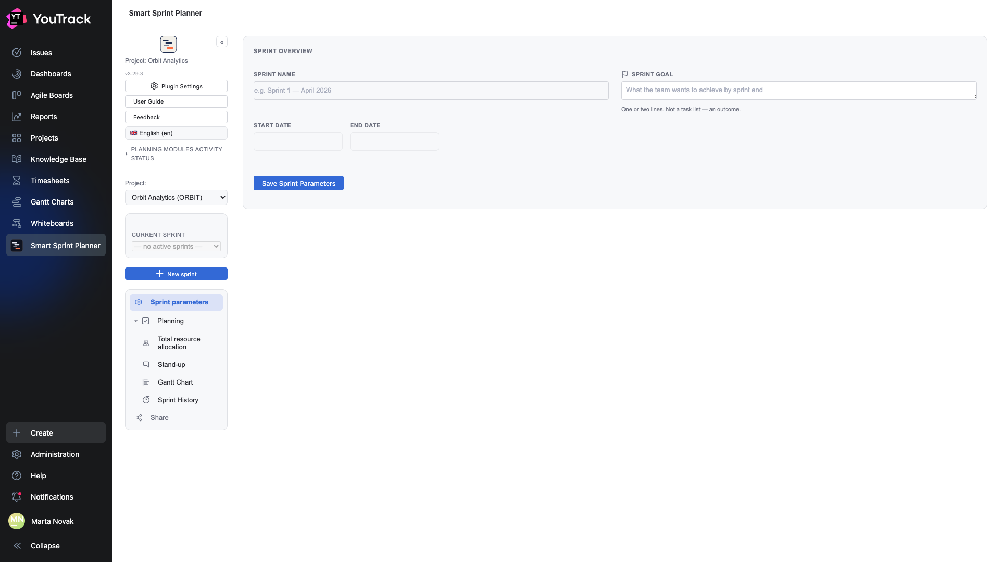
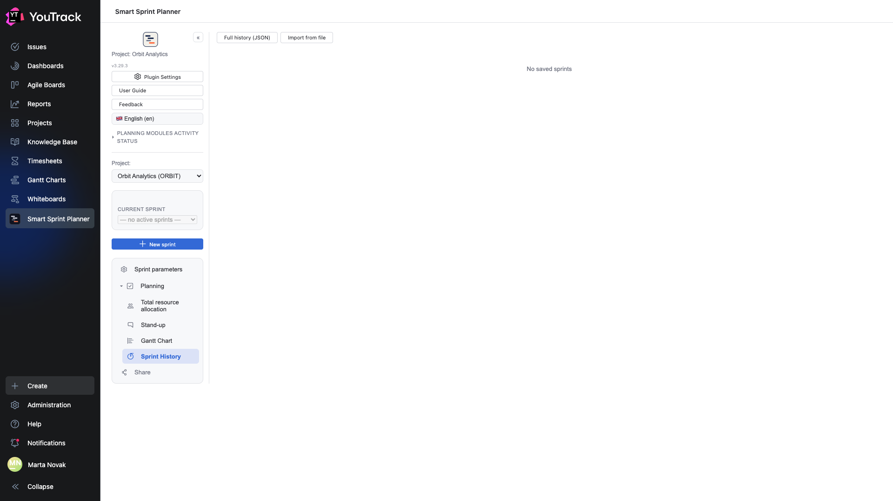
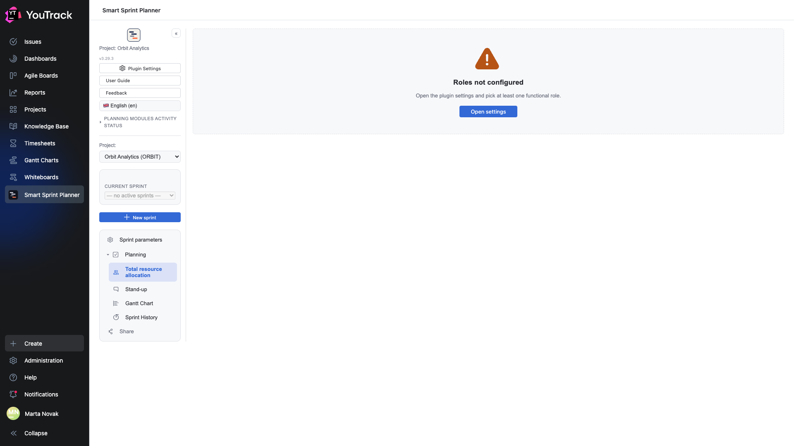

# 13. Day one on a new project

What you see if you open the planner in a project it has only just been attached to. Three empty screens — and each one says what is missing.

## Before setup: read-only mode

The yellow bar: **the project admin must set the settings-management group**. Until then the planner runs read-only — it reads and displays, but refuses every write.

There are no administration sections in the list on the left: with no group assigned, there is nobody to configure anything.

This is protection, not breakage: a freshly attached project should not configure itself. How to set the group — chapter 04 of [Setup and rollout](../02-setup/).

## No sprints yet

The sprint selector shows **«— no active sprints —»**, the parameter fields are empty, and the placeholders hold examples: «e.g. Sprint 1 — April 2026».

Notice the **rail**: it is shorter than usual. There is no Capacity, no Backlog, no Releases and no reporting — those sections appear only when the matching modules are switched on in the project settings. The planner does not show sections with nothing behind them.

## An empty history

**No saved sprints** — the history fills up with closed sprints, and there is nothing to close yet.

The **All history (JSON)** and **Import from file** buttons work even on an empty history: importing is a legitimate way to move history from another instance or restore it from an export.

## Roles not configured

The most common obstacle on the first step. The planner lays work out by role, and until at least one role is chosen there is nothing to lay it out by.

The screen does not leave you guessing: **«Open the plugin settings and pick at least one functional role»** with an **Open settings** button right there.

## The order this is fixed in

1. Set the **settings-management group** — otherwise nothing will save.
2. Choose the **roles** and the estimate/actual fields for each.
3. Switch on the **modules** you need: capacity, backlog, stand-up, releases, reporting.
4. Create the **first sprint**.

Step by step — the [Setup and rollout](../02-setup/) document.
