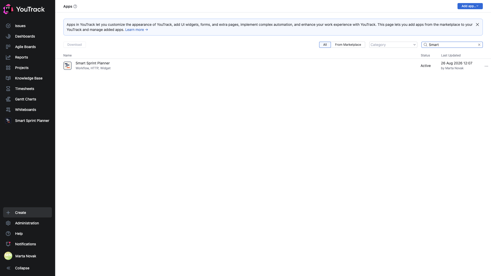
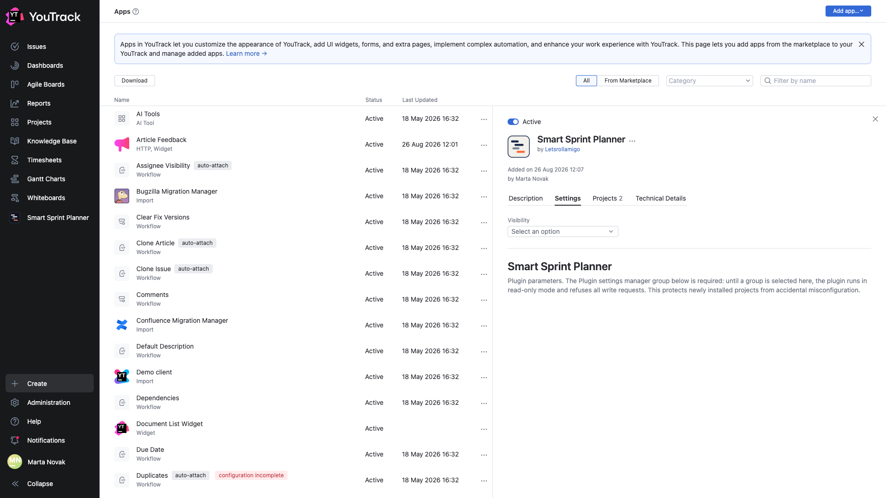

# 02. Installing the app

**Required, once per YouTrack.** The app is installed by a YouTrack administrator and is then available to every project on the instance.

If the planner is already installed in your YouTrack, go to chapter [03](03-attach.md).

## Two ways to install

| Way | Who it suits |
|---|---|
| **JetBrains Marketplace** | the ordinary path: the app arrives and updates through YouTrack itself |
| **A zip from GitHub Releases** | when you need a version sooner than marketplace review passes it, or the instance has no internet access |

From the marketplace: **Administration → Apps → Add app → From Marketplace**, find «Smart Sprint Planner», install.

From a zip: download `Smart-Sprint-Planner-vX.Y.Z-marketplace.zip` from the [Releases](https://github.com/Letsrollamigo/smart-sprint-planner/releases) page, then **Administration → Apps → Add app → Upload zip**.

## Checking that it installed

**Administration → Apps**, filter by name — «Smart».

The app's row shows what it consists of — **Workflow, HTTP, Widget** — and the status **Active**. Those three parts mean: workflow rules, a server side and interface widgets.

## The app card

Clicking the row opens the card.

| Tab | What is there |
|---|---|
| **Description** | what the app does |
| **Settings** | instance-level parameters |
| **Projects** | which projects the app is attached to; attaching happens here |
| **Technical Details** | version, author, contents |

## Updating

An update is installed over the top the same way — from the marketplace or by uploading a new zip. Project data is untouched by an update.

🔴 **Do not delete the app to «reinstall it cleanly».** Deleting the app from YouTrack wipes all of its data in every project: sprints, history, settings. An update installs over the top; nothing needs deleting for it.

## Requirements

- YouTrack **2024.3** or newer.
- YouTrack administrator rights to install. Configuring a particular project only needs project administrator rights.
