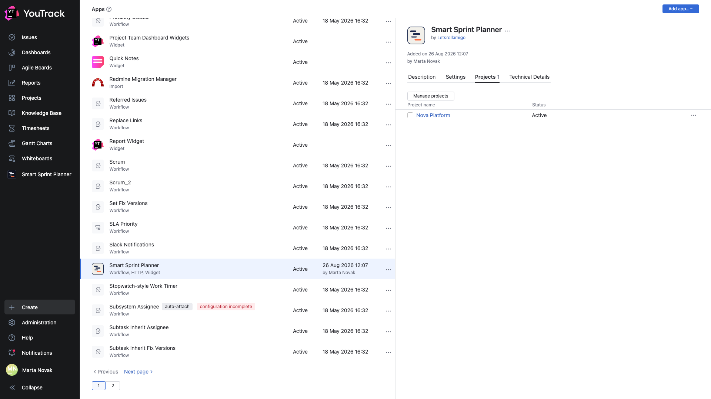
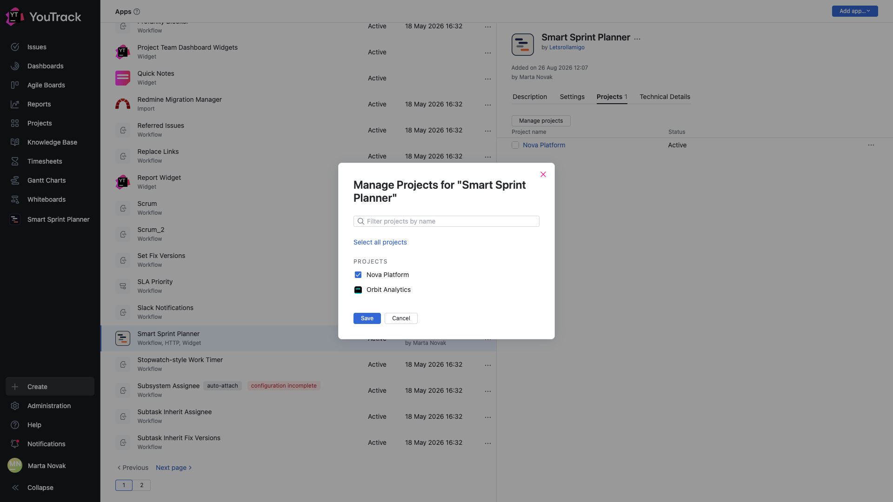
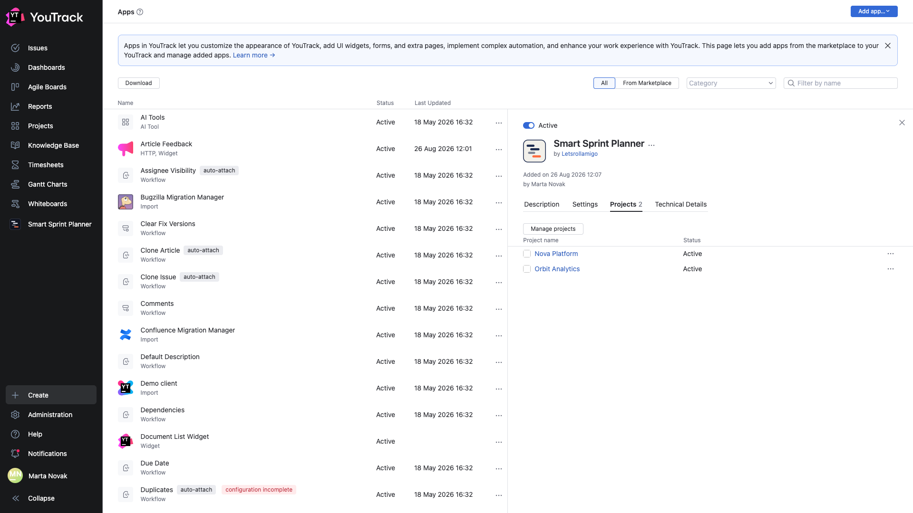

# 03. Attaching the planner to a project

**Required.** An installed app is not bound to any project by itself. Attaching is a separate step, done from the app's card.

## Where

**Administration → Apps → Smart Sprint Planner → the Projects tab**.

While the app is attached nowhere, the list is empty and the counter next to the tab's name shows zero.

## How to attach

The **Change the list of projects** button opens a dialog listing every project on the instance.

Tick the projects you need and save. The filter at the top helps when there are many; **Select all projects** ticks everything at once — worth doing only if the planner really is needed everywhere.

After saving, the projects appear in the list with the **Active** status and the tab's counter shows how many.

## What attaching does

Attaching does three things:

1. a **Project Settings → Apps → Smart Sprint Planner** section appears in the project;
2. the project starts showing up in the planner's project picker in the main menu;
3. the app's workflow rules start running on the project's issues.

It creates no settings: in a freshly attached project the planner runs read-only until the settings-management group is set — chapter [04](04-manager-group.md).

## Detaching

Untick the box in the same dialog. Detaching removes the settings section and hides the project from the picker, but **the planner's data in the project is kept**: attach it back and everything is there.

🔴 This is fundamentally different from **deleting the app** from YouTrack: deleting wipes the data in every project at once and irreversibly.

## Attach everything at once, or one at a time?

One at a time. Every attached project starts executing the app's workflow rules, and teams that do not use the planner will see an extra settings section. Attach as you roll out.
