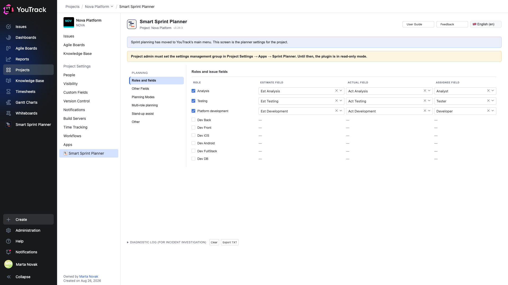
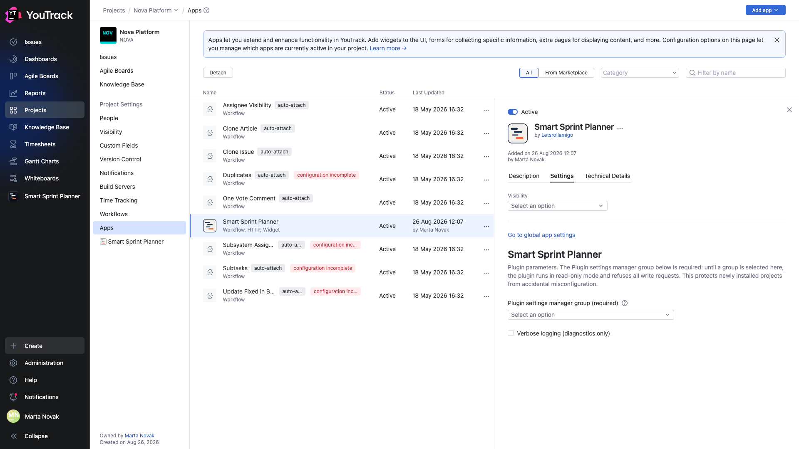

# 04. The settings-management group

**Required. Without this step the planner does not work** — it reads and displays, but refuses every write.

## What it looks like before this step

Open **Project Settings → Apps → Smart Sprint Planner** in a freshly attached project.

The yellow bar says it plainly: the project admin must set the settings-management group; until then the plugin is read-only.

There is no **ADMINISTRATION** block in the list on the left at all — there is nobody to open it for.

## Why it works this way

An app is attached to a project with one move by a YouTrack administrator, often in bulk. If a freshly attached planner allowed writing straight away, anyone who opened the settings screen could change the role fields and the capacity model — and nobody would notice.

The gate moves the decision to where it makes sense: the project admin explicitly names a group they trust with the configuration.

## Where it is set

**Project Settings → Apps → Smart Sprint Planner → the Settings tab**.

This is YouTrack's own form, not the planner's — which is why it is in English regardless of the interface language.

The **Plugin settings manager group (required)** field is a dropdown of YouTrack groups. Pick a group and save.

The second checkbox, **Verbose logging (diagnostics only)**, turns on a detailed diagnostic log. Keep it off: it is only for investigating an incident.

## What changes after saving

The yellow bar disappears and an **ADMINISTRATION** block appears in the list on the left with all its sections: permissions, differentiated tracking, roll-ups, links, display fields, backlog, capacity, releases, reporting.

From that moment the planner accepts writes — but only from members of the named group.

## Who belongs in the group

The people responsible for how the process is arranged: the team lead, the head of the discipline, whoever runs YouTrack in the department. Usually two or three people, not the whole team.

The settings-management group is not the same thing as planning rights: sprints are built and validated by other people, and their permissions are granted separately in chapter [09](09-permissions.md).

## Frequently asked

**Is the group set per project?** Yes. It is an app parameter inside a particular project.

**Can the group be changed later?** Yes, in the same form. Clearing the field and saving puts the planner back into read-only.

**Why is the form in English when the interface is not?** It is YouTrack's standard app-parameters form: it is generated from a schema and is not localised by the app.
