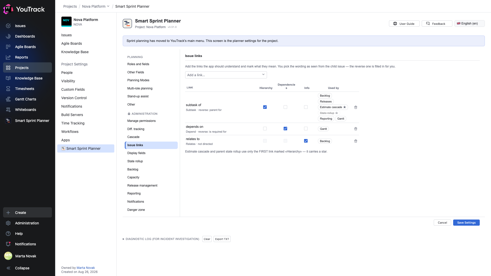

# 16. Issue links

**Optional, but several other modules read it — the «Used by» column shows which.** This section explains to the planner what each of YouTrack's link types means.

## Where

**Project Settings → Apps → Smart Sprint Planner → ADMINISTRATION → Issue links**.

## The problem it solves

In YouTrack link types are named freely and get renamed. The planner needs to know not the name but the meaning: this link is hierarchy, that one is a dependency, this other one is merely information.

## The «link type × role» table

A row is a link type from your YouTrack, the columns are three roles:

| Role | What it means | Who uses it |
|---|---|---|
| **Hierarchy** | a parent-child link | the backlog tree, the release scope, the estimate roll-up, the state roll-up, the TTM report (stories under an epic), epic groups on the Gantt chart in «All roles» mode |
| **Dependencies** | a predecessor-successor link | arrows on the Gantt chart; in «All roles» mode also schedule conflicts and the cross-role date forecast |
| **Info** | a link with no structural meaning | the backlog: a marker with the number of related issues; does not affect calculations |

Hierarchy and dependency also need a **side**: which end of the link holds the parent or the predecessor. The phrase picker shows your instance's actual wordings — «parent for», «is required for» — so there is nothing to guess.

## The «Used by» column

Next to each link the table lists the modules that read it: Backlog, Releases, Estimate cascade, State rollup, Reporting, Gantt. A module that is off in the project is crossed out — the link is set up, but nothing reads it yet. Estimate cascade and State rollup take only the **first** link marked «Hierarchy»; it carries a star. Gantt has no switch of its own: it always reads every Hierarchy link (epic groups in «All roles» mode) and every dependency (arrows).

A typical configuration:

| Link type | Hierarchy | Dependencies | Info |
|---|---|---|---|
| Subtask | source | | |
| Depend | | source | |
| Relates | | | ✓ |

## Why by name rather than by id

Link-type ids differ between YouTrack instances. The setting stores the type's **name**, so it can be moved between instances along with the rest of the project's settings.

⚠️ The flip side: rename a link type in YouTrack and the setting has to be corrected.

## Arrow colours on the Gantt chart

Every link type marked as a dependency gets its own colour, and the planner draws a legend above the chart. One picture then shows that one arrow is a hard dependency and another is «preferably after».

## What happens with nothing configured

The planner falls back to a sensible default: hierarchy by the built-in `Subtask` type (plus the historical `subtask of` phrase), dependency by `Depend`, information by `Relates`. It works — right up to the first renamed type.
