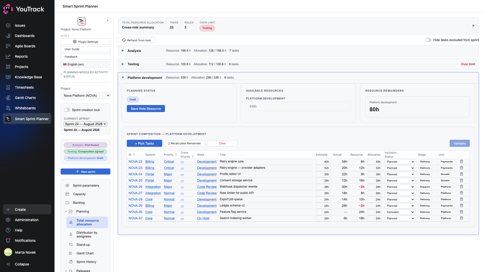

# 17. Display fields

**Optional.** This section lets you bring any of your project's fields into the issue tables.

## Where

**Project Settings → Apps → Smart Sprint Planner → ADMINISTRATION → Display fields**.

## How it works

A list of fields, each with three checkboxes: which tables to show it in.

| Checkbox | Where the column appears |
|---|---|
| **Summary** | the cross-role allocation summary |
| **Role** | the role composition and the distribution by assignees |
| **My role** | the personal «My role» view |

## Values are not stored

The planner does not copy field values to itself: it reads them from YouTrack when the table opens.

Two consequences follow, and both are good:

1. **You see exactly what you have access to.** A field hidden from you by YouTrack's permissions stays empty — the planner does not go around the tracker's rights.
2. **Values are always fresh.** Change a field on an issue and the table already shows the new value; the composition need not be refreshed.

## How many columns can be added

Technically as many as you like: the planner already fetches every field of an issue in one request, and an extra column costs nothing in speed.

Practically three or four. Beyond that the table stops fitting on screen and the columns start getting in each other's way.

## What to choose

Fields that answer «what kind of work is this» are useful: system, component, stage, stream. Fields already in the table are not: priority, state, estimate.

🔴 **Only choose fields the project actually has and that are filled in.** YouTrack's «Spent time», for instance, is not a custom field — it lives in time tracking, and a column for it comes out empty. An empty column is worse than a missing one: it looks like breakage.
