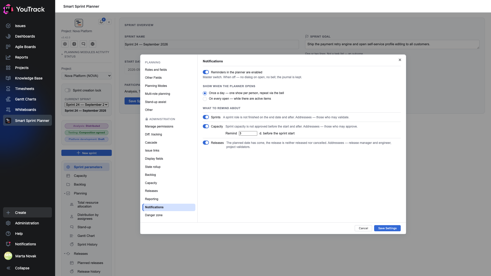
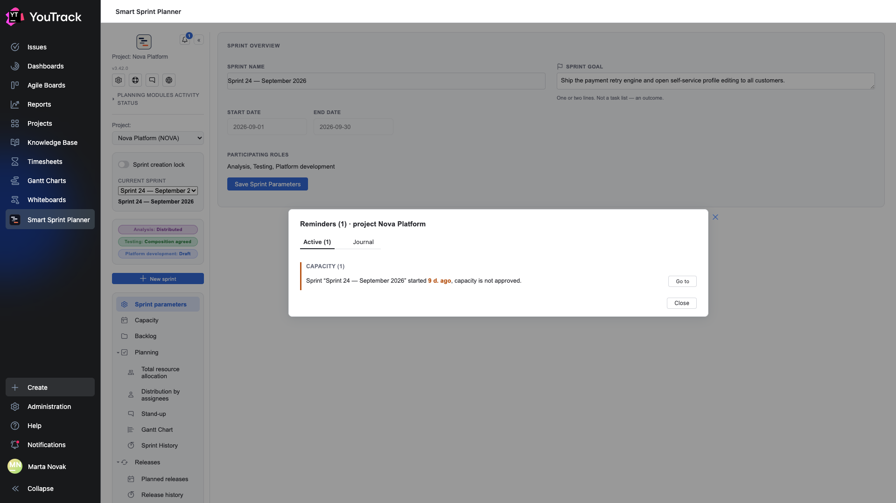
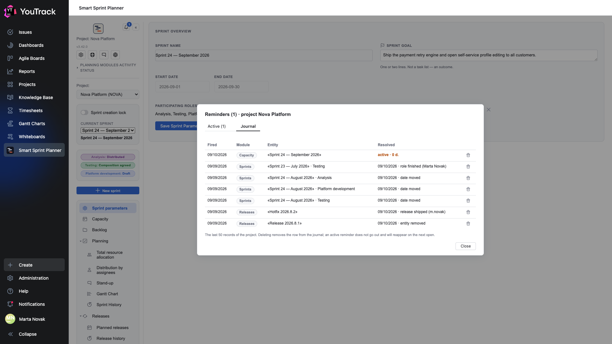

# 19a. Notifications and reminders

**Optional.** The planner can remind about three things that usually fall between sprints: a sprint role not finished after the end date, capacity not approved before the start, a release whose planned date has come and gone. A reminder is neither an e-mail nor an issue: it is a dialog when the planner opens and a bell in the header. After the upgrade the module is **off in every project** — it is enabled here.

## Where

**Project Settings → Apps → Smart Sprint Planner → ADMINISTRATION → «Notifications»** (right before «Danger zone»).

## What it reminds about, and whom

| Module | When | One item = | Who sees it |
|---|---|---|---|
| **Sprints** | the sprint's end date has come and a role is not «Finished»; separately — the sprint is over and no role was ever agreed | every unfinished role of every past sprint | the project's validators (chapter 09) |
| **Capacity** | N days before the sprint start (3 by default) or while the sprint runs, capacity is not approved; goes out the day after the end date. Works in the full planning model only (chapter 07) | a sprint | whoever may approve capacity: the settings-manager group and planning managers |
| **Releases** | the planned date has come, the status is neither «Released» nor «Cancelled». Works only with release management on (chapter 18) | a release | the release manager and engineer, the project's validators |

A reminder goes out **by state only**: finish the role, approve the capacity, ship or cancel the release, move the date — and the item disappears on its own. There is no «done» button: the cross, Esc and «Close» merely hide the dialog until tomorrow.

## Steps

1. Turn on **«Reminders in the planner are enabled»** — the master switch.
2. Pick the frequency: **«Once a day»** (one show per person and project per calendar day, repeat via the bell) or **«On every open»**.
3. Leave the modules you need on. The «Capacity» switch is available in the full planning model only, «Releases» — only with release management on; an unavailable switch is not hidden, it tells you where to enable the module itself.
4. For capacity, set how many days before the sprint start to remind (0–30).
5. Click **«Save settings»**.

## What it looks like

When the planner opens (from YouTrack's main menu) a dialog «Reminders (N) · project …» appears with a section per module, in the order Sprints → Capacity → Releases. Each item has a single **«Go to»** button: a sprint leads to the sprint history with the record expanded, capacity — to the capacity tab of that sprint, a release — to its card among the planned releases. With no items the dialog does not show.

The bell in the header of the left panel shows the number of active items and opens the same dialog, now with two tabs: **«Active»** and **«Journal»**. The bell is visible only when the module is on and at least one enabled module is addressed to you.

## The journal

The «Journal» tab lists the last 50 records of the project: when the item fired, which module, which entity and how it went out (date, reason, who). Active records are marked «active · N d.». The trash icon deletes a record — any addressee of the item may do that. Deleting does **not** resolve the reminder: an active item reappears in the journal the next time the planner opens.

## Limits

- Reminders are computed for the **currently selected project** only and only in the main-menu planner; the project settings page has none.
- A YouTrack administrator is an addressee of everything (they pass every rights check of the planner).
- With no validator groups configured (chapter 09) sprints and releases have no addressees: the items are computed and journaled, but shown to nobody except the release manager and engineer and the administrator.
- «Once a day» is remembered per person and project; on another computer the dialog shows again.
