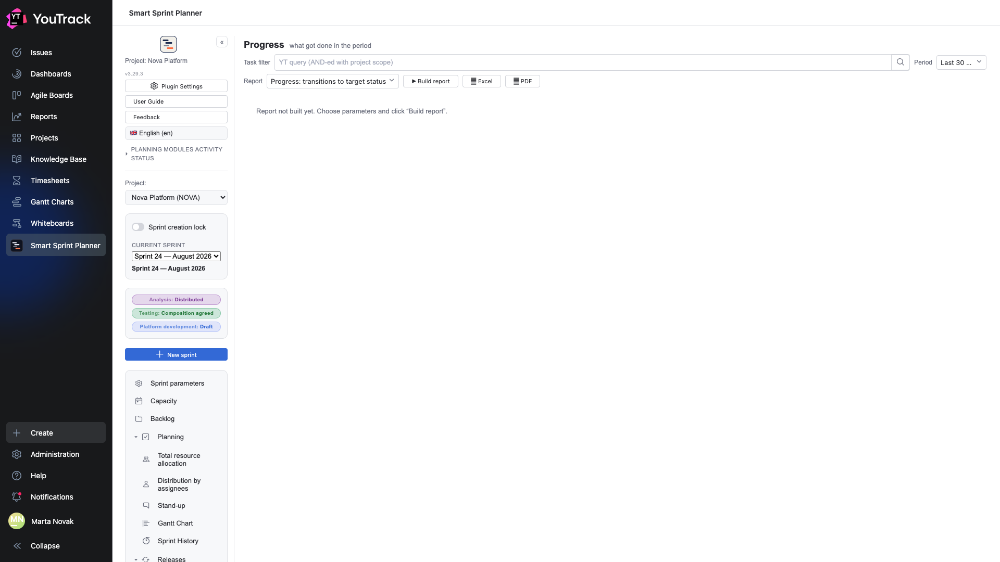

# 01. How reports work

All fourteen reports live on two screens and behave the same way.

## The report screen

| Element | What it does |
|---|---|
| **Task filter** | a YouTrack query added to the project's scope |
| **Period** | the window to count over: last 30 days, a quarter, a custom interval |
| **Report** | a picker: which of the circuit's reports to build |
| **▶ Build report** | build it |
| **⭳ Excel**, **⭳ PDF** | export the built report |

A report does not build itself when the screen opens: first you choose the parameters, then you press the button. That keeps a heavy query from reaching the server every time a tab is switched.

## The task filter

It takes YouTrack's ordinary search syntax: `Priority: Critical`, `Type: Bug`, `tag: hotfix`.

The filter is **added** to the project's scope rather than replacing it: it cannot pull another project's issues.

It is the main tool for narrowing: almost any report becomes more useful when built for one system or one issue type.

## The period

Not every report has one. Snapshot reports — WIP/Done, Aging, Backlog in hours — show the state right now and need no period. Time reports — TTM, Effort, Flow — count over a window.

## Export

**Excel** hands you the data as tables to work with further. **PDF** hands you what is on screen, charts included — good for attaching to an email.

What is exported is the **built** report: build first, then export.

## Where reports take their data from

There are three sources, and knowing them matters when a number looks odd:

| Source | Who uses it |
|---|---|
| **YouTrack work items** | Effort, Plan vs fact, Bug tax |
| **State transition history** | Aging, Progress, TTM, Flow |
| **Closed sprint snapshots** | Velocity, Spillover |

Hence the rule: time-in-state reports are useless on a project where states were set retroactively in one go, and Velocity is useless where sprints are never closed.

## Limiters

Reporting has a **timeout** and an **issue cap**, both configured per project. If a report hits the cap it says so rather than quietly showing partial data.

The cure is narrowing: a shorter period, a tighter filter.
