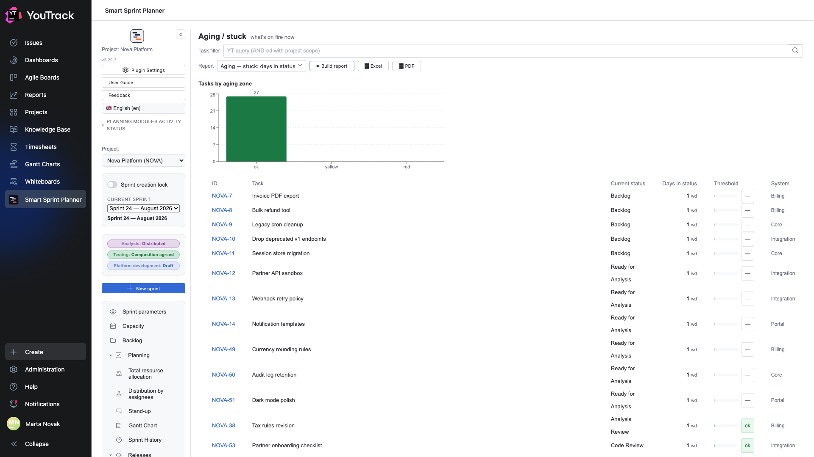
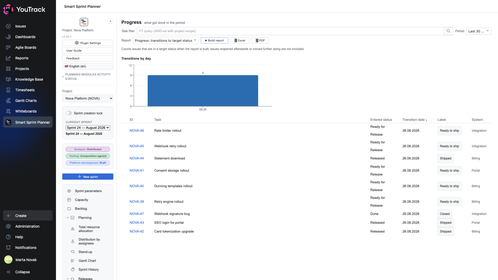
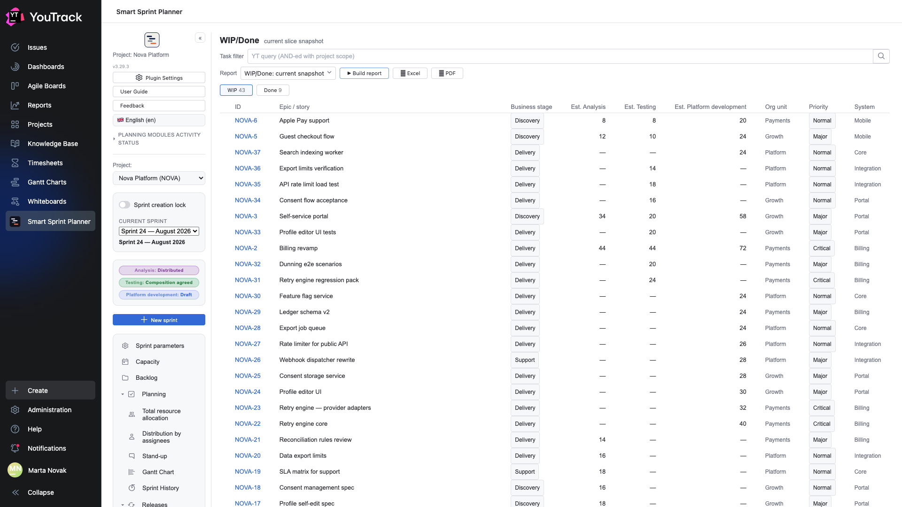

# 02. What is happening now

Three operational reports answering «where do we stand right now».

## Aging — stuck: days in status

**The question:** what is on fire.

The report takes every issue in the project and looks at **how many working days each has spent in its current state**. The bar chart splits them into three zones: **ok**, **yellow**, **red**.

Zone boundaries are set **per state** (chapter 19 of the setup document). That matters: five days in code review is an alarm, five days in development is normal.

| Column | What it means |
|---|---|
| **Current status** | where the issue is standing |
| **Days in status** | working days, with pauses subtracted |
| **Threshold** | a bar showing the position relative to the yellow and red boundaries |
| **System** | a breakdown, if the system field is configured |

**What to do with the result:** the red zone is the agenda for the next planning meeting. Not «why are we slow in general» but «why are these four issues standing still».

## Progress: transitions to target status

**The question:** what arrived during the period.

The report counts issues that **entered a target status during the chosen period**. Target statuses are set in the settings — usually «ready for release», «released», «done».

The line under the header is honest about the method: it counts issues that **are** in a target status when the report is built. An issue reopened or moved further along afterwards will not appear.

| Column | What it means |
|---|---|
| **Entered status** | which target status exactly |
| **Transition date** | when |
| **Label** | the human name of the status from the settings |

The «Transitions by day» chart shows the rhythm: a steady flow, or everything on the sprint's last day.

## WIP/Done: current snapshot

**The question:** what is in progress and what is finished.

Two tabs with counts: **WIP** for issues in progress, **Done** for finished ones. No period is needed; it is a snapshot of now.

The table shows estimates **per role separately** — so it is immediately clear what the volume consists of: where there are 40 hours of development with no analysis, and where the reverse.

| Column | What it means |
|---|---|
| **Epic / story** | the issue's title |
| **Business stage** | the value of the stage field, if configured |
| **Est. Analysis / Testing / Platform development** | hours per role |
| **Org unit**, **System** | breakdowns from project fields |

**What to do with the result:** the WIP count is the simplest overload metric. With 43 issues in progress for a team of six, none of them is moving fast.
