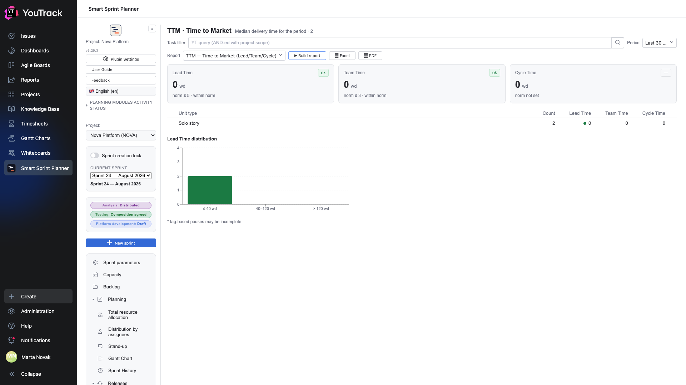
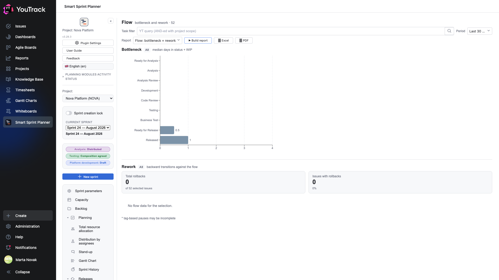

# 03. How long it takes

Two reports about time: how long an issue travels from start to delivery, and where exactly it stands still.

Both count from the **state transition history** — and both are useless on a project where states were set retroactively. See the warning in the [index](00-index.md).

## TTM — Time to Market (Lead / Team / Cycle)

**The question:** how long from «taken on» to «handed over».

Three metrics measure the same thing with different rulers:

| Metric | What it measures | Who cares |
|---|---|---|
| **Lead Time** | from request to delivery to the customer | the business: «how long is the wait» |
| **Team Time** | from starting work to readiness | the team: «how long do we take» |
| **Cycle Time** | the narrowest part — usually development to testing | engineers |

What counts as the start and the end of each metric is set by **anchors** in the settings: a pair of states per metric. Without anchors the report does not build.

Next to the number is an **«within norm» / «above norm»** badge: a comparison with the target from the settings. With no norm set the badge is empty and the number is still shown.

**The distribution histogram** matters more than the average: it shows whether there is a tail. A median of 12 days with a tail of 120 is not «twelve days», it is «twelve days and a lottery».

The **by unit type** table separates solo stories from parts of epics: they are different in nature, and mixing them into one median is misleading.

⚠️ The footnote «tag-based pauses may be incomplete» is an honest warning: pauses marked by tag are visible to the planner only as of build time, not through history.

## Flow: bottleneck + rework

**The question:** where exactly the issue stands and how often it is sent back.

The report has two parts.

### Bottleneck

Horizontal bars: the **median number of days in each state of the flow**, in the flow's order. The longest bar is the bottleneck.

This is not the same as Aging: Aging looks at current issues and says what is on fire now; Flow looks at the whole history and says where the process is **systematically** slow.

### Rework

Backward transitions against the flow's direction: from testing back to development, from review back to analysis.

| Tile | What it means |
|---|---|
| **Total rollbacks** | how many times issues moved backwards |
| **Issues with rollbacks** | how many issues were affected and what share that is |

Rework is the most honest quality-of-input metric: if every third issue comes back from testing, the problem is not in testing.

**What to do with the result:** a long bar raises «why is there a queue here». A lot of rework raises «why are we handing unfinished work to the next stage».
