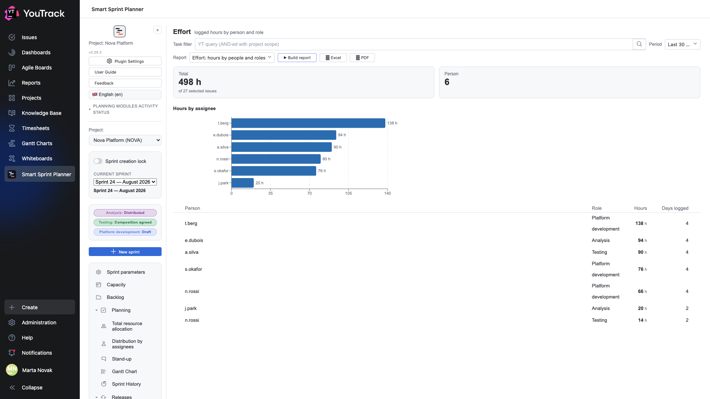
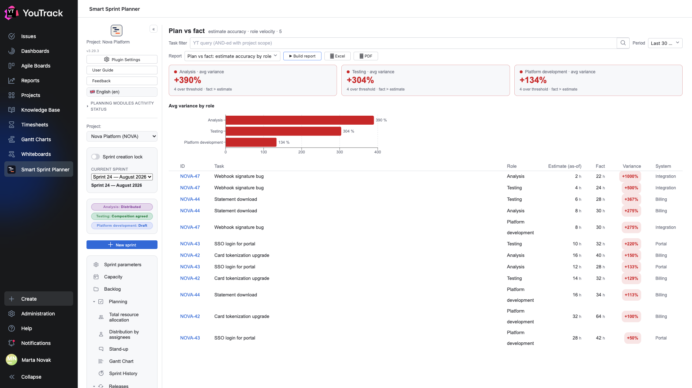

# 04. What it cost

Two reports that count from **YouTrack's logged work items**, and so work on any project where the team really logs its hours.

## Effort: hours by people and roles

**The question:** where the team's time went.

Two tiles at the top: **how many hours** in the period and **how many people** logged them. Below are bars by person and a table.

| Column | What it means |
|---|---|
| **Person** | the assignee's login |
| **Role** | the role derived from the work type via [differentiated tracking](../02-setup/13-dta.md) |
| **Hours** | the sum of logged items |
| **Days logged** | on how many different days the person logged time |

**Days logged** is an underrated column. Forty hours over two days and forty over ten are different stories: the first means someone logged in a retroactive batch, the second that they kept track as they went.

⚠️ The role is derived from the work type on the logged item. If differentiated tracking is not configured, or someone picked the wrong type, the row lands in «role undetermined».

## Plan vs fact: estimate accuracy by role

**The question:** how well we estimate at all.

One tile per role shows the **average variance of actual against estimate**. Red and a `+` sign mean the actual exceeded the plan.

Below are bars by role and a row-by-row table.

| Column | What it means |
|---|---|
| **Role** | which role the variance is computed for |
| **Estimate (as-of)** | how much was planned |
| **Fact** | how much was spent |
| **Variance** | by how much the estimate was missed |
| **System** | a breakdown |

**Estimate (as-of)** is an important subtlety: it takes the estimate that stood on the issue when it entered the sprint, not the current one. Otherwise correcting an estimate after the fact would be enough to make the report always show accuracy.

**What to do with the result:** a systematic `+300 %` on one role is not a reason to blame that role. It usually means the estimate is made by someone other than the person doing the work, or that half the work is not in the estimate at all (review, fixes, retesting).

Look separately at the **count over threshold** in the tile's caption: one ten-fold miss ruins an average more than ten fifty-per-cent misses.
