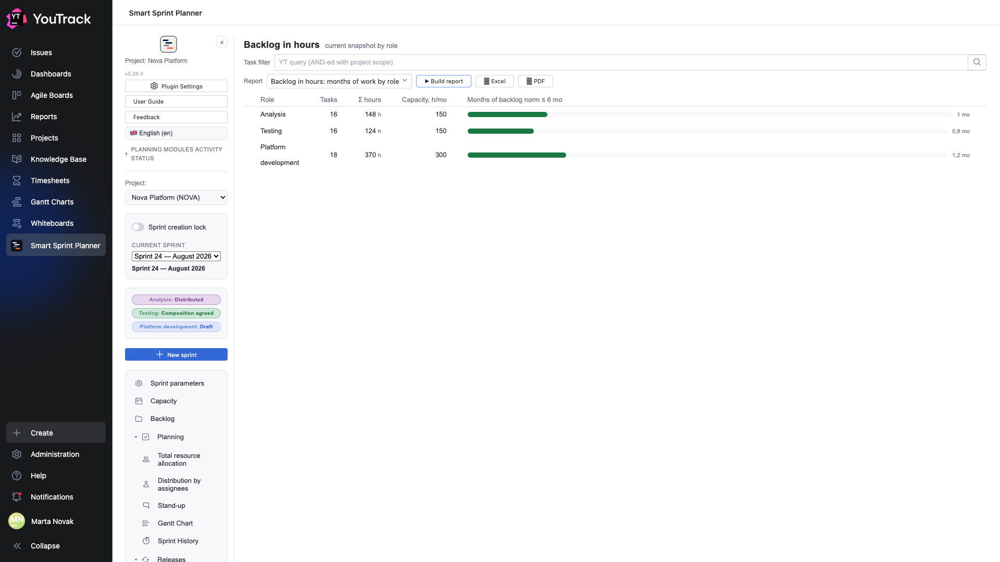
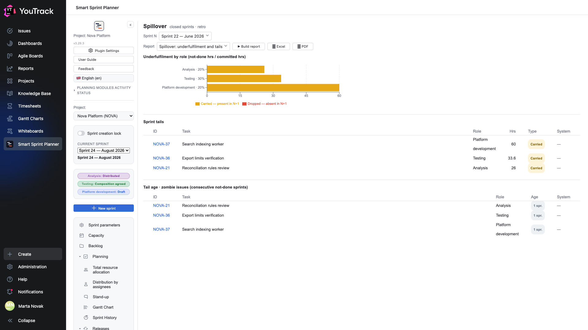
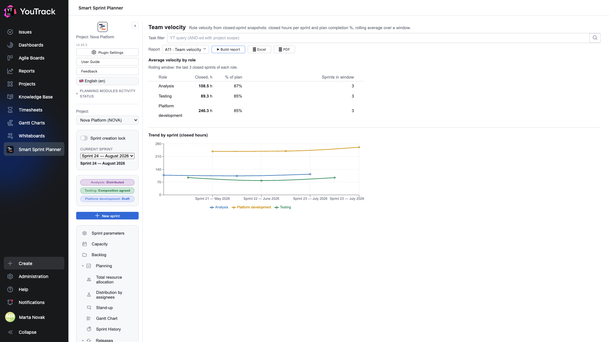

# 05. How much is left

Three reports that look forward: the queue of work, the tails of past sprints and the team's speed.

## Backlog in hours: months of work by role

**The question:** how buried are we.

The report turns an abstract «sixteen issues» into an understandable «a month of work».

| Column | What it means |
|---|---|
| **Role** | whose queue |
| **Tasks** | how many issues are waiting |
| **Σ hours** | the sum of this role's estimates across the queue |
| **Capacity, h/mo** | how much the role delivers per month — from the reporting settings |
| **Months of backlog** | Σ hours ÷ capacity, with a bar against the norm |

The norm (six months by default) is set in the settings. A bar that reaches the right edge means this role's queue is no longer a planning question but a prioritisation one.

**Why this beats «number of issues»:** sixteen analysis issues and eighteen development issues look the same and cost 148 and 370 hours.

## Spillover: underfulfilment and tails

**The question:** what we promised and did not deliver.

The report counts from **closed sprint snapshots**: it compares what was planned with what actually closed.

**Underfulfilment by role** is the share of hours that did not reach the end of the sprint, split in two:

| Kind | What it means |
|---|---|
| **Carried** | the issue is in the next sprint |
| **Dropped** | the issue is not in the next sprint — it was simply forgotten |

The difference matters: carrying over is a management decision, dropping is a loss.

**Sprint tails** is a row-by-row list: which issues did not make it, how many hours, of which kind.

**Tail age · zombie issues** shows how many sprints in a row an issue has been carried. The «warm» and «hot» bands are set in the settings. An issue carried for the fourth time is usually not «almost done» — it should either be done or closed.

## A11 · Team velocity

**The question:** how much the team actually closes.

Computed from closed sprint snapshots over a rolling window (the last three sprints of each role by default).

| Column | What it means |
|---|---|
| **Closed, h** | the average number of closed hours per sprint |
| **% of plan** | what share of the plan the role closes |
| **Sprints in window** | how many sprints were averaged |

**The trend chart** shows every sprint separately — it reveals whether speed is stable or jumps around.

**How to use this:** «closed, h» is the number worth planning the next sprint with, instead of capacity. Capacity says how many hours a role has; velocity says how many it actually closes. The second is always smaller, and the difference is the process's overhead.

⚠️ Velocity decides what «closed» means from the **done-states** list in the stand-up settings (chapter 12 of the setup document), not from the actual-hours field. An incomplete list understates speed.
