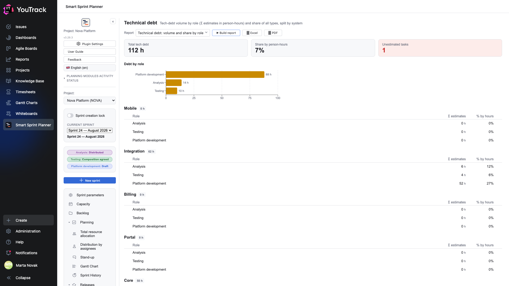
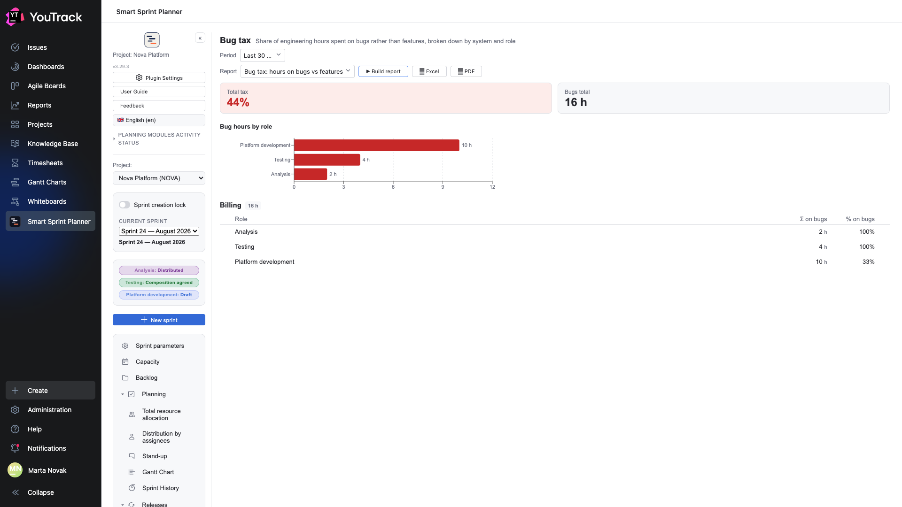
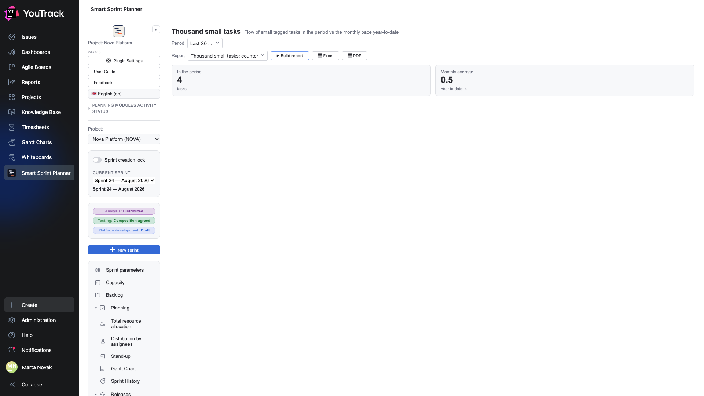
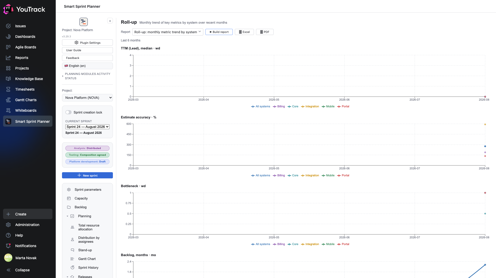

# 06. The management circuit

Four reports answering not «how is the sprint going» but «what does the process cost us». The horizon is quarters, not weeks.

Access is granted through a separate **Circuit B** column in the [permissions matrix](../02-setup/09-permissions.md).

## Technical debt: volume and share by role

**The question:** how much unpaid debt have we accumulated.

The report collects issues of the technical-debt type and adds up their estimates.

| Tile | What it means |
|---|---|
| **Total tech debt** | the sum of estimates in person-hours |
| **Share by person-hours** | what part of the whole volume the debt takes |
| **Unestimated tasks** | how many debt issues have no estimate — they are not in the sum |

The «unestimated» tile is highlighted for a reason: it says plainly that the figure is understated. Debt nobody has estimated is the most dangerous kind.

Below are **debt by role** as bars and a breakdown **by system**: each system gets its own table with the total and the share per role.

**What to do with the result:** a 7 % share is normal. A 30 % share means a third of the team is working on the past. The system breakdown shows exactly where.

## Bug tax: hours on bugs vs features

**The question:** how much time goes into fixing rather than building.

The report splits **logged hours** into two pockets: work on features and work on bugs. The second is the «tax».

| Tile | What it means |
|---|---|
| **Total tax** | what share of hours went to bugs |
| **Bugs total** | how many hours that is |

Below are hours by role and a table by system: `Σ on bugs` and `% on bugs` for each role inside a system.

⚠️ The report needs the **link types for reports** (chapter 19 of the setup document): they tell it that this bug belongs to that feature. Without them it refuses to compute.

**What to do with the result:** 44 % is not «a bad team», it is «we pay almost half our time for past decisions». The system breakdown shows which system sets that price.

## Thousand small tasks: counter

**The question:** how much time the stream of small work eats.

A plain counter of issues tagged as «small», with two numbers: **how many in the period** and the **monthly average year-to-date**.

The report is deliberately simple. Its point is not analysis but making the stream of small requests visible: each is «only fifteen minutes» on its own, and together they are half a sprint.

For the report to work, the team has to apply the tag. Without it the report shows zero — which is an answer too.

## Roll-up: monthly metric trend by system

**The question:** where are we heading.

Four charts, each with a line per system plus a shared «all systems» line:

| Chart | What it shows |
|---|---|
| **TTM (Lead), median** | how long delivery takes |
| **Estimate accuracy** | how badly we miss |
| **Bottleneck** | how many days the slowest state holds |
| **Backlog, months** | how fast the queue is growing |

This is the only report that looks at a **trend** rather than a snapshot. A single value of a metric means almost nothing; six points in a row show whether things got better or worse.

The system breakdown answers the follow-up question immediately: is the decline general, or is one system dragging everyone down.

⚠️ The report rests on state transition history, so on a young project it is empty. That is normal: it needs a few months of data.
