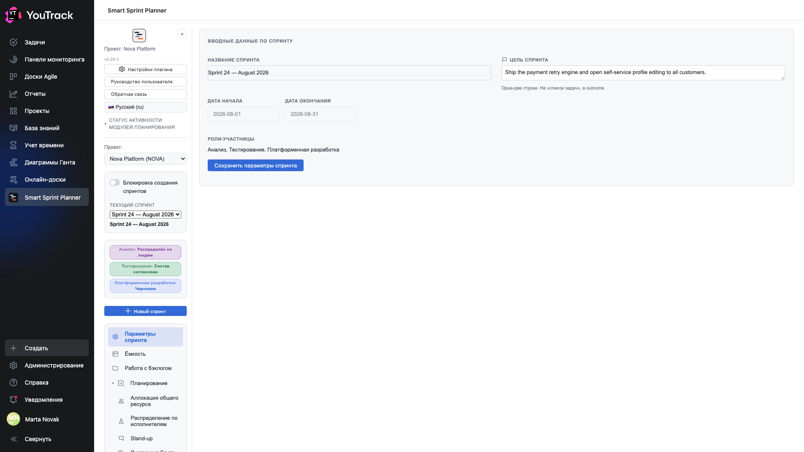

# 01. Где живёт планер и как в него войти

У планера два входа, и они делают разное.

## Вход первый: главное меню YouTrack

Пункт **Smart Sprint Planner** в левом меню YouTrack — это и есть планирование. Здесь вы выбираете проект, выбираете спринт и работаете: набираете состав, раскладываете часы, смотрите Гант и историю.

Слева — **рельс**: дерево разделов планера. Он один на все экраны и не меняется при переходах. Кнопка `«` над ним сворачивает рельс, когда нужно больше места под таблицу.

## Вход второй: настройки проекта

**Настройки проекта → Приложения → Smart Sprint Planner** — это не планирование, а *настройка* планера для конкретного проекта: какие роли участвуют, из каких полей задачи брать оценку и факт, кто что может.

Синяя полоса сверху прямо об этом и говорит: планирование переехало в главное меню, а этот экран — настройки. Что делать на нём — в документе [«Внедрение и настройка»](../02-setup/).

## Выбор проекта

Пикер **«Проект»** в рельсе показывает только те проекты, где планер подключён и настроен, и где у вас есть к нему доступ. Если проект в списке не появился — либо приложение к нему не подключено, либо не задана группа управления настройками (глава 04 документа по внедрению).

Смена проекта в пикере переключает весь экран: спринты, состав, история — всё своё у каждого проекта. Планер не смешивает данные проектов.

## Шапка над рельсом

| Что | Зачем |
|---|---|
| **Настройки плагина** | быстрый переход к настройкам этого проекта; видна только тем, кто состоит в группе управления настройками |
| **Руководство пользователя** | ссылка на эту документацию |
| **Обратная связь** | ссылка на трекер задач продукта |
| **Язык** | язык интерфейса самого планера |
| **Статус активности модулей планирования** | раскрывающийся список: какие модули включены в этом проекте |

## Два языка, два тумблера

Это неочевидно и стоит запомнить: **язык планера и язык YouTrack переключаются раздельно**.

- **Язык планера** — пикер в шапке рельса. Он влияет только на текст самого планера и запоминается для вас лично.
- **Язык YouTrack** — в вашем профиле YouTrack. Он отвечает за сайдбар, крошки, названия разделов настроек проекта.

Если переключить только один, интерфейс станет смешанным. На кадрах этой документации переключены оба.

⚠️ После смены языка планера экран настроек проекта перерисовывается не полностью — навигация разделов остаётся на прежнем языке до перезагрузки страницы. Это известный дефект, лечится обновлением страницы.

## Выбор спринта

Под пикером проекта — селектор **«Текущий спринт»** и кнопка **«+ Новый спринт»**. В селекторе только «живые» спринты: закрытые уходят в [историю](10-history.md) и оттуда при необходимости возвращаются к правке.

Кнопка создания спринта может быть недоступна — в проекте включают запрет создания спринтов, чтобы команда не заводила новый, не закрыв предыдущий. Переключатель **«Блокировка создания спринтов»** виден тут же.

## Плашки статусов ролей

Под селектором спринта — по одной плашке на роль: **Черновик**, **Состав согласован**, **Распределён по людям**, **Закрыт**. Роли идут по этой лестнице независимо друг от друга. Подробно — в главе [12](12-stages-rights.md).
