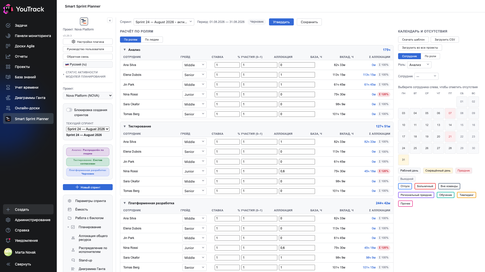

# 03. Ёмкость

Экран, который отвечает на вопрос «сколько часов у команды вообще есть». Всё остальное планирование опирается на его цифры.

## Где

Рельс → **«Ёмкость»**. Раздел появляется, только если в проекте выбрана модель планирования, которая считает ресурс по людям (глава 10 документа по внедрению).

## Как читать таблицу

Таблица сгруппирована по ролям, внутри роли — строка на человека.

| Колонка | Что значит |
|---|---|
| **Сотрудник** | человек из состава команды проекта |
| **Грейд** | Junior / Middle / Senior — влияет на коэффициент производительности |
| **Ставка** | доля ставки: `1` — полная, `0,5` — половина |
| **% участия (0–1)** | какая доля рабочего времени человека отдана этому проекту |
| **Аллокация** | доля времени человека на **эту роль**: `1` — целиком, `0,6` — шестьдесят процентов |
| **База, ч** | сколько рабочих часов в периоде спринта у этого человека по календарю, за вычетом отсутствий |
| **Вклад, ч** | итог: база × ставка × участие × аллокация × коэффициент грейда |
| **Σ аллокации** | сумма аллокаций человека по всем ролям |

Число справа от названия роли — **сумма вкладов** этой роли. Именно оно и становится ресурсом роли на экране [«Аллокация общего ресурса»](05-allocation.md).

## Красная Σ 120 %

Если сумма аллокаций человека по всем ролям больше единицы, планер подсвечивает её красным: **Σ 120 %**. Это не запрет — бывают спринты, где человек официально работает больше обычного, — но это сигнал, что цифра ресурса завышена и на неё нельзя опираться как на реальность.

Один и тот же человек может участвовать в нескольких ролях: аналитик, который часть спринта тестирует, вносит вклад и в анализ, и в тестирование. Планер это поддерживает — важно лишь, чтобы сумма его долей была осмысленной.

## Два вида таблицы

Переключатель **«По ролям» / «По людям»** меняет только группировку. «По ролям» отвечает на вопрос «сколько часов у роли», «по людям» — «куда уходит время конкретного человека». Цифры одни и те же.

## Календарь и отсутствия

Правая панель — производственный календарь периода и отсутствия людей.

- Дни календаря раскрашены: **рабочий день**, **сокращённый день**, **праздник**, **выходной**.
- Отсутствия ставятся на человека: **отпуск**, **больничный**, **вне команды**, **региональный праздник**, **обучение**, **тимлидинг**, **прочее**.
- Чтобы отметить отсутствие, сначала выберите сотрудника в пикере слева, затем щёлкайте по дням.

Каждый нерабочий день человека уменьшает его **базу**, а значит и вклад, а значит и ресурс роли. В этом весь смысл экрана: планер не считает «восемь человек по сто шестьдесят часов», он считает по календарю.

**«Скачать шаблон»** и **«Загрузить CSV»** — массовый ввод календаря и отсутствий файлом. **«Загрузить во все проекты»** переносит календарь на остальные проекты, где планер настроен: производственный календарь у компании обычно один.

## Черновик, «Утвердить», «Сохранить»

Три кнопки сверху различаются по смыслу:

- **«Сохранить»** — записать текущие цифры как черновик, не объявляя их окончательными.
- **«Утвердить»** — зафиксировать ёмкость спринта: с этого момента расчёт считается согласованным.
- **Плашка «Черновик»** слева показывает текущее состояние.

Пока ёмкость в черновике, планировать по ней можно — просто все понимают, что цифры ещё поедут.

## Откуда берётся коэффициент грейда

Коэффициенты Junior / Middle / Senior задаются в настройках проекта, разделом «Ёмкость». Планер не придумывает их сам и не подставляет отраслевых значений: если в проекте решили, что junior и senior считаются одинаково, так и будет.
