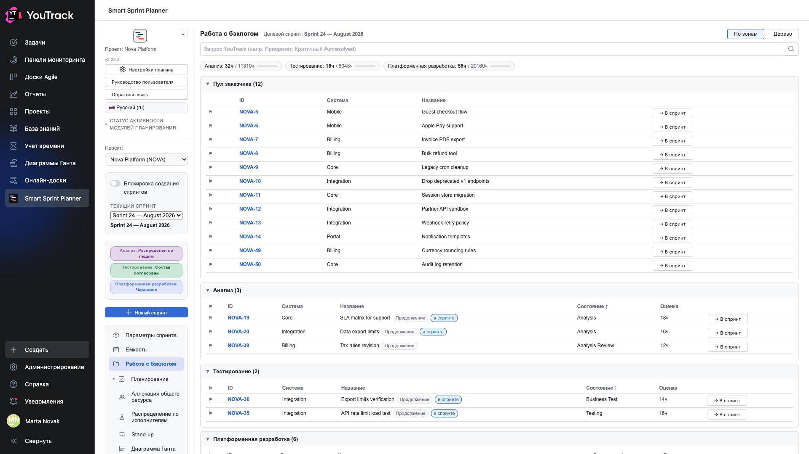
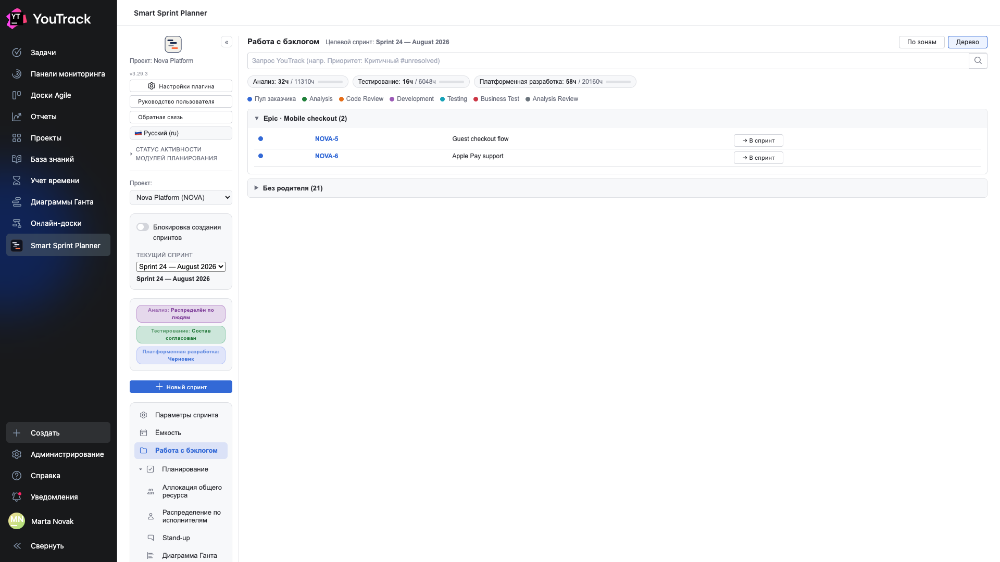

# 04. Работа с бэклогом

Экран, с которого задачи попадают в спринт. До него спринт пустой.

## Где

Рельс → **«Работа с бэклогом»**. Раздел появляется, если модуль бэклога включён в настройках проекта.

## Что такое пул и зоны

Планер спрашивает у YouTrack задачи проекта и раскладывает их на два вида секций.

- **Пул заказчика** — задачи в стартовых состояниях: работа ещё не начиналась. Это входящая очередь.
- **Зоны** — секции по состояниям пайплайна: «Анализ», «Analysis Review», «Development», «Code Review», «Testing», «Business Test». Каждая зона привязана к роли, и это привязка из настроек проекта, а не из имени состояния.

Такое деление отвечает на вопрос «что сейчас в работе и у кого», а не просто «какие задачи есть».

## Полоски сверху

Под строкой запроса — по полоске на роль: **сколько часов уже набрано в спринт** и **сколько всего часов в бэклоге у этой роли**. Полоска показывает, насколько спринт «съел» очередь.

## Строка запроса YouTrack

Поле **«Запрос YouTrack»** принимает обычный поисковый синтаксис трекера: `Приоритет: Критичный #unresolved`. Запрос добавляется к области проекта, а не заменяет её: вывести чужие задачи через него нельзя.

Это самый быстрый способ отфильтровать длинный пул: по системе, по приоритету, по тегу.

## Кнопка «→ В спринт»

Кнопка в конце строки отправляет задачу в состав спринта той роли, к которой относится её зона. Задача из пула заказчика попадёт в роль по своему состоянию.

После этого задача появляется в [составе роли](06-role-card.md), и уже там ей ставят часы.

## Метки на задачах

| Метка | Что значит |
|---|---|
| **Продолжение** | задача уже была в предыдущем спринте и переходит дальше |
| **в спринте** | задача уже добавлена в текущий спринт |
| флажок слева | приоритет задачи, цветом YouTrack |

## Вид «Дерево»

Переключатель **«По зонам» / «Дерево»** в правом верхнем углу меняет способ раскладки.

**Дерево** группирует задачи по иерархии связей: под эпиком — его дети, всё остальное — в группе «Без родителя». Полезно, когда бэклог набран крупными кусками работы и нужно понять, из чего они состоят.

Точки-легенда над деревом показывают, из какой зоны каждая задача: цвет точки слева от задачи соответствует зоне.

⚠️ Дерево показывает **пул**, а не весь проект. Если ребёнок эпика имеет тип, который не входит в фильтр типов пула, он в дереве не появится, и эпик будет выглядеть пустым. Фильтр типов задаётся в настройках бэклога.

## Оранжевая полоса «Незамапленные состояния»

Планер сверяет список состояний проекта со своей раскладкой и честно говорит, если какое-то состояние никуда не отнесено: не зона, не стартовое, не пауза и не «решённое» состояние YouTrack.

Это не ошибка, а напоминание закончить настройку: задачи в таком состоянии не попадут ни в одну секцию и просто исчезнут с экрана.

## Паузы

Состояния и теги, отмеченные в настройках как «пауза», выделяются отдельно: задача формально в работе, но команда её не двигает — ждёт поставщика, ответа, чужого релиза. В отчётности эти интервалы вычитаются из времени цикла.
