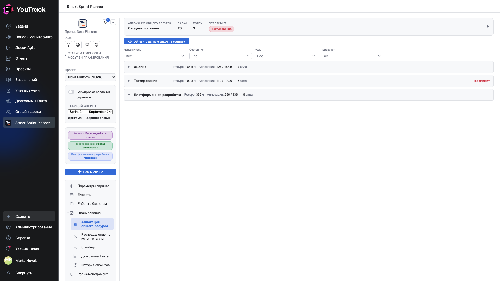
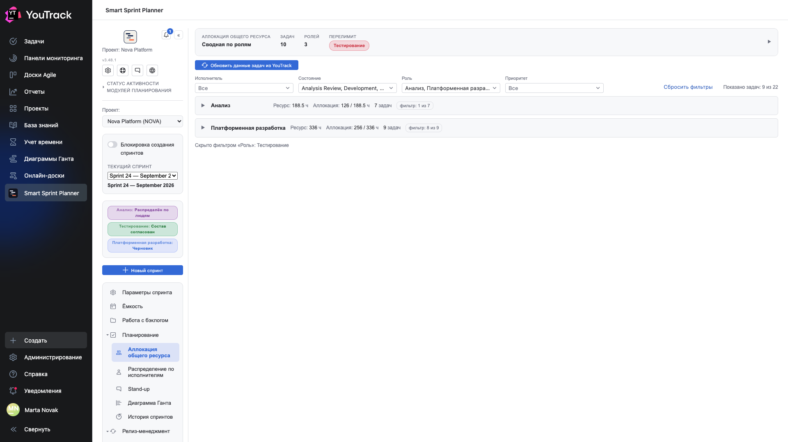

# 05. Аллокация общего ресурса

Главный экран планирования. Здесь видно, влезает ли работа в спринт.

## Где

Рельс → **«Планирование» → «Аллокация общего ресурса»**.

## Шапка

Верхняя плашка — сводка по всему спринту: сколько **задач**, сколько **ролей**, и по каким ролям **перелимит**. Треугольник справа раскрывает сводную таблицу по ролям.

## Строка роли

Каждая роль — одна свёрнутая строка:

| Что | Что значит |
|---|---|
| **Ресурс: 336 ч** | сколько часов у роли есть — берётся с экрана [«Ёмкость»](03-capacity.md) |
| **Аллокация: 256 / 336 ч** | сколько роль уже запланировала из этого ресурса |
| **9 задач** | сколько задач в составе роли |
| **Перелимит** | красная метка: аллокация превысила ресурс |

**Перелимит — не блокировка.** Планер не мешает переобещать; он мешает переобещать *незаметно*. Решение — за командой: убрать задачу, урезать оценку или сознательно уйти в минус.

## Кнопка «Обновить из задачи»

Кнопка над списком ролей перечитывает задачи в YouTrack и обновляет то, что планер о них хранит: состояние, приоритет, оценку, исполнителя, цвет состояния.

Нажимать её стоит, когда команда работала в трекере, а не в планере: состояния уехали, оценки поменялись — и состав спринта об этом ещё не знает.

⚠️ Кнопка обновляет **текущую роль**. Если ролей три, а обновить надо все, придётся нажать её в каждой.

## Фильтры

Под кнопкой — строка фильтров: **Исполнитель**, **Состояние**, **Роль**, **Приоритет**. В каждом можно отметить несколько значений: внутри поля — «любое из отмеченных», между полями — «и». Фильтр действует сразу на сводную таблицу и на составы всех ролей.

| Что видно | Что значит |
|---|---|
| **Показано задач: N из M** | сколько задач спринта проходят фильтр |
| **фильтр: N из M** в строке роли | таблица роли показывает не весь состав; ресурс, аллокация, число задач и «Перелимит» по-прежнему считаются по всему составу |
| **Скрыто фильтром «Роль»: …** | роли, снятые фильтром «Роль», скрыты целиком |
| **Нет задач под выбранные фильтры** | таблица пуста из-за фильтра, а не потому, что состав пуст |
| **Сбросить фильтры** | вернуть всё как было |

В списках — только значения, которые есть в задачах спринта; состояния и приоритеты — в порядке YouTrack. «Исполнитель» появляется, только если в модели планирования есть исполнители; «Не назначен» отбирает задачи без исполнителя.

Фильтр ничего не меняет в данных и нигде не сохраняется: выбор живёт до перезагрузки страницы, общий с экраном [«Распределение по исполнителям»](07-assignees.md) и сбрасывается при смене проекта.

## Раскрытая карточка роли

Щелчок по строке роли раскрывает её целиком: статус планирования, ресурс, остаток и таблица задач. Подробно — в главе [06](06-role-card.md).

## Откуда берутся часы

Планер сам часы не выдумывает. У каждой роли в настройках проекта указано **поле оценки** — например `Est Development`. Аллокация роли на задачу берётся из этого поля задачи в YouTrack.

Отсюда следует главное правило: **если оценка не проставлена в задаче, в планере её не будет.** Пустая аллокация на экране — это почти всегда пустое поле в трекере, а не сбой планера.

## Что считается остатком

**Остаток = ресурс роли − сумма аллокаций.** Отрицательный остаток подсвечивается красным и порождает метку «Перелимит».

Остаток пересчитывается кнопкой **«Σ Пересчитать остаток»** внутри карточки роли — она нужна, когда часы правили руками и хочется свести баланс, не сохраняя.
