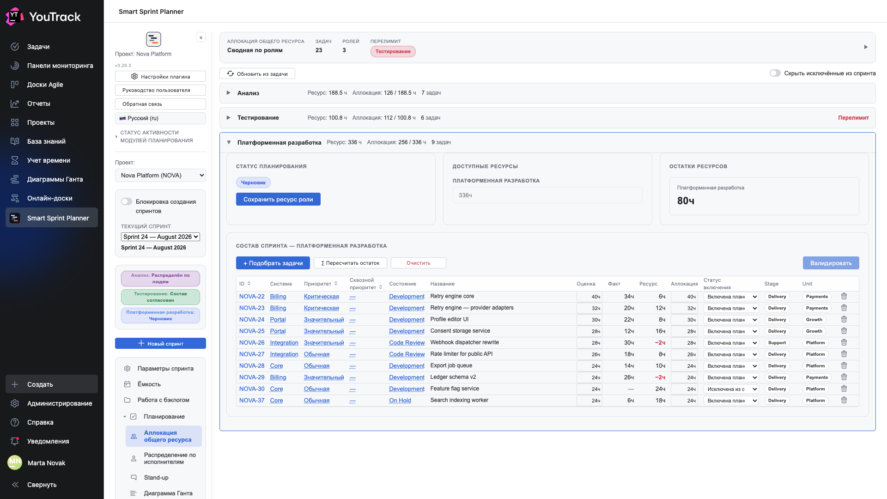

# 06. Состав роли изнутри

Раскрытая карточка роли — рабочее место того, кто набирает спринт для своей роли.

## Где

Рельс → **«Аллокация общего ресурса»** → щелчок по строке роли.

## Три плитки сверху

| Плитка | Что показывает |
|---|---|
| **Статус планирования** | на какой ступени роль: черновик, состав согласован, распределён, закрыт. Здесь же кнопка **«Сохранить ресурс роли»** |
| **Доступные ресурсы** | ресурс роли в часах — приходит с экрана «Ёмкость» |
| **Остатки ресурсов** | ресурс минус сумма аллокаций |

## Кнопки над таблицей

- **«+ Подобрать задачи»** — диалог выбора задач из проекта: поиск, фильтр, отметки, добавление пачкой.
- **«Σ Пересчитать остаток»** — свести остаток по текущим числам, ничего не сохраняя.
- **«Очистить»** — убрать из состава все задачи роли.
- **«Валидировать»** — проверить состав и перевести роль на следующую ступень.

## Колонки таблицы

| Колонка | Откуда |
|---|---|
| **ID**, **Название** | задача YouTrack, ID кликабелен |
| **Система** | поле проекта: к какой системе относится задача |
| **Приоритет**, **Сквозной приоритет** | приоритет задачи и, если настроен, отдельный сквозной |
| **Состояние** | состояние задачи в трекере |
| **Оценка** | поле оценки роли — сколько работы в задаче |
| **Факт** | поле факта роли — сколько уже списано |
| **Ресурс** | оценка минус факт: сколько ещё осталось сделать |
| **Аллокация** | сколько часов роль берёт на эту задачу в этом спринте |
| **Статус включения** | включена в план / исключена из спринта |
| **корзина** | убрать задачу из состава |

Правее могут стоять **отображаемые поля** — произвольные поля проекта, добавленные в настройках: на кадре это «Stage» и «Unit». Планер их не хранит, а читает из YouTrack при открытии таблицы, поэтому видно ровно то, к чему у вас есть доступ.

## Отрицательный ресурс

Колонка **«Ресурс»** может уйти в минус и подсветиться красным: списано больше, чем оценивали. Это не ошибка ввода, а факт — задача оказалась дороже, чем думали. Планер показывает это прямо, чтобы на ретро был предмет разговора.

## Статусы включения

- **Включена в план** — задача считается в аллокацию роли.
- **Исключена из спринта** — задача остаётся в списке, но её часы не считаются.

Исключение нужно, чтобы не терять историю решения: видно, что задачу рассматривали и вынесли, а не забыли.

## Кнопка «Распределить по исполнителям»

Внизу карточки. Переводит на экран [«Распределение по исполнителям»](07-assignees.md), где часы роли раскладываются по людям.

## Валидация

**«Валидировать»** — не косметика: она проверяет состав по правилам проекта и переводит роль на следующую ступень. Кнопка доступна не всем — право на валидацию выдаётся группе в настройках проекта (глава 09 документа по внедрению).

Если состав нарушает лимиты, планер об этом скажет. Разрешено ли всё равно сохранить — зависит от настройки «разрешить планирование с превышением лимитов».
