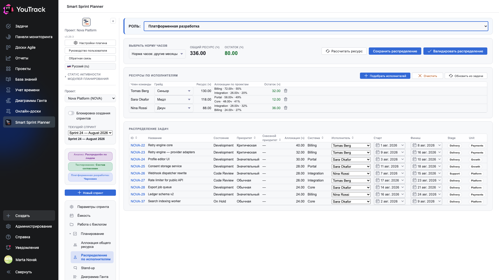

# 07. Распределение по исполнителям

Экран второго шага: часы роли уже набраны, теперь их надо разложить по людям и по дням.

## Где

Рельс → **«Планирование» → «Распределение по исполнителям»**. Роль выбирается пикером **«Роль»** вверху.

## Шапка расчёта

| Поле | Что значит |
|---|---|
| **Выбрать норму часов** | по какому месяцу считать норму: январь, май или другие месяцы |
| **Общий ресурс (ч)** | ресурс роли целиком |
| **Остаток (ч)** | сколько ещё не распределено |
| **«Рассчитать ресурс»** | пересчитать ресурсы людей по норме и календарю |
| **«Сохранить распределение»** | записать раскладку |
| **«Валидировать распределение»** | проверить и перевести роль на ступень «распределён» |

## Ресурсы исполнителей

Верхняя таблица — люди, подобранные на эту роль.

| Колонка | Что значит |
|---|---|
| **Сотрудник** | человек |
| **Грейд** | Junior / Middle / Senior |
| **Ресурс (ч)** | сколько часов у человека есть на эту роль |
| **Аллокации по проектам** | на что уходит его время, с долями: `Billing · 72.00h · 55%` |
| **Остаток (ч)** | сколько у человека ещё свободно |

**«+ Подобрать исполнителей»** открывает выбор людей, **«Очистить»** снимает всех, **«Обновить из задачи»** перечитывает данные задач.

Колонка «Аллокации по проектам» — самая полезная на планёрке: сразу видно, что человек не «наполовину свободен», а разорван между тремя системами.

## Таблица распределения задач

Нижняя таблица — задачи роли, по одной строке.

| Колонка | Что значит |
|---|---|
| **ID**, **Название** | задача |
| **Состояние**, **Приоритет**, **Сквозной приоритет** | из трекера |
| **Аллокация (ч)** | часы роли на эту задачу |
| **Система** | к какой системе относится |
| **Исполнитель** | выпадающий список: кто делает |
| **Начало**, **Окончание** | даты работы над задачей |
| **Списанное время** | сколько списано в YouTrack |

Даты выбираются календарём — это те же даты, которые потом рисует [диаграмма Ганта](09-gantt.md).

## Как считается остаток человека

**Остаток человека = его ресурс − сумма аллокаций задач, где он исполнитель.** Поэтому назначение задачи меняет две цифры сразу: остаток человека и общий остаток роли.

## Норма часов

Пикер **«Выбрать норму часов»** нужен потому, что месяцы неравны: январь и май в производственном календаре короче обычного. Выбор нормы влияет на пересчёт по кнопке «Рассчитать ресурс».

## Валидация распределения

**«Валидировать распределение»** переводит роль на ступень **«Распределён по людям»**. С этого момента считается, что у каждой задачи роли есть ответственный и сроки.

Право на валидацию — у группы, назначенной в настройках проекта. Кнопка «Сохранить распределение» доступна шире: сохранять черновик может редактор.
