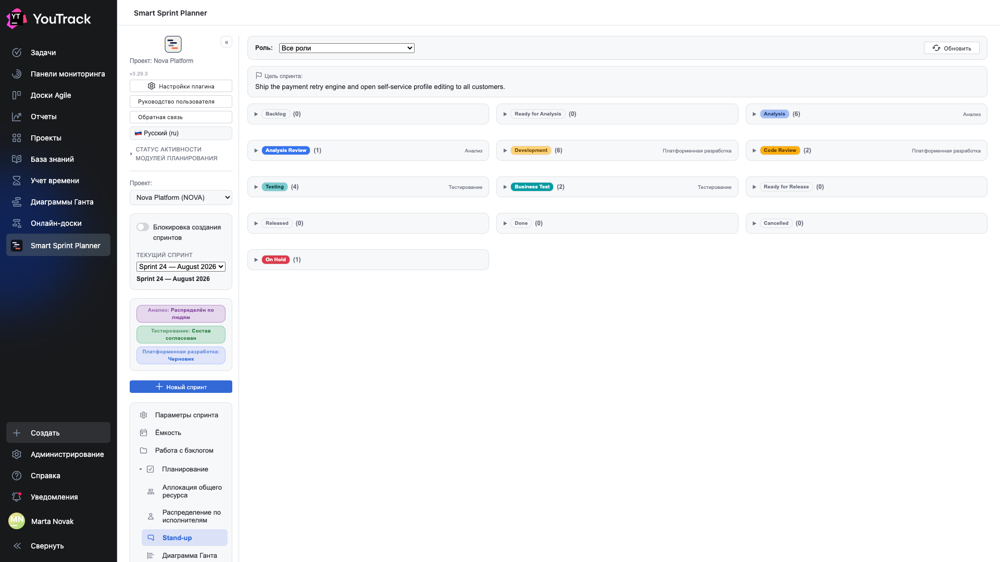

# 08. Stand-up

Экран для ежедневной пятиминутки: одна страница, на которой видно, где стоит вся работа спринта.

## Где

Рельс → **«Планирование» → «Stand-up»**. Раздел появляется, если модуль stand-up assist включён в настройках проекта.

## Как устроен экран

Сверху — **цель спринта**, та самая, что задана в [параметрах](02-sprint-params.md). Она здесь не для красоты: пятиминутка легче держится в рамках, когда перед глазами написано, ради чего спринт.

Ниже — **секции по состояниям**. Одна секция на состояние из потока проекта, в порядке потока: Backlog → Ready for Analysis → Analysis → Analysis Review → Development → Code Review → Testing → Business Test → Ready for Release → Released → Done → Cancelled → On Hold.

В каждой секции:

- **плашка состояния** — с родным цветом состояния из YouTrack;
- **число задач** в скобках;
- **роль-владелец** справа — чья это зона по настройке.

Треугольник слева раскрывает секцию и показывает сами задачи.

## Пикер роли

**«Роль»** сверху сужает экран до одной роли. «Все роли» — общий вид для планёрки всей команды, конкретная роль — для планёрки внутри направления.

## Кнопка «Обновить»

Перечитывает состояния задач из YouTrack. Стендап смотрят утром, когда за ночь что-то могло уехать, — кнопка нужна почти всегда.

## Пустые секции

Секции с нулём задач не прячутся. Это осознанно: пустая «Code Review (0)» — тоже информация, она означает, что на ревью ничего не висит. Скрыть отдельные состояния можно настройкой (глава 12 документа по внедрению).

## Чем это отличается от доски Agile

Доска YouTrack показывает **задачи** и позволяет их таскать. Стендап планера показывает **распределение по состояниям в разрезе ролей спринта** и ничего не двигает: это экран для разговора, а не для работы.

Второе отличие важнее: стендап знает состав спринта планера. Задача, которой нет в составе, на нём не появится, даже если она в проекте и в этом состоянии.
