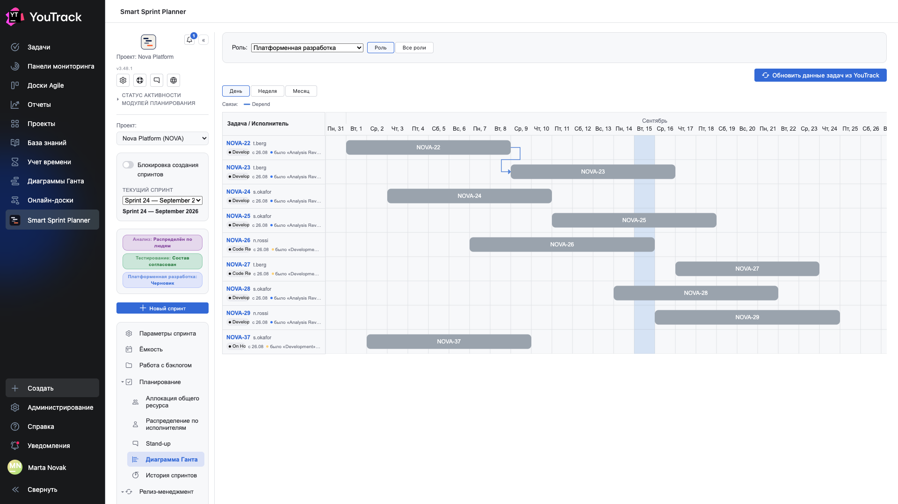
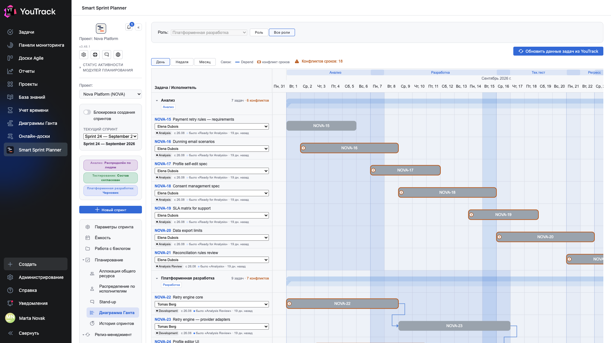
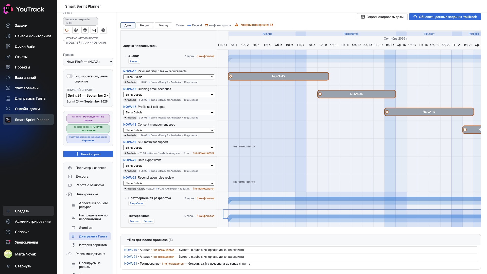

# 09. Диаграмма Ганта

Сроки спринта во времени: кто что делает, когда и что от чего зависит.

## Где

Рельс → **«Планирование» → «Диаграмма Ганта»**. Роль выбирается пикером **«Роль»** вверху; кнопки **«Роль | Все роли»** рядом переключают диаграмму с одной роли на весь спринт (раздел [«Все роли»](#все-роли)).

## Откуда берутся полосы

Полоса рисуется по датам **начала** и **окончания**, которые проставлены на экране [«Распределение по исполнителям»](07-assignees.md). Задача без дат растягивается на весь спринт.

Цвет полосы — цвет состояния задачи из YouTrack. Поэтому диаграмма читается как срез: жёлтые полосы — разработка, оранжевые — ревью, красная — задача на паузе.

## Строка слева

Под номером задачи — исполнитель и **бейдж состояния**: плашка с текущим состоянием, дата, с которой задача в нём находится, и предыдущее состояние. Это отвечает на вопрос «сколько она уже так стоит» без перехода в трекер.

## Масштабы

Кнопки **«День» / «Неделя» / «Месяц»** меняют шаг оси. День — для спринта, месяц — чтобы увидеть картину целиком, когда задачи растянуты.

## Стрелки зависимостей

Если у задач настроены связи-зависимости, планер рисует между полосами стрелку: от предшественника к последователю. Над диаграммой появляется **легенда**: какой цвет соответствует какому типу связи.

Роли типов связей задаются в настройках проекта (глава 16 документа по внедрению): планер не угадывает по названию типа, а берёт таблицу «тип × роль». Поэтому диаграмма показывает именно те связи, которые команда считает зависимостями, а не все подряд.

**Предшественник за пределами спринта** стрелкой не рисуется — рисовать не от чего. Вместо этого на строке задачи появляется значок с его номером и состоянием: работа зависит от чего-то, чего в этом спринте нет.

## Перетаскивание дат

Полосу можно тянуть мышью — даты задачи изменятся. Права проверяются в момент отпускания: у кого нет права на правку, увидит откат полосы на место.

Это тот же канал записи, что и календарь на экране распределения, — данные одни и те же.

## Кнопка «Обновить данные задач из YouTrack»

Перечитывает состояния, цвета и связи. Нужна после того, как в трекере что-то поменяли: диаграмма не опрашивает YouTrack сама по таймеру.

## Все роли

Режим **«Все роли»** показывает спринт одной картиной: дорожка на каждую роль, в дорожке — задачи роли. Выбор режима и масштаб запоминаются; ссылка «Поделиться» на этот узел открывает у получателя тот же режим (YouTrack 2026.1 и новее).

**Дорожка** — заголовок с кареткой, числом задач и конфликтов и чипами фаз роли; сводная полоса охватывает задачи дорожки. Каретка сворачивает дорожку до перезагрузки, стрелки при этом переходят на сводную полосу. **Строка задачи** — ключ и название, исполнитель списком людей роли, состояние с историей переходов.

**Цепочка задачи.** Если одна задача есть в нескольких ролях, её полосы связаны серым пунктиром. Порядок ролей — по фазам работ, когда фазы включены и роли к ним привязаны (роли без привязки встают по встроенному порядку относительно привязанных); иначе — анализ → разработки → тестирование.

**Конфликты сроков** — подсказка, а не запрет. «Старт раньше конца предшественника» — задача начинается не позже дня, когда заканчивается её предшественник, по связи-зависимости (предшественник в любой роли) или по цепочке. «Вне фазы своей роли» — полоса выходит за даты фаз своей роли (только при включённых фазах). Конфликтная полоса обведена и отмечена «!», причины — в её подсказке; над диаграммой — счётчик «Конфликтов сроков: N». Считаются задачи с собственными датами.

**Полосы фаз** — отрезки фаз работ на полотне, с акцентом в дорожках своих ролей; названия фаз — в шапке.

**Правка.** Полосу любой дорожки можно тянуть, исполнителя — выбрать в строке: изменения пишутся в роль этой дорожки. Полномочия те же, что в режиме «Роль»; если сервер отказал, экран возвращается к сохранённому.

**Прошлый спринт** открывается только на чтение с плашкой «История · … · только чтение»; роль без снимка показана дорожкой «снимка нет».

## Прогноз по всем ролям

Кнопка **«Спрогнозировать даты»** в режиме «Все роли» (видна при включённом «Авто-прогнозе дат», нужны права редактора) считает даты всех ролей спринта разом: задача ждёт своих предшественников — по связи-зависимости и по цепочке (та же задача в предыдущей роли), очередь — у каждого человека в каждой роли, ёмкость, календарь и отсутствия — как у прогноза роли. Если у назначенных задач уже есть даты, планер спросит подтверждение — даты будут перезаписаны для всех ролей спринта. Записываются только даты.

- **ждёт {задача} · {роль}** — у предшественника нет дат, например анализ той же задачи никому не назначен;
- **не помещается** — ёмкость человека исчерпана до конца спринта;
- **Без дат после прогноза (N)** — блок под полотном: задача, роль, причина; раскрыт сразу после прогноза;
- **Цикл связей: …** — задачи зависят друг от друга; даты поставлены как для независимых.

Пометки и блок держатся до перезагрузки. Задача без исполнителя дат не получает и держит зависимые от неё задачи.

## Группы эпиков

Если у задач дорожки есть общий родитель (роль «Иерархия» экрана связей) и он состоит в спринте хотя бы в одной роли, подзадачи собираются под ним: строка родителя с кареткой и чипом **«эпик · N подзадач»**, подзадачи с отступом, бар родителя — охват дат подзадач. В своей роли родитель остаётся полной строкой — исполнитель и состояние правятся как у любой задачи; в чужой дорожке вместо них пометка **«родитель в роли «X»»**. Каретка сворачивает группу — стрелки переходят на бар родителя. Родитель вне спринта — подзадачи показаны плоско.
