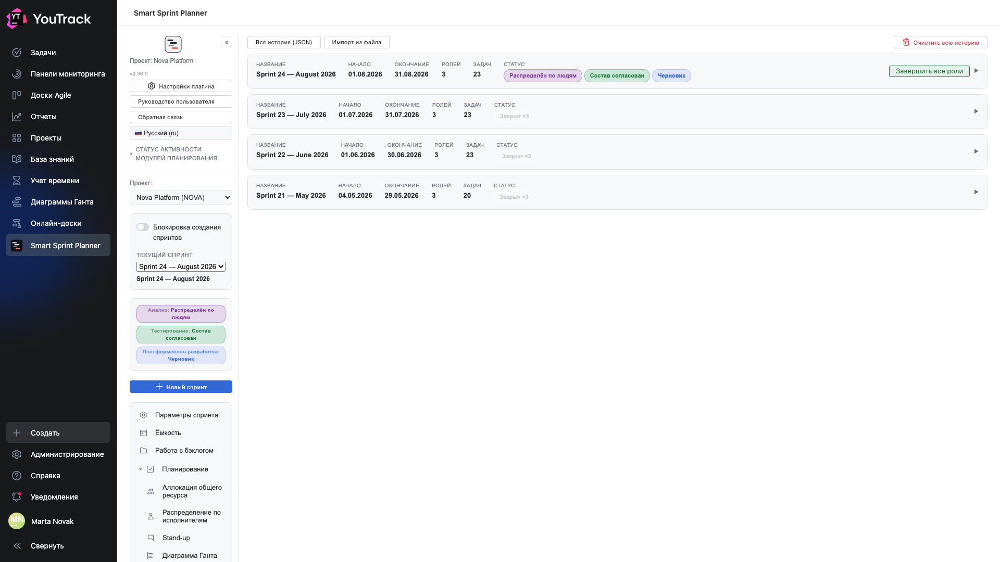

# 10. История спринтов

Список спринтов проекта: активный сверху, закрытые ниже. Отсюда спринты закрывают, выгружают и при необходимости возвращают к правке.

## Где

Рельс → **«История спринтов»**.

## Строка спринта

| Колонка | Что показывает |
|---|---|
| **Название** | как спринт назвали |
| **Начало**, **Окончание** | период |
| **Ролей** | сколько ролей участвовало |
| **Задач** | сколько задач было в составе |
| **Статус** | плашки по ролям: у активного — по одной на роль, у закрытого — «Закрыт ×3» |

Треугольник справа раскрывает запись: состав по ролям, часы, кто и когда её менял.

## Кнопка «Завершить все роли»

У активного спринта справа. Переводит все роли в состояние **«Закрыт»**: спринт уходит в историю, его состав фиксируется снимком.

Снимок — не ссылка на задачи, а копия их состояния на момент закрытия. Поэтому потом, когда задачи в трекере поедут дальше, история спринта останется той, какой была при закрытии. На этом свойстве держится вся [отчётность](../03-reporting/): Velocity и Spillover считают по снимкам, а не по текущему состоянию.

## Выгрузка

- **«Вся история (JSON)»** — выгрузить всю историю проекта одним файлом.
- Внутри раскрытой записи есть выгрузка отдельного спринта в Excel и JSON.
- **«Импорт из файла»** — загрузить историю обратно: перенос между стендами, восстановление. Под выбором режима окно показывает «Записей к применению: N · перезапись: M · пропуск: K» и пересчитывает строку на каждую галочку — объём последствий виден до нажатия «Импортировать».

## Возврат к правке

Закрытый спринт можно вернуть в работу из раскрытой записи. Это нужно, когда роль закрыли раньше времени или нашли ошибку в составе.

Возврат — операция заметная: он меняет данные, по которым уже могли построить отчёты. Право на неё выдаётся отдельно.

## «Очистить всю историю»

Красная кнопка в правом верхнем углу. Стирает историю спринтов проекта целиком и необратимо.

Право на неё выдаётся отдельной группой в настройках проекта — специально, чтобы кнопка не оказалась под рукой у всех, кто умеет открыть планер.

## Что попадает в снимок

- состав задач по ролям с оценками, фактом и аллокациями;
- ресурсы ролей и остатки;
- распределение по исполнителям и даты;
- состояния задач на момент закрытия.

Это тот минимум, по которому потом можно ответить на вопрос «что мы обещали и что сделали», не полагаясь на то, что задачи в трекере остались нетронутыми.
