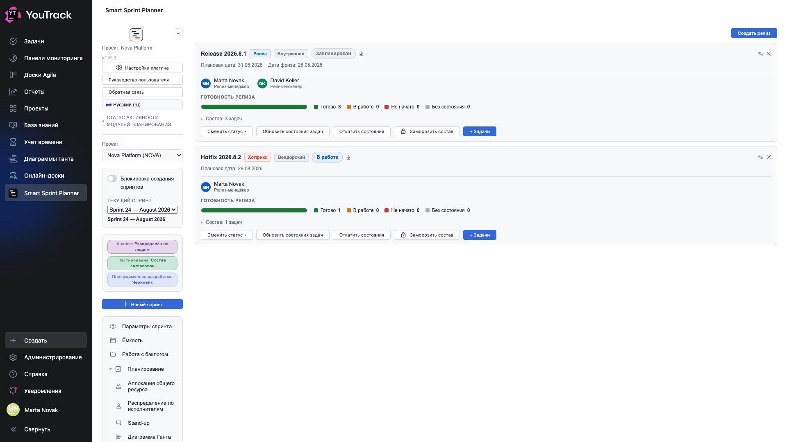
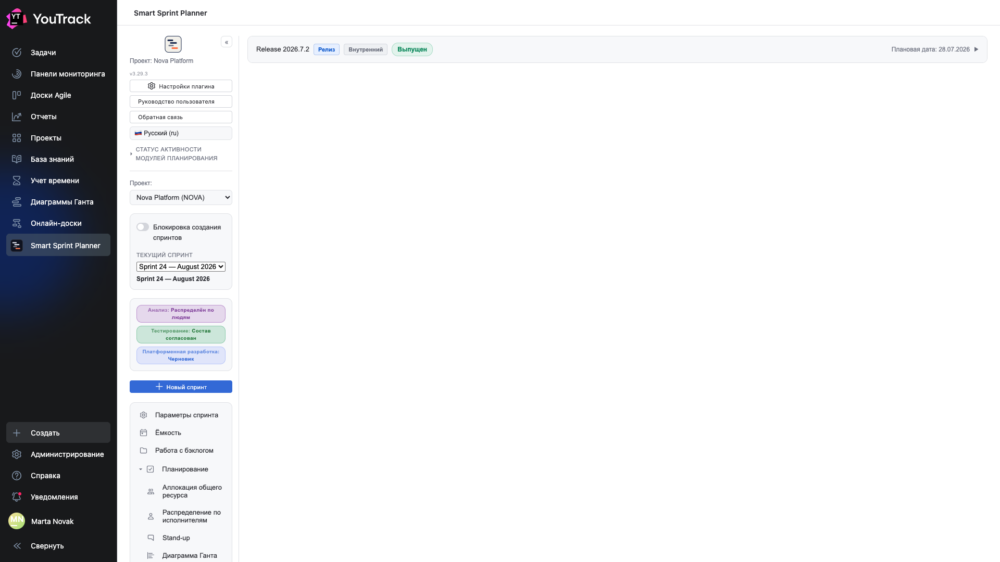

# 11. Релизы

Модуль отвечает на вопрос «что мы выкатываем и готово ли это». Спринт и релиз — разные вещи: спринт про время команды, релиз про поставку.

## Где

Рельс → **«Релизы»** → **«Планируемые релизы»** и **«История релизов»**. Раздел появляется, если релиз-менеджмент включён в настройках проекта.

## Планируемые релизы

Каждый релиз — карточка.

**Шапка карточки:** название, **вид** (релиз / хотфикс), **источник** (внутренний / поставщик), **статус** (планируется / в работе / выпущен) и метка **«Просрочен»**, если плановая дата уже прошла.

**Даты:** плановая дата выпуска и **дата заморозки** — с неё состав релиза не меняют.

**Ответственные:** роли релиза — менеджер релиза, инженер релиза. Берутся из состава команды проекта.

### Полоса готовности

**«Готовность релиза»** — светофор по задачам состава:

| Зона | Что значит |
|---|---|
| **Готово** | задача в состоянии, помеченном как «выпущено» или «решено» |
| **В работе** | задача в промежуточном состоянии |
| **Не начато** | задача в стартовом состоянии |
| **Без состояния** | состояние задачи не отнесено ни к одной зоне |

Готовность считается автоматически по состояниям задач и маппингу из настроек. Отдельного поля «готовность» у релиза нет — иначе оно всегда бы врало.

### Кнопки карточки

- **«Изменить статус»** — перевести релиз по цепочке планируется → в работе → выпущен.
- **«Обновить состояния задач»** — перечитать состояния состава из YouTrack.
- **«Откатить состояния»** — вернуть задачам состояния, которые были до массового перевода. Нужно, когда релиз сорвался.
- **«Заморозить состав»** — запретить изменения состава.
- **«+ Задачи»** — добавить задачи в состав релиза.

### Состав

Строка **«Состав: 3 задачи»** раскрывается в список. Задача может быть одновременно в спринте и в релизе — это разные срезы одной работы.

## История релизов

Выпущенные релизы уходят сюда. Запись раскрывается и показывает состав на момент выпуска — так же, как история спринтов хранит снимок.

## Автоматические теги

Если в настройках включены теги релиза, планер проставляет задачам состава тег при смене статуса релиза. Так в YouTrack остаётся след: по тегу видно, каким релизом уехала задача, даже вне планера.
