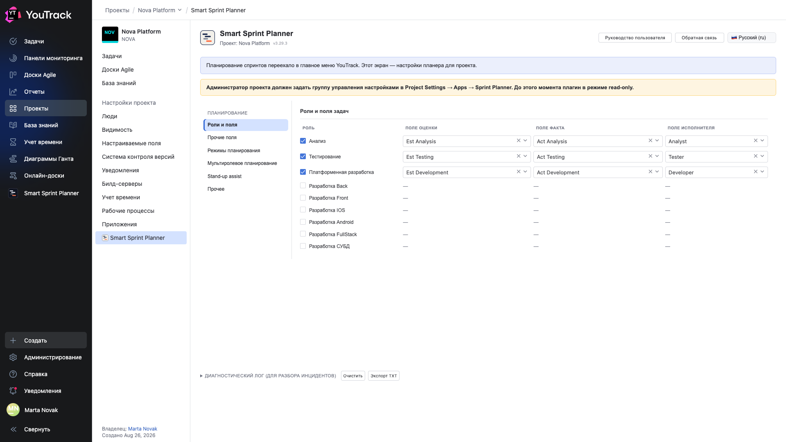
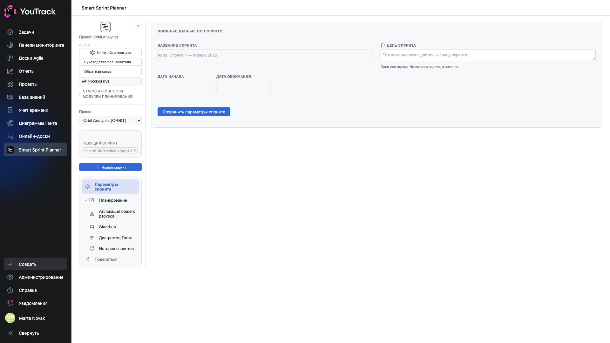
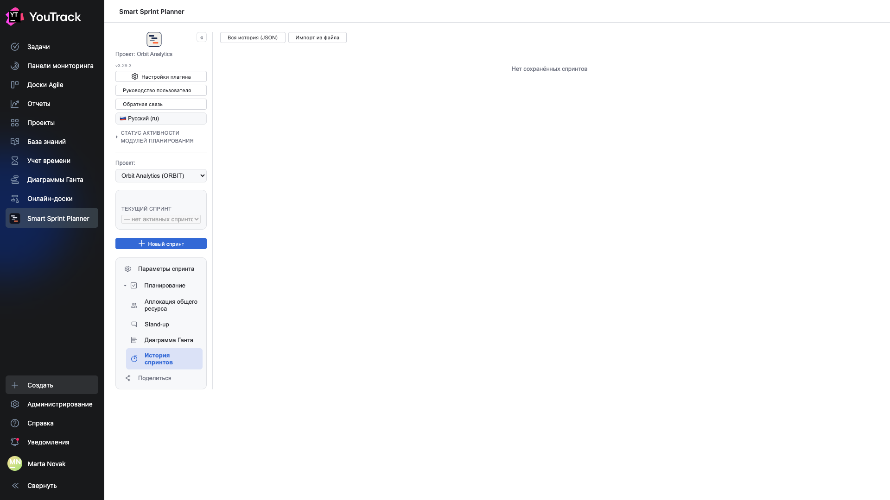
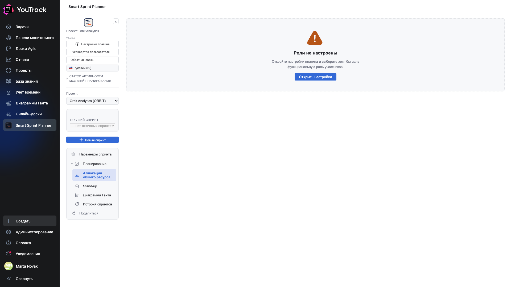

# 13. Первый день на новом проекте

Что вы увидите, если открыть планер в проекте, где его только что подключили. Три пустых экрана — и каждый говорит, чего не хватает.

## Планер до настройки: режим «только чтение»

Жёлтая полоса: **администратор проекта должен задать группу управления настройками**. До этого момента планер работает в режиме read-only — читает и показывает, но отклоняет любую запись.

Разделов администрирования в левом списке нет: пока не назначена группа, некому и настраивать.

Это защита, а не поломка: свежеподключённый проект не должен настраивать сам себя. Как задать группу — глава 04 документа [«Внедрение и настройка»](../02-setup/).

## Спринтов ещё нет

Селектор спринта показывает **«— нет активных спринтов —»**, поля параметров пусты, а в подсказках стоят примеры: «напр. Sprint 1 — April 2026».

Обратите внимание на **рельс**: он короче обычного. Нет ни «Ёмкости», ни «Работы с бэклогом», ни «Релизов», ни отчётности — эти разделы появляются только тогда, когда соответствующие модули включены в настройках проекта. Планер не показывает разделы, за которыми ничего нет.

## Пустая история

**«Нет сохранённых спринтов»** — история наполняется закрытыми спринтами, а закрывать пока нечего.

Кнопки **«Вся история (JSON)»** и **«Импорт из файла»** доступны и на пустой истории: импорт — законный способ перенести историю с другого стенда или восстановить её из выгрузки.

## Роли не настроены

Самое частое препятствие на первом шаге. Планер раскладывает работу по ролям, и пока не выбрана ни одна роль, раскладывать не по чему.

Экран не оставляет догадываться: **«Откройте настройки плагина и выберите хотя бы одну функциональную роль»** и кнопка **«Открыть настройки»** прямо здесь.

## Порядок, в котором это лечится

1. Задать **группу управления настройками** — иначе ничего не сохранится.
2. Выбрать **роли** и поля оценки/факта для каждой.
3. Включить нужные **модули**: ёмкость, бэклог, стендап, релизы, отчётность.
4. Создать **первый спринт**.

Подробно и по шагам — документ [«Внедрение и настройка»](../02-setup/).
