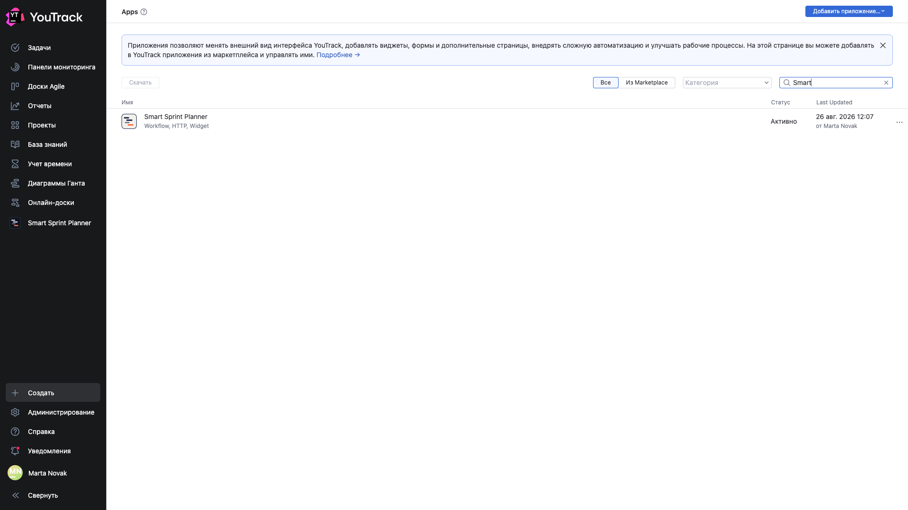
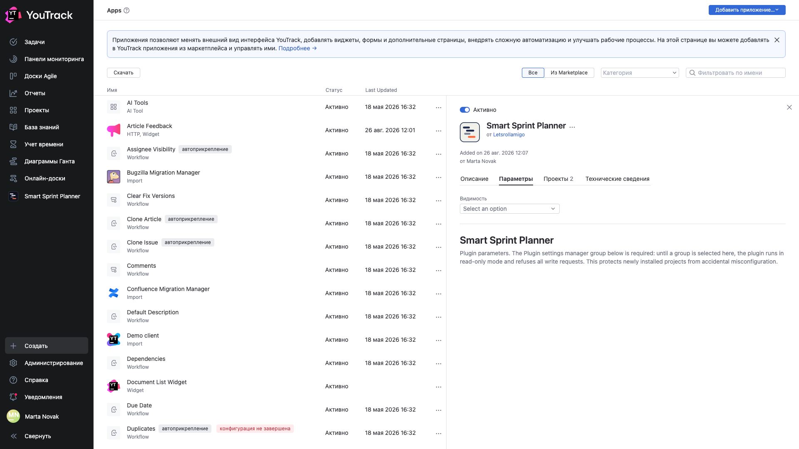

# 02. Установка приложения

**Обязательно, один раз на весь YouTrack.** Приложение ставится администратором YouTrack и после этого доступно всем проектам инстанса.

Если планер в вашем YouTrack уже установлен — переходите к главе [03](03-attach.md).

## Два способа поставить

| Способ | Кому подойдёт |
|---|---|
| **JetBrains Marketplace** | обычный путь: приложение приезжает и обновляется средствами YouTrack |
| **Zip с GitHub Releases** | когда нужна версия раньше, чем её пропустит ревью маркетплейса, или инстанс без доступа в интернет |

Из маркетплейса: **Администрирование → Приложения → Добавить приложение → Из Marketplace**, найти «Smart Sprint Planner», установить.

Зипом: скачать `Smart-Sprint-Planner-vX.Y.Z-marketplace.zip` со страницы [Releases](https://github.com/Letsrollamigo/smart-sprint-planner/releases), затем **Администрирование → Приложения → Добавить приложение → Загрузить zip**.

## Как проверить, что установилось

**Администрирование → Приложения**, фильтр по имени — «Smart».

Строка приложения показывает состав — **Workflow, HTTP, Widget** — и статус **«Активно»**. Три составляющие означают: воркфлоу-правила, серверная часть и виджеты интерфейса.

## Карточка приложения

Щелчок по строке открывает карточку.

| Вкладка | Что там |
|---|---|
| **Описание** | что делает приложение |
| **Параметры** | параметры уровня инстанса |
| **Проекты** | к каким проектам приложение подключено; отсюда его и подключают |
| **Технические сведения** | версия, автор, состав |

## Обновление версии

Обновление ставится поверх той же командой — из маркетплейса или загрузкой нового зипа. Данные проектов при обновлении не трогаются.

🔴 **Не удаляйте приложение, чтобы «переустановить начисто».** Удаление приложения из YouTrack сносит все его данные во всех проектах: спринты, историю, настройки. Обновление ставится поверх, удалять для этого ничего не нужно.

## Требования

- YouTrack **2024.3** или новее.
- Права администратора YouTrack — на установку. На настройку конкретного проекта достаточно прав администратора проекта.
