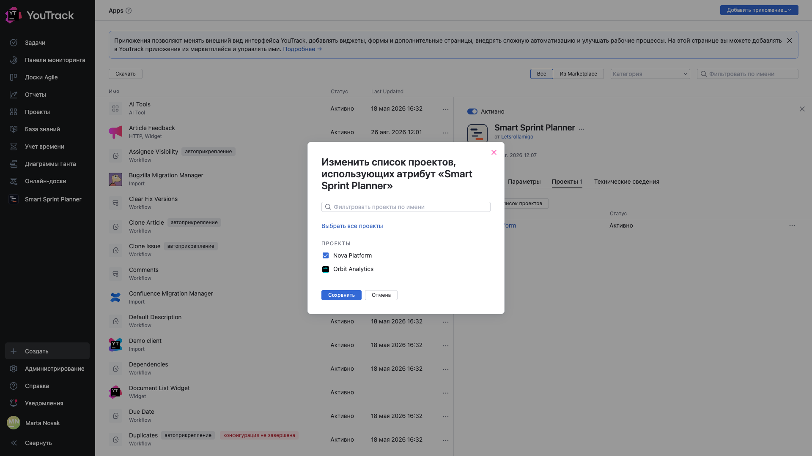
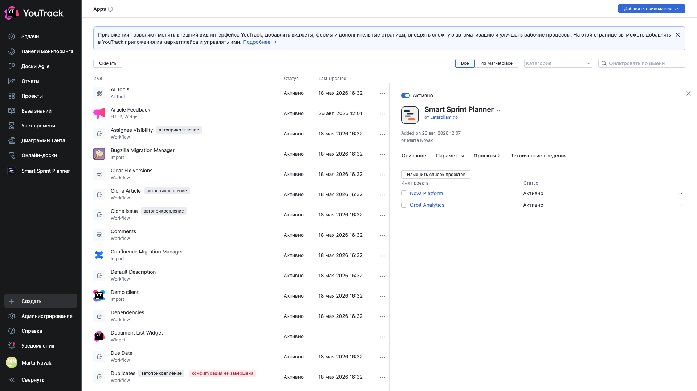

# 03. Подключение планера к проекту

**Обязательно.** Установленное приложение само по себе ни к какому проекту не привязано. Подключение — отдельный шаг, и делается он в карточке приложения.

## Где

**Администрирование → Приложения → Smart Sprint Planner → вкладка «Проекты»**.

Пока приложение никуда не подключено, список пуст, а счётчик рядом с названием вкладки показывает ноль.

## Как подключить

Кнопка **«Изменить список проектов»** открывает диалог со списком всех проектов инстанса.

Отметьте нужные проекты и сохраните. Поле фильтра сверху помогает, когда проектов много; **«Выбрать все проекты»** отмечает сразу все — но так делать стоит, только если планер действительно нужен везде.

После сохранения проекты появляются в списке со статусом **«Активно»**, а счётчик вкладки показывает их число.

## Что даёт подключение

Подключение делает три вещи:

1. в проекте появляется раздел **Настройки проекта → Приложения → Smart Sprint Planner**;
2. проект начинает показываться в пикере проектов планера в главном меню;
3. воркфлоу-правила приложения начинают работать на задачах проекта.

Настроек оно при этом никаких не создаёт: планер в свежеподключённом проекте работает в режиме «только чтение», пока не задана группа управления настройками — глава [04](04-manager-group.md).

## Отключение

Снять галочку в том же диалоге. Отключение убирает раздел настроек и прячет проект из пикера, но **данные планера в проекте сохраняются**: подключите обратно — всё на месте.

🔴 Это принципиально отличается от **удаления приложения** из YouTrack: удаление сносит данные во всех проектах разом и необратимо.

## Подключать сразу все проекты или по одному

По одному. Каждый подключённый проект начинает исполнять воркфлоу-правила приложения, а команды, которые планером не пользуются, увидят в настройках лишний раздел. Подключайте по мере внедрения.
