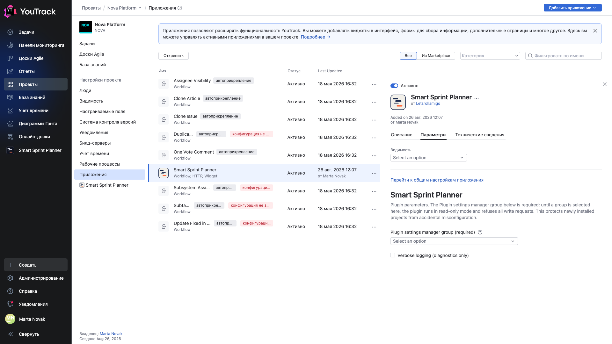
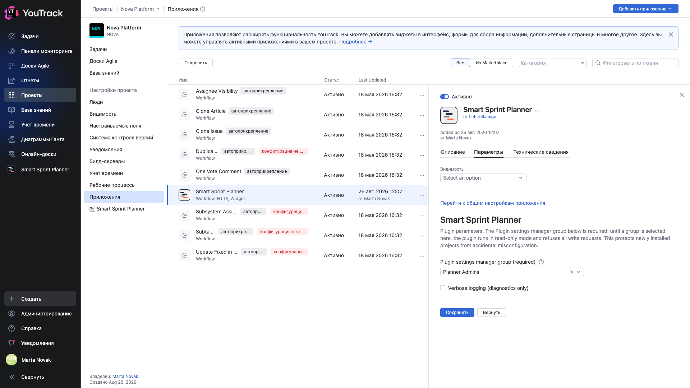

# 04. Группа управления настройками

**Обязательно. Без этого шага планер не работает** — он читает и показывает, но отклоняет любую запись.

## Что происходит до этого шага

Откройте **Настройки проекта → Приложения → Smart Sprint Planner** в свежеподключённом проекте.

Жёлтая полоса говорит прямо: администратор проекта должен задать группу управления настройками, до этого плагин в режиме read-only.

Разделов **АДМИНИСТРИРОВАНИЕ** в левом списке нет вовсе — их некому открывать.

## Почему так сделано

Приложение подключается к проекту одним движением администратора YouTrack, часто пачкой. Если бы свежеподключённый планер сразу разрешал писать, любой, кто открыл экран настроек, мог бы поменять поля ролей и модель ёмкости — и никто бы не заметил.

Гейт переносит решение туда, где оно осмысленно: администратор проекта явно называет группу, которой доверяет настройку.

## Где задаётся

**Настройки проекта → Приложения → Smart Sprint Planner → вкладка «Параметры»**.

Это форма самого YouTrack, а не планера, — поэтому она на английском независимо от языка интерфейса.

Поле **«Plugin settings manager group (required)»** — выпадающий список групп YouTrack. Выберите группу и сохраните.

Второй флажок, **«Verbose logging (diagnostics only)»**, включает подробный диагностический лог. Держите его выключенным: он нужен только при разборе инцидента.

## Что меняется после сохранения

Жёлтая полоса исчезает, в левом списке появляется блок **АДМИНИСТРИРОВАНИЕ** со всеми разделами: права, дифф. учёт, каскады, связи, отображаемые поля, бэклог, ёмкость, релизы, отчётность.

С этого момента планер принимает запись — но только от членов названной группы.

## Кого включать в группу

Тех, кто отвечает за то, как устроен процесс: лида команды, руководителя направления, того, кто ведёт YouTrack в подразделении. Обычно это два-три человека, а не вся команда.

Группа управления настройками — не то же самое, что права на планирование: спринт набирают и валидируют другие люди, и им отдельные полномочия выдаются в главе [09](09-permissions.md).

## Частые вопросы

**Группа задаётся на каждый проект отдельно?** Да. Это параметр приложения в конкретном проекте.

**Можно ли поменять группу потом?** Да, в той же форме. Если очистить поле и сохранить, планер вернётся в read-only.

**Почему форма на английском, хотя интерфейс русский?** Это стандартная форма параметров приложения YouTrack: она строится по схеме и не локализуется приложением.
