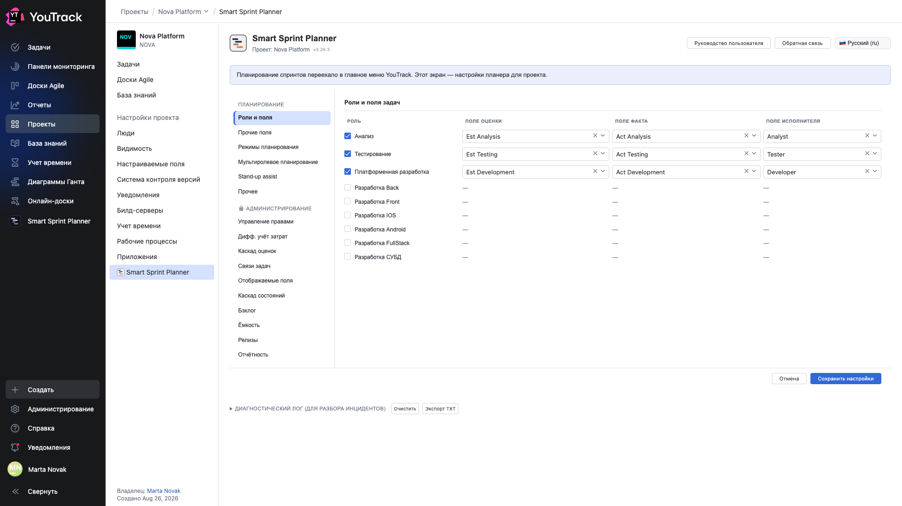

# 05. Роли и поля задач

**Обязательно.** Главный экран настройки: здесь решается, какие роли участвуют в планировании и из каких полей задачи брать их числа.

## Где

**Настройки проекта → Приложения → Smart Sprint Planner → ПЛАНИРОВАНИЕ → «Роли и поля»**.

## Таблица

Строка — роль, всего девять: **Анализ**, **Тестирование**, **Платформенная разработка** и шесть видов специализированной разработки (Back, Front, iOS, Android, FullStack, СУБД).

| Колонка | Что выбрать |
|---|---|
| чекбокс слева | участвует ли роль в планировании этого проекта |
| **Поле оценки** | поле задачи типа «период», где лежит план часов этой роли |
| **Поле факта** | поле задачи типа «период», где лежит факт |
| **Поле исполнителя** | пользовательское поле задачи: кто делает эту работу |

Выключенная роль не показывается нигде: ни в спринте, ни в бэклоге, ни в отчётах. Прочерки в её строке — это норма.

## Сколько ролей включать

Ровно столько, сколько видов работы команда реально планирует **раздельно**. Если разработка планируется одной цифрой, включать шесть подролей не нужно — это только раздробит таблицы.

Типовой набор — три роли: анализ, разработка, тестирование.

## Почему поля обязательны

Планер не хранит часы у себя: он читает **поле оценки** роли и складывает. Без указанного поля роль не сможет посчитать ни аллокацию, ни остаток, ни перелимит — она будет включена, но пуста.

То же с **полем факта**: без него не будет колонки «Факт», не посчитается ресурс задачи (оценка минус факт) и не заработает отчёт «План-факт».

**Поле исполнителя** нужно экрану распределения и Ганту: по нему планер понимает, кто делает задачу в этой роли. Обычный `Assignee` для этого не годится, если ролей несколько: у задачи один `Assignee`, а исполнителей по ролям — три.

## Что будет, если поле выбрать неверно

Планер не проверяет смысл: он проверит только тип поля. Если в «поле оценки» роли анализа выбрать поле оценки разработки, всё будет работать — и складывать не то. Проверьте соответствие по названию.

## Порядок ролей

Роли идут в фиксированном порядке; переставить их нельзя. Он же определяет порядок ролей на экранах планирования и в отчётах.

## После сохранения

Кнопка **«Сохранить настройки»** внизу. После сохранения роли появляются в пикерах планера, а спринт можно набирать.

⚠️ Набор ролей **спринта** фиксируется в момент его создания. Если включить новую роль позже, она появится в новых спринтах, а старые останутся с прежним составом ролей — так история не «переписывается задним числом».
