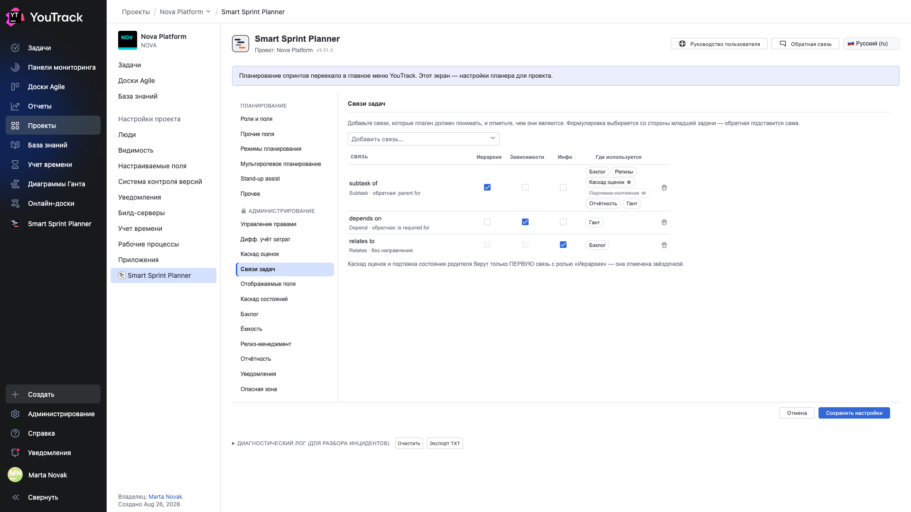

# 16. Связи задач

**Необязательно, но на неё опираются несколько других модулей — какие именно, показывает колонка «Где используется».** Раздел объясняет планеру, какие связи YouTrack что означают.

## Где

**Настройки проекта → Приложения → Smart Sprint Planner → АДМИНИСТРИРОВАНИЕ → «Связи задач»**.

## Проблема, которую это решает

В YouTrack типы связей называются как угодно и переименовываются. Планеру нужно знать не название, а смысл: эта связь — иерархия, эта — зависимость, эта — просто информация.

## Таблица «тип связи × роль»

Строка — тип связи из вашего YouTrack, колонки — три роли:

| Роль | Что означает | Кто пользуется |
|---|---|---|
| **Иерархия** | связь «родитель — ребёнок» | дерево бэклога, состав релиза, каскад оценок, каскад состояний, отчёт TTM (стори под эпиком), группы эпиков на диаграмме Ганта в режиме «Все роли» |
| **Зависимости** | связь «предшественник — последователь» | стрелки на диаграмме Ганта; в режиме «Все роли» — ещё конфликты сроков и прогноз дат по всем ролям |
| **Инфо** | связь без структурного смысла | бэклог: маркер с числом связанных задач; на расчёты не влияет |

Для иерархии и зависимости нужно указать ещё и **сторону**: на каком конце связи сидит родитель или предшественник. Пикер формулировок показывает готовые фразы вашего инстанса — «parent for», «is required for», — так что гадать не приходится.

## Колонка «Где используется»

Рядом с каждой связью таблица показывает модули, которые её читают: Бэклог, Релизы, Каскад оценок, Подтяжка состояния, Отчётность, Гант. Модуль, выключенный в проекте, зачёркнут — связь настроена, но пока её никто не читает. Каскад оценок и подтяжка состояния берут только **первую** связь с ролью «Иерархия» — у неё звёздочка. У Ганта своего переключателя нет: он всегда читает все связи «Иерархии» (группы эпиков в режиме «Все роли») и все зависимости (стрелки).

Типовая настройка:

| Тип связи | Иерархия | Зависимости | Инфо |
|---|---|---|---|
| Subtask | source | | |
| Depend | | source | |
| Relates | | | ✓ |

## Почему по имени, а не по идентификатору

Идентификаторы типов связей у разных инстансов YouTrack разные. Настройка хранит **имя** типа — так её можно перенести между стендами вместе с остальными настройками проекта.

⚠️ Обратная сторона: если тип связи переименуют в YouTrack, настройку придётся поправить.

## Цвет стрелок на Ганте

Каждому типу связи, отмеченному как зависимость, планер назначает свой цвет — и рисует легенду над диаграммой. Так на одной картинке видно, что одна стрелка — жёсткая зависимость, а другая — «желательно после».

## Что будет, если ничего не настроить

Планер применит разумный запас по умолчанию: иерархия — встроенный тип `Subtask` (плюс историческая фраза `subtask of`), зависимость — `Depend`, информация — `Relates`. Работать будет, но ровно до первого переименованного типа.
