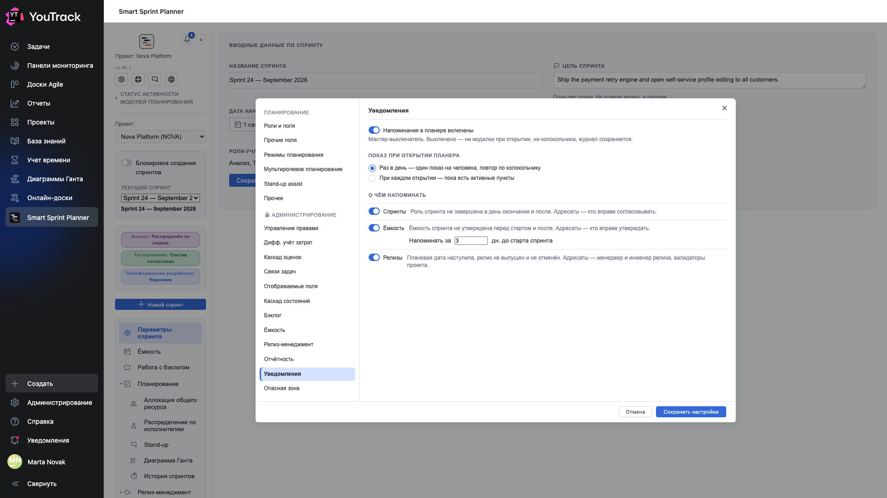
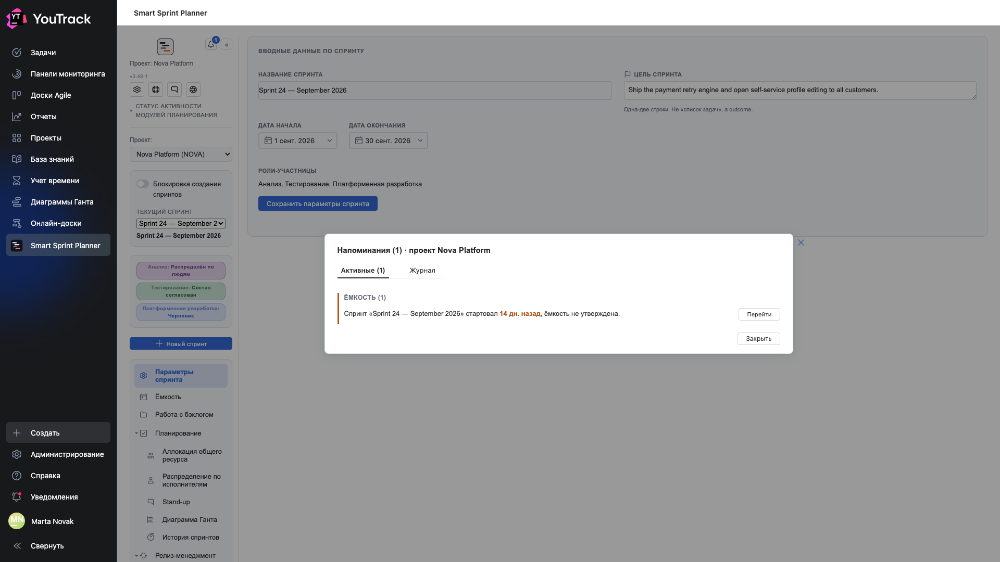
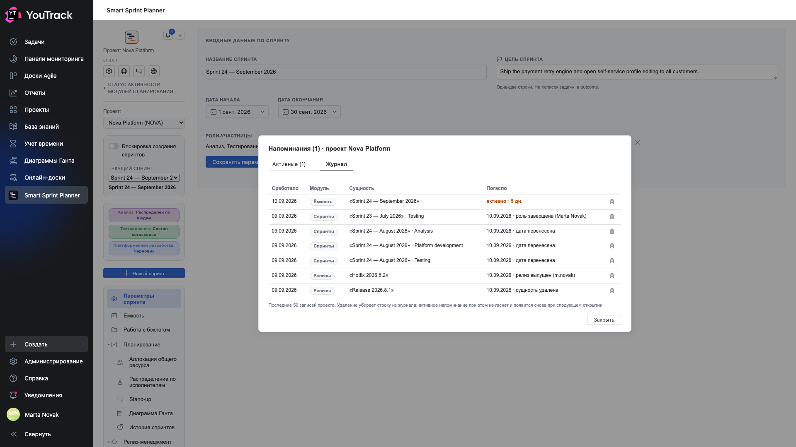

# 19a. Уведомления и напоминания

**Необязательно.** Планер умеет напоминать о трёх вещах, которые обычно теряются между спринтами: роль спринта не завершена после даты окончания, ёмкость не утверждена перед стартом, плановая дата релиза наступила, а релиз не выпущен. Напоминание — не письмо и не задача: это окно при открытии планера и колокольчик в шапке. После обновления модуль **выключен во всех проектах** — включается здесь.

## Где

**Настройки проекта → Приложения → Smart Sprint Planner → АДМИНИСТРИРОВАНИЕ → «Уведомления»** (непосредственно перед «Опасной зоной»).

## Что напоминает и кому

| Модуль | Когда напоминает | Один пункт = | Кому показывается |
|---|---|---|---|
| **Спринты** | наступил день даты окончания спринта, а роль не переведена в «Завершена»; отдельно — спринт закончился, а ни одна роль так и не была согласована | каждая незавершённая роль каждого прошедшего спринта | валидаторам проекта (глава 09) |
| **Ёмкость** | до старта спринта осталось N дней (по умолчанию 3) или спринт уже идёт, а ёмкость не утверждена; гаснет на следующий день после даты окончания. Работает только в полной модели планирования (глава 07) | спринт | тем, кто вправе утверждать ёмкость: группа управления настройками и планировочные менеджеры |
| **Релизы** | плановая дата наступила, статус релиза не «Выпущен» и не «Отменён». Работает только при включённом релиз-менеджменте (глава 18) | релиз | менеджеру и инженеру релиза, валидаторам проекта |

Напоминание гаснет **только по состоянию**: завершили роль, утвердили ёмкость, выпустили или отменили релиз, перенесли дату — пункт исчезает сам. Кнопки «сделано» нет: крестик, Esc и «Закрыть» лишь прячут окно до завтра.

Если погасили пункт сами — в этом же планере, — колокольчик пересчитается сразу после сохранения, без перезагрузки страницы (с версии 3.43.0). То, что сделали коллеги, станет видно при следующем открытии планера.

## Шаги

1. Включите **«Напоминания в планере включены»** — мастер-выключатель.
2. Выберите частоту показа: **«Раз в день»** (один показ на человека и проект в календарный день, повтор — по колокольчику) или **«При каждом открытии»**.
3. Оставьте включёнными нужные модули. Тумблер «Ёмкость» доступен только в полной модели планирования, «Релизы» — только при включённом релиз-менеджменте; недоступный тумблер не прячется, а подсказывает, где включить сам модуль.
4. Для ёмкости укажите, за сколько дней до старта спринта напоминать (0–30).
5. Нажмите **«Сохранить настройки»**.

## Как это выглядит

При открытии планера (в главном меню YouTrack) появляется окно «Напоминания (N) · проект …» с секциями по модулям в порядке Спринты → Ёмкость → Релизы. У каждого пункта одна кнопка **«Перейти»**: спринт ведёт в историю спринтов с раскрытой записью, ёмкость — на вкладку ёмкости нужного спринта, релиз — к карточке в планируемых релизах. Если пунктов нет, окно не показывается.

Колокольчик в шапке левой панели показывает число активных пунктов и открывает то же окно, но с двумя вкладками: **«Активные»** и **«Журнал»**. Колокольчик виден, только если модуль включён и вам адресован хотя бы один из включённых модулей.

## Журнал

Вкладка «Журнал» — последние 50 записей проекта: когда пункт сработал, какой модуль, что за сущность и чем погасло (дата, причина, кто). Активные записи помечены «активно · N дн.». Корзина удаляет запись — это может сделать любой адресат пункта. Удаление **не гасит** напоминание: активный пункт появится в журнале снова при следующем открытии планера.

## Ограничения

- Напоминания считаются только для **текущего выбранного проекта** и только в планере главного меню; на странице настроек проекта их нет.
- Администратор YouTrack — адресат всего (он проходит любую проверку прав планера).
- Если в проекте не заданы группы валидаторов (глава 09), у спринтов и релизов нет адресатов: пункты считаются и попадают в журнал, но не показываются никому, кроме менеджера и инженера релиза и администратора.
- Показ «раз в день» запоминается за человеком и проектом; на другом компьютере окно покажется снова.
