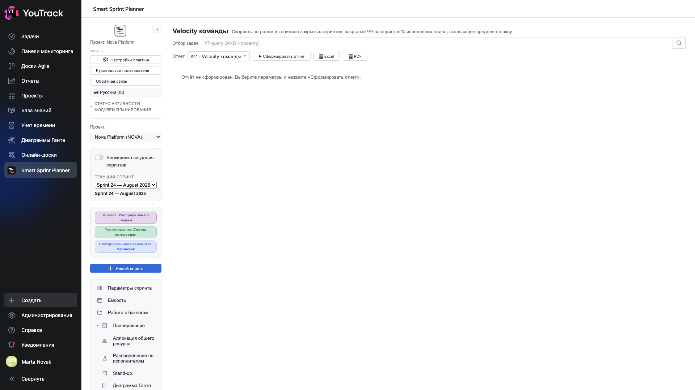

# 01. Как устроены отчёты

Все четырнадцать отчётов живут на двух экранах и работают одинаково.

## Экран отчёта

| Элемент | Что делает |
|---|---|
| **Фильтр задач** | запрос YouTrack, который добавляется к области проекта |
| **Период** | окно, за которое считать: последние 30 дней, квартал, произвольный интервал |
| **Отчёт** | пикер: какой из отчётов контура построить |
| **▶ Сформировать отчёт** | построить |
| **⭳ Excel**, **⭳ PDF** | выгрузить построенный отчёт |

Отчёт не строится сам при открытии экрана: сначала выбираете параметры, потом нажимаете кнопку. Так тяжёлая выборка не уходит на сервер при каждом переключении вкладки.

## Фильтр задач

Принимает обычный синтаксис поиска YouTrack: `Приоритет: Критичный`, `Тип: Баг`, `тег: hotfix`.

Фильтр **добавляется** к области проекта, а не заменяет её: вывести через него задачи чужого проекта нельзя.

Это главный инструмент сужения: почти любой отчёт становится полезнее, когда его строят по одной системе или одному типу задач.

## Период

Не у всех отчётов он есть. Отчёты «среза» — WIP/Done, Aging, Бэклог в ЧЧ — показывают состояние на сейчас, и период им не нужен. Отчёты по времени — TTM, Трудозатраты, Поток — считают за окно.

## Выгрузка

**Excel** отдаёт данные таблицами — с ними можно работать дальше. **PDF** отдаёт то, что на экране, вместе с графиками — годится, чтобы приложить к письму.

Выгружается **построенный** отчёт: сначала «Сформировать», потом выгрузка.

## Откуда отчёты берут данные

Источников три, и это важно понимать, когда цифра кажется странной:

| Источник | Кто им пользуется |
|---|---|
| **Списания времени YouTrack** | Трудозатраты, План-факт, Налог на баги |
| **История переходов состояний** | Aging, Прогресс, TTM, Поток |
| **Снимки закрытых спринтов** | Velocity, Spillover |

Отсюда правило: отчёты по времени в статусе бесполезны на проекте, где состояния проставили задним числом одним махом, а Velocity бесполезна там, где спринты не закрывают.

## Ограничители

У отчётности есть **таймаут** и **потолок числа задач** — настраиваются в проекте. Если отчёт упёрся в потолок, он скажет об этом, а не покажет неполные данные молча.

Лечится сужением: период короче, фильтр уже.
