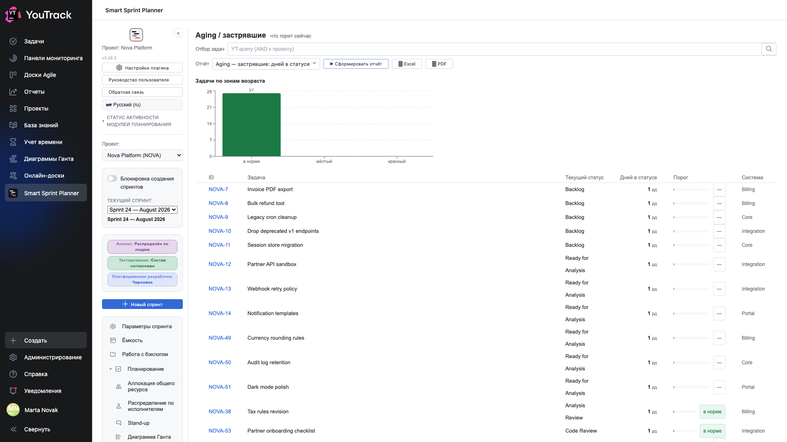
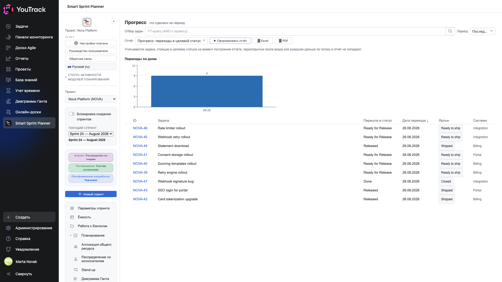
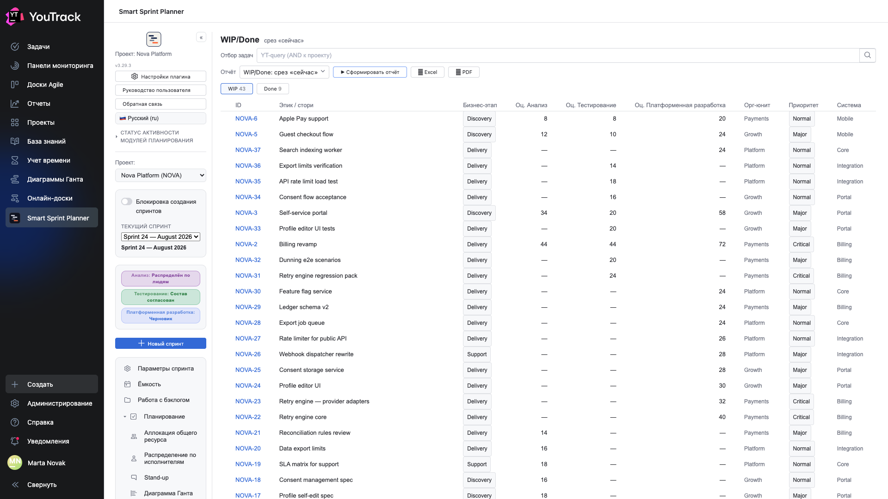

# 02. Что происходит сейчас

Три отчёта оперативного контура, отвечающие на вопрос «где мы стоим прямо сейчас».

## Aging — застрявшие: дней в статусе

**Вопрос:** что горит.

Отчёт берёт все задачи проекта и смотрит, **сколько рабочих дней каждая провела в текущем состоянии**. Столбиковая диаграмма раскладывает их по трём зонам: **ok**, **жёлтая**, **красная**.

Границы зон задаются **на каждое состояние отдельно** (глава 19 документа по внедрению). Это важно: пять дней в код-ревью — тревога, пять дней в разработке — норма.

| Колонка | Что значит |
|---|---|
| **Текущий статус** | где задача стоит |
| **Дней в статусе** | рабочих дней, паузы вычтены |
| **Порог** | полоска с положением относительно жёлтой и красной границы |
| **Система** | разрез, если поле системы настроено |

**Что делать с результатом:** красная зона — повестка ближайшей планёрки. Не «почему медленно вообще», а «почему вот эти четыре задачи стоят».

## Прогресс: переходы в целевой статус

**Вопрос:** что доехало за период.

Отчёт считает задачи, **попавшие в целевой статус за выбранный период**. Целевые статусы задаются в настройках — обычно это «готово к релизу», «выпущено», «выполнено».

Строка под шапкой предупреждает честно: считаются задачи, которые **находятся** в целевом статусе на момент построения. Если задачу переоткрыли или увели дальше, в отчёт она не попадёт.

| Колонка | Что значит |
|---|---|
| **Вошла в статус** | в какой именно целевой статус |
| **Дата перехода** | когда |
| **Подпись** | человеческое название статуса из настроек |

Диаграмма «Переходы по дням» показывает ритм: ровный поток или всё в последний день спринта.

## WIP/Done: срез «сейчас»

**Вопрос:** что в работе и что готово.

Две вкладки с числами: **WIP** — задачи в работе, **Done** — завершённые. Период не нужен, это срез на сейчас.

Таблица показывает оценки **по каждой роли отдельно** — сразу видно, из чего складывается объём: где 40 часов разработки без анализа, где наоборот.

| Колонка | Что значит |
|---|---|
| **Эпик / история** | название задачи |
| **Бизнес-стадия** | значение поля стадии, если настроено |
| **Оценка: анализ / тестирование / разработка** | часы по ролям |
| **Орг. юнит**, **Система** | разрезы из полей проекта |

**Что делать с результатом:** число WIP — самая простая метрика перегрузки. Если в работе 43 задачи на команду из шести человек, ни одна из них не движется быстро.
