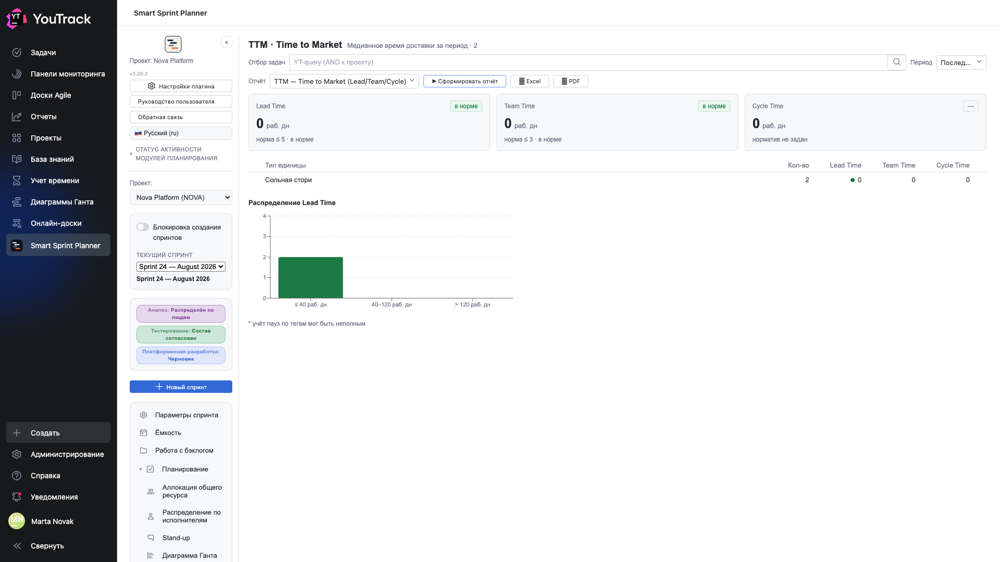
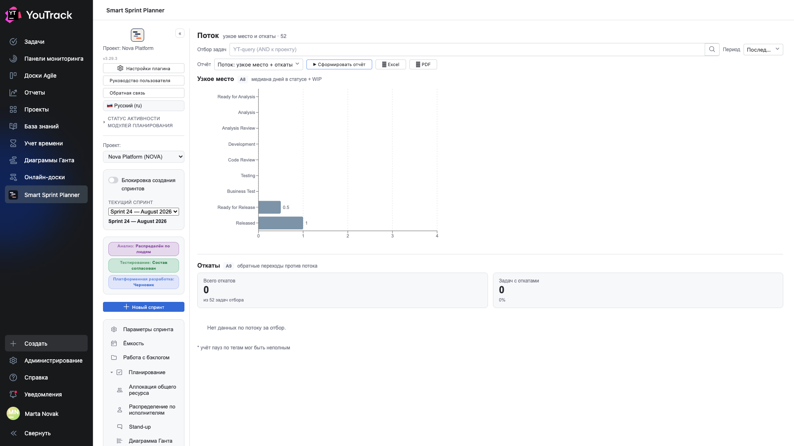

# 03. Сколько это занимает

Два отчёта о времени: сколько задача едет от начала до поставки и где именно она стоит.

Оба считают по **истории переходов состояний** — и оба бесполезны на проекте, где состояния проставили задним числом. См. предупреждение в [оглавлении](00-index.md).

## TTM — Time to Market (Lead / Team / Cycle)

**Вопрос:** сколько проходит от «взяли» до «отдали».

Три метрики измеряют одно и то же разными линейками:

| Метрика | Что меряет | Кому важна |
|---|---|---|
| **Lead Time** | от постановки до поставки заказчику | бизнесу: «сколько ждать» |
| **Team Time** | от начала работы до готовности | команде: «сколько мы делаем» |
| **Cycle Time** | самая узкая часть — обычно от разработки до тестирования | инженерам |

Что именно считать началом и концом каждой метрики, задаётся **якорями** в настройках: пара состояний на метрику. Без якорей отчёт не строится.

Рядом с числом — плашка **«в норме» / «выше нормы»**: сравнение с целевым значением из настроек. Если норма не задана, плашка пустая, а число всё равно показывается.

**Гистограмма распределения** важнее среднего: она показывает, есть ли хвост. Медиана в 12 дней при хвосте в 120 — это не «двенадцать дней», это «двенадцать дней и лотерея».

Таблица **по типу единицы** разделяет одиночные истории и части эпиков: у них разная природа, и смешивать их в одной медиане обманчиво.

⚠️ Сноска «паузы по тегам могут быть неполны» — честное предупреждение: паузы, отмеченные тегом, планер видит только на момент построения, а не в истории.

## Поток: узкое место + откаты

**Вопрос:** где именно задача стоит и как часто её возвращают.

Отчёт состоит из двух частей.

### Узкое место

Горизонтальные полосы: **медианное число дней в каждом состоянии потока**, в порядке потока. Самая длинная полоса и есть узкое место.

Это не то же, что Aging: Aging смотрит на текущие задачи и говорит, что горит сейчас; «Поток» смотрит на всю историю и говорит, где процесс тормозит **систематически**.

### Откаты

Обратные переходы против направления потока: из тестирования обратно в разработку, из ревью в анализ.

| Плитка | Что значит |
|---|---|
| **Всего откатов** | сколько раз задачи ехали назад |
| **Задач с откатами** | сколько задач это затронуло и какая это доля |

Откаты — самая честная метрика качества входа: если каждая третья задача возвращается из тестирования, проблема не в тестировании.

**Что делать с результатом:** длинная полоса — вопрос «почему тут очередь». Много откатов — вопрос «почему мы отдаём в следующую стадию неготовое».
