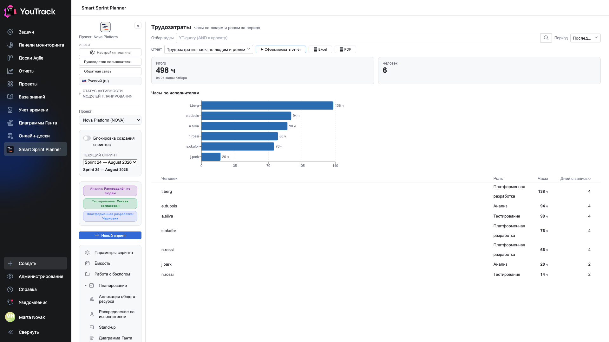
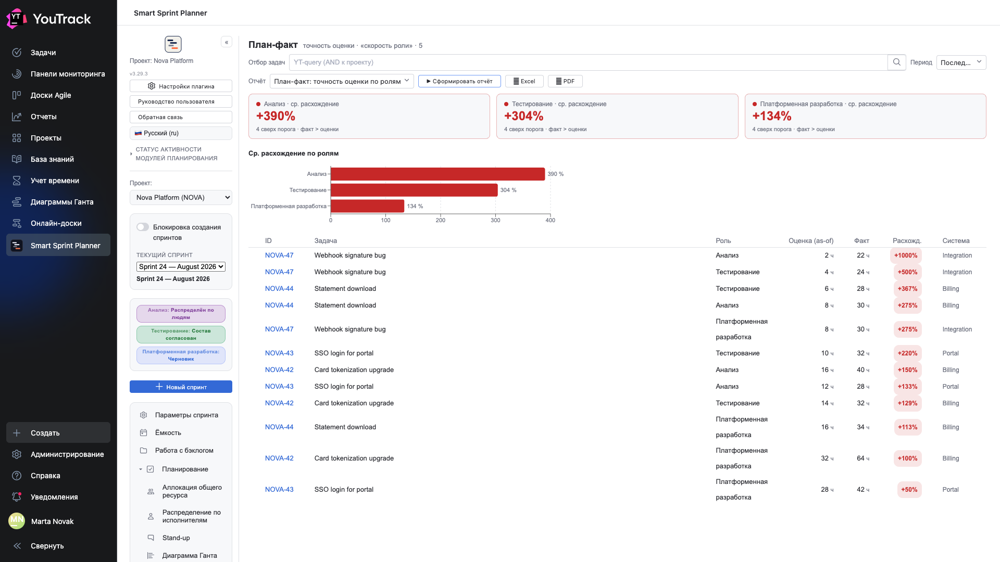

# 04. Во что это обошлось

Два отчёта, которые считают по **списаниям времени YouTrack** и потому работают на любом проекте, где команда действительно списывает часы.

## Трудозатраты: часы по людям и ролям

**Вопрос:** куда ушло время команды.

Две плитки сверху: **сколько всего часов** за период и **сколько человек** их списали. Ниже — столбики по людям и таблица.

| Колонка | Что значит |
|---|---|
| **Человек** | логин исполнителя |
| **Роль** | роль, определённая по типу работы через [дифф. учёт](../02-setup/13-dta.md) |
| **Часы** | сумма списаний |
| **Дней с записью** | в скольких разных днях человек списывал время |

**«Дней с записью»** — недооценённая колонка. Сорок часов за два дня и сорок за десять — разные истории: первое означает, что человек списывал задним числом пачкой, второе — что вёл учёт по ходу.

⚠️ Роль определяется по типу работы в списании. Если дифф. учёт не настроен или человек выбрал не тот тип, строка уедет в «роль не определена».

## План-факт: точность оценки по ролям

**Вопрос:** насколько мы вообще умеем оценивать.

Плитка на роль показывает **среднее отклонение факта от оценки**. Красный цвет и знак `+` означают, что факт больше плана.

Ниже — столбики по ролям и построчная таблица.

| Колонка | Что значит |
|---|---|
| **Роль** | по какой роли считается расхождение |
| **Оценка (на момент)** | сколько планировали |
| **Факт** | сколько ушло |
| **Отклонение** | во сколько раз промахнулись |
| **Система** | разрез |

**«Оценка (на момент)»** — важная тонкость: берётся оценка, которая стояла в задаче на момент попадания в спринт, а не текущая. Иначе достаточно было бы поправить оценку задним числом, и отчёт всегда показывал бы точность.

**Что делать с результатом:** систематическое `+300 %` у одной роли — не повод ругать роль. Обычно это означает, что оценку ставит не тот, кто делает, или что в оценку не входит половина работы (ревью, исправления, повторное тестирование).

Отдельно смотрите на **число задач сверх порога** в подписи плитки: одно отклонение в десять раз портит среднее сильнее, чем десять отклонений в полтора.
