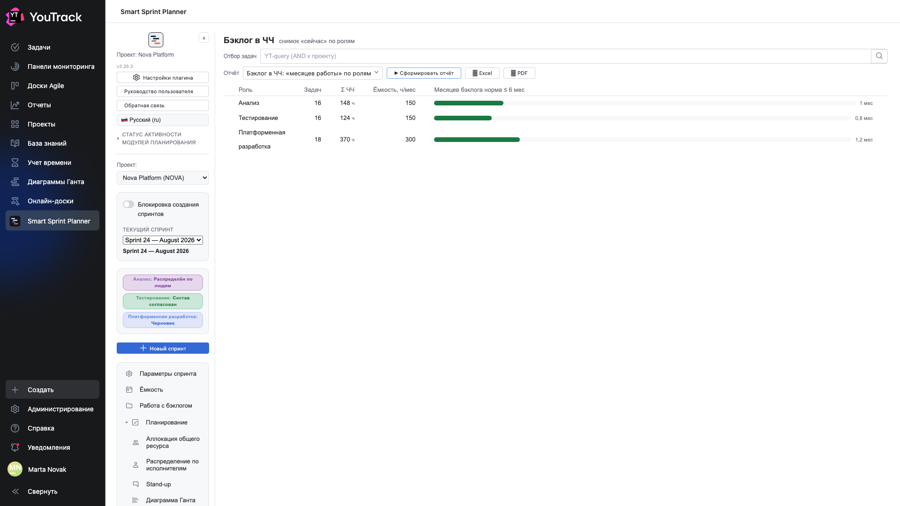
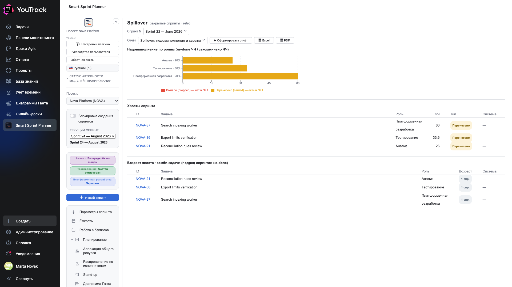
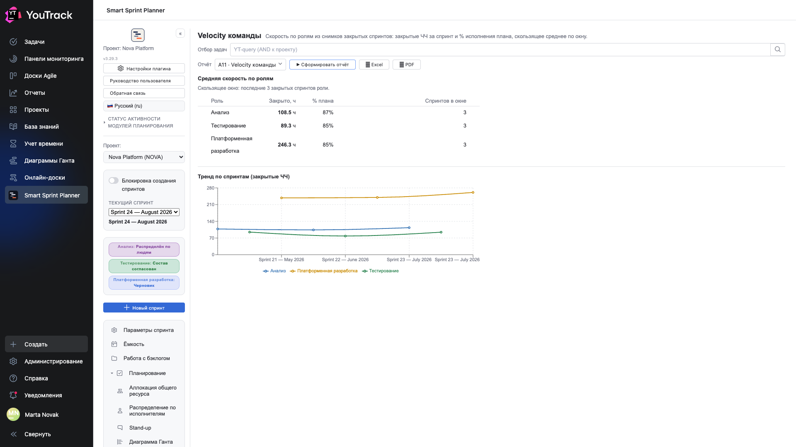

# 05. Сколько ещё осталось

Три отчёта, которые смотрят вперёд: очередь работы, хвосты прошлых спринтов и скорость команды.

## Бэклог в ЧЧ: «месяцев работы» по ролям

**Вопрос:** насколько мы завалены.

Отчёт переводит очередь из абстрактных «шестнадцати задач» в понятное «месяц работы».

| Колонка | Что значит |
|---|---|
| **Роль** | чья очередь |
| **Задач** | сколько задач ждёт |
| **Σ часов** | сумма оценок этой роли по всей очереди |
| **Ёмкость, ч/мес** | сколько роль делает за месяц — из настроек отчётности |
| **Месяцев бэклога** | Σ часов ÷ ёмкость, с полосой относительно нормы |

Норма (по умолчанию — шесть месяцев) задаётся в настройках. Полоса, упирающаяся в правый край, означает, что очередь этой роли уже не про планирование, а про приоритизацию.

**Почему это лучше «числа задач»:** шестнадцать задач анализа и восемнадцать задач разработки выглядят одинаково, а стоят 148 и 370 часов.

## Spillover: недовыполнение и хвосты

**Вопрос:** что мы обещали и не сделали.

Отчёт считает по **снимкам закрытых спринтов**: сравнивает, что было в плане, с тем, что закрылось.

**Недовыполнение по ролям** — доля часов, не доехавших до конца спринта, с делением на два вида:

| Вид | Что значит |
|---|---|
| **Перенесено (carried)** | задача есть в следующем спринте |
| **Выпало (dropped)** | задачи нет в следующем спринте — про неё просто забыли |

Разница принципиальная: перенос — управленческое решение, выпадение — потеря.

**Хвосты спринта** — построчный список: какие задачи не доехали, сколько часов, какого вида.

**Возраст хвоста · зомби-задачи** — сколько спринтов подряд задача переносится. Полосы «тёплая» и «горячая» задаются в настройках. Задача, перенесённая четвёртый раз, обычно не «почти готова» — её надо либо делать, либо закрывать.

## A11 · Velocity команды

**Вопрос:** сколько команда реально закрывает.

Считается по снимкам закрытых спринтов, скользящим окном (по умолчанию — три последних спринта каждой роли).

| Колонка | Что значит |
|---|---|
| **Закрыто, ч** | среднее число закрытых часов за спринт |
| **% плана** | какую долю запланированного роль закрывает |
| **Спринтов в окне** | по скольким спринтам усреднено |

**График тренда** показывает каждый спринт отдельно — на нём видно, стабильна скорость или скачет.

**Как этим пользоваться:** «закрыто, ч» — это то число, которым стоит планировать следующий спринт, вместо ёмкости. Ёмкость говорит, сколько часов у роли есть; velocity — сколько она реально закрывает. Второе всегда меньше, и разница — это и есть накладные расходы процесса.

⚠️ Velocity считает «закрыто» по списку **состояний «сделано»** из настроек стендапа (глава 12 документа по внедрению), а не по полю факта. Неполный список занижает скорость.
