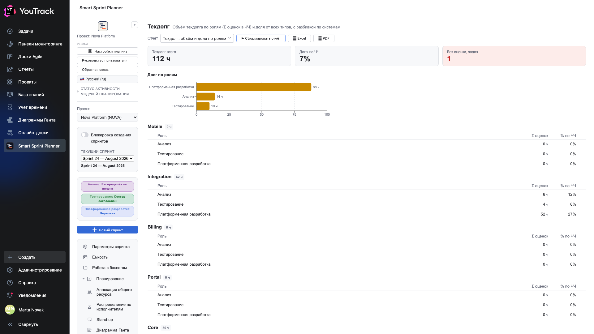
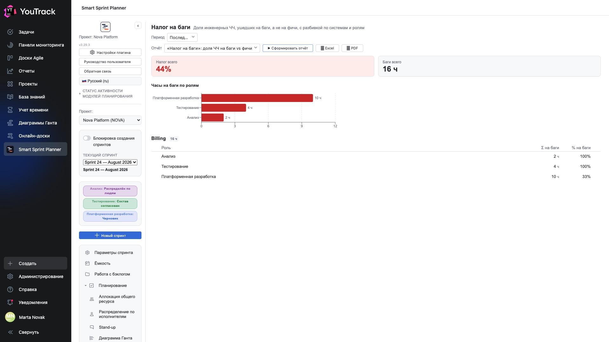
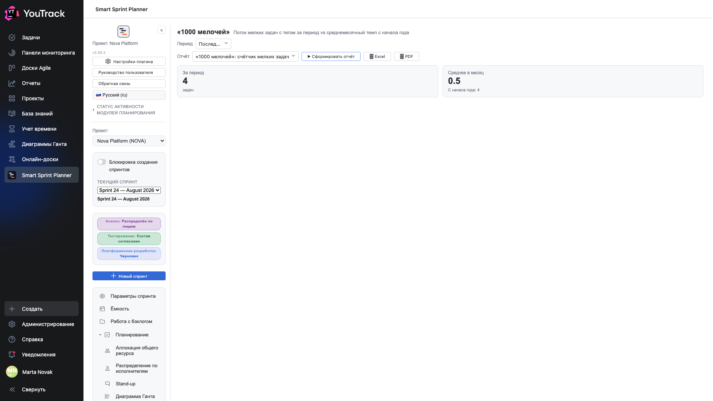
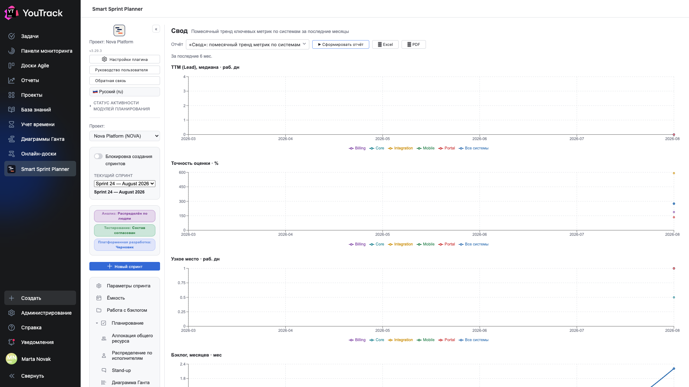

# 06. Управленческий контур

Четыре отчёта, отвечающих не на вопрос «как идёт спринт», а на вопрос «во что нам обходится процесс». Горизонт — кварталы, а не недели.

Доступ выдаётся отдельной колонкой **«Контур B»** в [матрице прав](../02-setup/09-permissions.md).

## Техдолг: объём и доля по ролям

**Вопрос:** сколько неоплаченного долга мы накопили.

Отчёт собирает задачи типа «технический долг» и складывает их оценки.

| Плитка | Что значит |
|---|---|
| **Всего техдолга** | сумма оценок в человеко-часах |
| **Доля по человеко-часам** | какую часть всего объёма занимает долг |
| **Неоценённые задачи** | сколько задач долга без оценки — они в сумму не попали |

Плитка «неоценённые» подсвечена не зря: она честно говорит, что цифра занижена. Долг, который никто не оценивал, — самый опасный.

Ниже — **долг по ролям** столбиками и разбивка **по системам**: у каждой системы своя таблица с суммой и долей по каждой роли.

**Что делать с результатом:** доля 7 % — это норма. Доля 30 % означает, что треть команды работает на прошлое. Разбивка по системам показывает, где именно.

## «Налог на баги»: доля ЧЧ на баги vs фичи

**Вопрос:** сколько времени уходит на исправление вместо создания.

Отчёт делит **списанные часы** на два кармана: работа над фичами и работа над багами. Второе и есть «налог».

| Плитка | Что значит |
|---|---|
| **Общий налог** | какая доля часов ушла на баги |
| **Всего по багам** | сколько это в часах |

Ниже — часы по ролям и таблица по системам: `Σ по багам` и `% по багам` для каждой роли внутри системы.

⚠️ Отчёту нужны **типы связей для отчётов** (глава 19 документа по внедрению): по ним он понимает, что вот этот баг относится к вот этой фиче. Без них отчёт отказывается считать.

**Что делать с результатом:** 44 % — это не «плохая команда», это «мы платим почти половину времени за прошлые решения». Разрез по системам показывает, какая именно система эту цену назначает.

## «1000 мелочей»: счётчик мелких задач

**Вопрос:** сколько времени съедает поток мелкой работы.

Простой счётчик задач, помеченных тегом «мелочь», с двумя числами: **сколько за период** и **среднемесячный темп с начала года**.

Отчёт намеренно устроен просто. Его смысл не в аналитике, а в том, чтобы поток мелких просьб перестал быть невидимым: каждая по отдельности «на пятнадцать минут», а вместе — половина спринта.

Чтобы отчёт работал, команда должна проставлять тег. Если тега нет, отчёт покажет ноль — и это тоже ответ.

## «Свод»: помесячный тренд метрик по системам

**Вопрос:** куда мы движемся.

Четыре графика, у каждого — линия на систему плюс общая линия «все системы»:

| График | Что показывает |
|---|---|
| **TTM (Lead), медиана** | сколько занимает доставка |
| **Точность оценки** | насколько промахиваемся |
| **Узкое место** | сколько дней стоит самое медленное состояние |
| **Бэклог, месяцев** | насколько растёт очередь |

Это единственный отчёт, который смотрит на **тренд**, а не на срез. Одно значение метрики почти ничего не значит; шесть точек подряд показывают, стало лучше или хуже.

Разрез по системам отвечает на следующий вопрос сразу: ухудшение общее или это одна система тянет всех вниз.

⚠️ Отчёт опирается на историю переходов состояний, поэтому на молодом проекте он пуст. Это нормально: ему нужно несколько месяцев данных.
